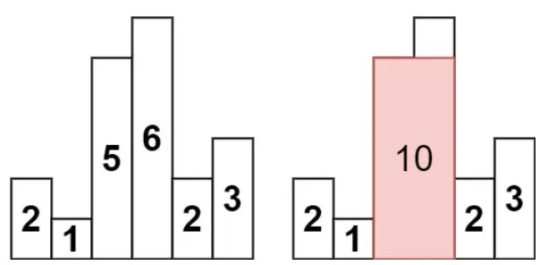

# Exploring the Biggest Rectangle in a Histogram


Let’s talk about a tricky problem called 84. Largest Rectangle in Histogram. We’ll learn some cool tricks that can help with other tasks too. Come join us as we figure out how to solve this problem step by step, using easy methods to find the biggest rectangle in the histogram. Welcome to our adventure of exploring big rectangles in histograms!

Firstly let’s describe the problem:

“Given an array of integers heights representing the histogram's bar height where the width of each bar is 1, return the area of the largest rectangle in the histogram.”

Let’s see first example:



Here we see that the max result is 10.

A simple approach to solve this problem is by calculating the area between the i-th column and all subsequent columns. We’ll iterate through each row, starting from the i-th row, and then calculate the maximum area for all subsequent rows. We’ll attempt to update this maximum area with values from previous rows.

~~~ java
public class LargestRectangleInHistogramExample {
    public static int largestRectangleArea(int[] heights) {
        int maxArea = 0;
        int n = heights.length;

        for (int i = 0; i < n; i++) {
            int minHeight = heights[i];
            for (int j = i; j < n; j++) {
                minHeight = Math.min(minHeight, heights[j]);
                int width = j - i + 1;
                int area = minHeight * width;
                maxArea = Math.max(maxArea, area);
            }
        }
        return maxArea;
    }

    public static void main(String[] args) {
        int[] histogram = {2, 1, 5, 6, 2, 3};
        //Output 10
        System.out.println("Largest rectangle area: " + largestRectangleArea(histogram));
    }
}
~~~

Here, we compute the area using a straightforward method: determining the width and height and then multiplying them to obtain the area. However, this results in an O(n²) solution, which is not particularly efficient.

Observations:

- When encountering a new value that is less than the current value, we take the minimum between them, which means we can’t ensure that the new value is greater.
- If we have a continuously increasing sequence, we can definitely form a rectangle.

How can we apply this insight?

- We can keep track of values greater than the previous ones because we’re certain that in such cases, we can form a larger rectangle compared to previous values.
- If we encounter values lower than our current one, we’re certain we won’t be able to construct a rectangle with that height.

Considering these observations, it appears that utilizing a stack could be advantageous. We’ll push values onto the stack if they’re greater than or equal to the previous ones. Then, when we pop values from the stack, we can calculate our potential area.

```java
public int largestRectangleArea(int[] heights) {
    Stack<Integer> st = new Stack<>();
    int maxArea = 0;
    for (int i = 0; i <= heights.length; i++) {
        while (!st.isEmpty() && (i == heights.length || heights[st.peek()] > heights[i])) {
            int height = heights[st.pop()];
            int width = i;
            if (!st.isEmpty()) width = (i - st.peek() - 1);
            int curArea = height * width;
            maxArea = Math.max(maxArea, curArea);
        }
        st.push(i);
    }
    return maxArea;
}
```

Indeed, this algorithm has a time complexity of O(n) and a space complexity of O(n) due to the stack usage.

Additionally, this algorithm can be applied to another problem:

85. Maximal Rectangle

Description:
“Given a rows x cols binary matrix filled with 0's and 1's, find the largest rectangle containing only 1's and return its area.”

This problem involves identifying the maximum rectangle within a matrix, which bears striking resemblance to determining the largest rectangle within a histogram.


```java
class MaximalRectangleExample {
    public int maximalRectangle(char[][] matrix) {
        int maxArea = 0;
        int n = matrix[0].length;
        int[] height = new int[n];

        for (char[] chars : matrix) {
            for (int j = 0; j < n; j++) {
                if (chars[j] == '1') height[j]++;
                else height[j] = 0;
            }
            maxArea = Math.max(largestRectangleArea(height), maxArea);
        }
        return maxArea;
    }

    public int largestRectangleArea(int[] heights) {
        Stack<Integer> st = new Stack<>();
        int maxArea = 0;
        for (int i = 0; i <= heights.length; i++) {
            while (!st.isEmpty() && (i == heights.length || heights[st.peek()] > heights[i])) {
                int height = heights[st.pop()];
                int width = i;
                if (!st.isEmpty()) width = (i - st.peek() - 1);
                int curArea = height * width;
                maxArea = Math.max(maxArea, curArea);
            }
            st.push(i);
        }
        return maxArea;
    }
}
```

Full example you can find on [Github](https://github.com/alxkm/articles/tree/master/src/main/java/org/alx/article/_13_exploring_the_biggest_rectangle_in_a_histogram), [Largest Rectangle](https://github.com/alxkm/articles/blob/master/src/main/java/org/alx/article/_13_exploring_the_biggest_rectangle_in_a_histogram/LargestRectangleInHistogramSimpleExample.java) and [Maximal Rectangle](https://github.com/alxkm/articles/blob/master/src/main/java/org/alx/article/_13_exploring_the_biggest_rectangle_in_a_histogram/MaximalRectangleExample.java).
