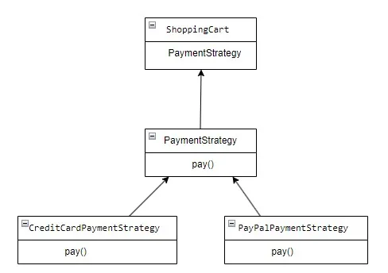

# Java Design Patterns: Strategy


In Java, the Strategy pattern is a behavioral design pattern that allows you to define a family of algorithms, encapsulate each one of them, and make them interchangeable. It enables clients to choose an algorithm from a family of algorithms at runtime without altering its structure.

The Strategy pattern is useful for several reasons:

- Encapsulation of Algorithms: It encapsulates each algorithm (or strategy) into its own class, making the code more modular and organized. Each algorithm is implemented independently of the others, which promotes code reuse and maintainability.
- Flexibility and Extensibility: The Strategy pattern allows you to easily add new algorithms or modify existing ones without affecting the client code. Since the algorithms are encapsulated, you can add new strategies by creating new classes that implement the strategy interface, making the system more flexible and extensible.
- Runtime Selection of Algorithms: With the Strategy pattern, you can select the appropriate algorithm at runtime. This is particularly useful when you have multiple algorithms that can be used interchangeably based on certain conditions or preferences. For example, in the payment processing example, you might want to allow users to choose between different payment methods (credit card, PayPal, etc.) at checkout.
- Simplification of Complex Conditional Statements: Instead of having complex conditional statements to select between different algorithms, the Strategy pattern simplifies the code by encapsulating each algorithm in its own class. This improves readability and maintainability, as it separates the algorithm selection logic from the rest of the code.
- Testing and Debugging: Since each algorithm is implemented independently, it is easier to test and debug them. You can create separate test cases for each strategy, which simplifies the testing process and improves code quality.

Overall, the Strategy pattern promotes better code organization, flexibility, and maintainability, making it a valuable tool in software design and development.


Strategy pattern in Java:



Let’s define the Strategy Interface: This interface declares a method that all concrete strategy classes will implement.

```java
public interface PaymentStrategy {
    void pay(double amount);
}
```
Create Concrete Strategy Classes: These are the different algorithms that implement the strategy interface.

```java
public class CreditCardPaymentStrategy implements PaymentStrategy {
    private String cardNumber;
    private String expiryDate;
    private String cvv;

    public CreditCardPaymentStrategy(String cardNumber, String expiryDate, String cvv) {
        this.cardNumber = cardNumber;
        this.expiryDate = expiryDate;
        this.cvv = cvv;
    }

    @Override
    public void pay(double amount) {
        System.out.println(amount + " paid with credit/debit card.");
    }
}

public class PayPalPaymentStrategy implements PaymentStrategy {
    private String email;
    private String password;

    public PayPalPaymentStrategy(String email, String password) {
        this.email = email;
        this.password = password;
    }

    @Override
    public void pay(double amount) {
        System.out.println(amount + " paid using PayPal.");
    }
}
```
Create Context Class: This class holds a reference to the selected strategy and provides a method to change it.

```java
public class ShoppingCart {
    private PaymentStrategy paymentStrategy;

    public void setPaymentStrategy(PaymentStrategy paymentStrategy) {
        this.paymentStrategy = paymentStrategy;
    }

    public void checkout(double amount) {
        paymentStrategy.pay(amount);
    }
}
```

Client Code: The client code creates the context object and sets the desired strategy.

```java
public class Main {
    public static void main(String[] args) {
        ShoppingCart cart = new ShoppingCart();

        // Use credit card payment
        cart.setPaymentStrategy(new CreditCardPaymentStrategy("1234 5678 9012 3456", "12/24", "123"));
        cart.checkout(100.0);

        // Use PayPal payment
        cart.setPaymentStrategy(new PayPalPaymentStrategy("example@example.com", "password"));
        cart.checkout(200.0);
    }
}
```


In this example, the ShoppingCart class is the context where different payment strategies can be applied interchangeably. The client code can easily switch between different payment methods without altering the ShoppingCart class. This demonstrates the flexibility and reusability provided by the Strategy pattern in Java.

Full example you can find on [Github](https://github.com/alxkm/articles/tree/master/src/main/java/org/alx/article/_14_java_design_patterns_strategy).