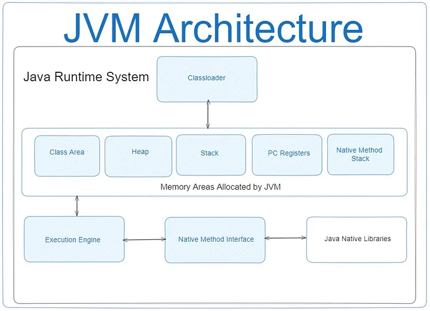

# Java: JVM, minimum what every developer should know

As a Java developer, having a fundamental understanding of the Java Virtual Machine (JVM) is paramount. The JVM serves as the cornerstone of the Java platform, providing the runtime environment necessary for executing Java applications across various devices and operating systems.

At its core, the JVM is a robust and sophisticated software implementation that acts as an intermediary between Java bytecode and the underlying hardware. It plays a crucial role in executing Java programs by translating bytecode instructions into machine code that can be understood and executed by the host system.

In essence, familiarity with the JVM is not merely a technical prerequisite but a foundational skill that equips Java developers with the expertise needed to build robust, scalable, and high-performance software solutions in the Java ecosystem.

What is the Java Virtual Machine (JVM) and its role in Java?
Firstly let’s define for what JVM is responsible. JVM is responsible for several key tasks that enable the execution of Java applications:

- Loading and Linking: The JVM is responsible for loading classes and resources required by the Java application. This involves locating and loading class files from the file system or network, verifying their correctness, and preparing them for execution. Linking involves resolving symbolic references, such as method invocations and field accesses, to concrete memory addresses.
- Bytecode Execution: Once classes are loaded and linked, the JVM executes Java bytecode instructions contained within these classes. It interprets or translates bytecode into machine code instructions that the underlying hardware can execute. The JVM employs various optimization techniques, such as Just-In-Time (JIT) compilation, to improve the performance of bytecode execution.
- Memory Management: The JVM manages memory allocation and deallocation for Java objects. It allocates memory on the heap for objects dynamically created during program execution and releases memory when objects are no longer needed. Memory management tasks include garbage collection, which identifies and removes unreachable objects to reclaim memory resources.
- Garbage Collection: Garbage collection is a crucial responsibility of the JVM. It automatically identifies and removes objects that are no longer referenced by the application, preventing memory leaks and ensuring efficient memory utilization. The JVM employs different garbage collection algorithms, such as generational garbage collection, to optimize performance and minimize pauses.
- Execution Environment: The JVM provides a runtime environment for Java applications, abstracting away platform-specific details. It provides standard libraries, runtime services, and system interfaces that facilitate application development and execution across different operating systems and hardware architectures.
- Security: The JVM enforces security policies to protect against malicious code and unauthorized access to system resources. It provides a sandboxed execution environment where untrusted code runs within restricted boundaries, preventing it from accessing sensitive resources or causing harm to the host system.
- Concurrency Management: The JVM supports concurrent programming through features such as threads and synchronization mechanisms. It provides built-in support for multithreading, allowing Java applications to execute multiple tasks concurrently and efficiently manage shared resources in a thread-safe manner.
- Overall, the JVM plays a central role in the execution of Java applications, handling tasks such as loading and linking classes, executing bytecode, managing memory, performing garbage collection, providing a runtime environment, enforcing security policies, and supporting concurrent programming. Its responsibilities are essential for the reliable, efficient, and secure execution of Java software in diverse computing environments.

The JVM indeed operates with two main types of data: primitive types and reference types.

Primitive Types: Primitive types in Java represent basic data types that contain simple values. They include:
- byte: 8-bit integer.
- short: 16-bit integer.
- int: 32-bit integer.
- long: 64-bit integer.
- float: 32-bit floating-point number.
- double: 64-bit floating-point number.
- boolean: Boolean type (true or false).
- char: 16-bit character type.
  Primitive types are stored directly on the stack memory and have a fixed size, which ensures fast access and efficient memory usage.

Reference Types: Reference types in Java represent objects and arrays, which contain complex data structures and are dynamically allocated in the heap memory. They include:
- Objects of classes.
- Arrays.
- References to other objects.
  Reference types are stored in the heap memory, their size can change during program execution, and they are managed by the JVM’s garbage collector.

### ClassLoader
The class loader, an integral component of the Java Runtime Environment (JRE), dynamically loads Java classes into the Java Virtual Machine (JVM). Classes are typically loaded into memory only when specifically requested, allowing for efficient resource utilization and optimized performance.

Thanks to the class loader, the Java runtime system operates independently of files and file systems. Delegation, a crucial concept handled by the loader, ensures efficient handling of class loading tasks.

The class loader is tasked with locating libraries, reading their contents, and loading the classes they contain. This loading process usually occurs “on demand,” meaning it waits until the program requests the class. Each named class can only be loaded once by a specific class loader.

Upon JVM startup, three class loaders are utilized:

- The Bootstrap class loader loads core Java libraries located in the <JAVA_HOME>/jre/lib directory. This loader is a core part of the JVM, implemented in native code.
- The Extensions class loader loads code from extension directories (<JAVA_HOME>/jre/lib/ext, or any other directory specified by the java.ext.dirs system property).
- The System class loader loads code found in java.class.path, which corresponds to the CLASSPATH environment variable. This is implemented by the sun.misc.Launcher$AppClassLoader class.
- The class loader performs three fundamental actions in a strict sequence:

- Loading: locates and imports binary data for the type.
- Linking: performs verification, preparation, and (optionally) resolution.
- Verification ensures the correctness of the imported type.
- Preparation allocates memory for class variables and initializes memory with default values.
- Resolution converts symbolic references from the type into direct references.
3. Initialization: invokes Java code that initializes class variables with their proper initial values.

A custom user class loader in Java is a class that extends the Classloader class to provide customized loading behavior for classes. It allows developers to define their own logic for loading classes from different sources, such as databases, network locations, or encrypted files, rather than relying solely on the default class loading mechanism provided by the JVM. The class loader is written in Java. Therefore, it’s possible to create a custom class loader without fully understanding the intricacies of the JVM. Every Java class loader has a parent class loader, defined either when creating a new instance of the class loader or as the default system class loader for the virtual machine.

This enables the following:

Loading or unloading classes during runtime (e.g., dynamically loading libraries at runtime, even from an HTTP resource). This is crucial for:
Implementing scripting languages.
Utilizing bean builders.
Adding custom extensions.
Allowing multiple namespaces to communicate.
Altering the bytecode loading mechanism (e.g., using encrypted Java class bytecode).
Modifying the loaded bytecode (e.g., for weaving aspects during loading when using aspect-oriented programming).
Java memory
This is very huge topic. In this article, I already a bit described it link.

### Frames
In the context of the Java Virtual Machine (JVM), “frames” refer to a fundamental concept in the execution of Java programs. Frames represent the method call stack frames, which are data structures used by the JVM to manage method invocations and track the state of execution.

- Method Invocation: When a Java method is invoked, a new frame is created on the method call stack to store information about the method invocation. This includes the method’s parameters, local variables, return address, and other necessary data.
- Stack-Based Architecture: The JVM utilizes a stack-based architecture, where method invocations are managed using a Last-In-First-Out (LIFO) stack. Each frame corresponds to a method invocation, and frames are pushed onto the stack when a method is called and popped off the stack when the method returns.
- Frame Structure: Each frame consists of several components, including:
- Local Variables: Storage space for method-specific variables, including parameters and local variables declared within the method.

Operand Stack: A stack used to perform operand calculations for the method, such as arithmetic operations and method invocations.

Frame Data: Metadata associated with the method invocation, such as the constant pool, exception handling information, and synchronization flags.

Return Address: The address to return to after the method completes execution.

- Stack Frames Management: The JVM manages the method call stack and frames dynamically during program execution. As methods are invoked and return, frames are pushed and popped off the stack accordingly. This mechanism allows the JVM to support method calls, recursion, exception handling, and other control flow constructs in Java programs.
- Optimizations: JVM implementations may employ optimizations to improve the efficiency of frame management and method invocation. This includes techniques such as stack allocation, inline caching, and just-in-time (JIT) compilation to optimize the performance of method calls and stack operations.

### Execution Engine
Interpreter:

An interpreter is a program that reads and executes instructions directly. In the context of programming languages like Java, an interpreter reads source code and executes it line by line. It translates each line of code into machine language or intermediate code and executes it immediately. Interpreters are known for their simplicity and ease of implementation. They are often used in scripting languages and for rapid prototyping.

In Java, the JVM (Java Virtual Machine) initially uses an interpreter to execute bytecode. The interpreter reads each bytecode instruction, translates it into machine code, and executes it. While interpreters are relatively straightforward and easy to implement, they can be slower compared to compiled code because they need to perform the translation process at runtime.

JIT Compiler (Just-In-Time Compiler):

A JIT compiler is a type of compiler that translates bytecode into machine code at runtime, just before executing it. Unlike interpreters, which translate and execute code line by line, JIT compilers translate entire blocks of bytecode into native machine code and then execute them. This approach combines the advantages of both interpretation and compilation, as it avoids the overhead of interpreting each instruction while still providing the flexibility of dynamic translation.

In Java, the JVM employs a JIT compiler to improve the performance of bytecode execution. When a method is called frequently, the JIT compiler identifies it as a hot spot and compiles it into native machine code. Subsequent invocations of the method then execute the compiled machine code directly, resulting in significantly faster execution compared to interpretation.

Overall, while interpreters provide simplicity and flexibility, JIT compilers offer improved performance by translating bytecode into machine code just before execution, effectively combining the benefits of both interpretation and compilation.

- Intermediate Code Generator: This component produces intermediate code.
- Code Optimizer: Responsible for optimizing the intermediate code generated above. Target Code Generator: Responsible for generating machine code or native code.
- Profiler: A specialized component that identifies hot spots, determining whether a method is called multiple times or not.
Here are the primary topics that every Java software developer should be familiar with. However, many details were not covered in this article.