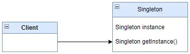

# Java: Double check locking pattern


There are a lot article about double check locking pattern, but maybe this article will add more understanding to this pattern.

Double-checked locking is a design pattern used to reduce the overhead of acquiring locks by first testing the locking condition without holding the lock. If the condition passes, the lock is acquired, and the condition is checked again within the critical section. Here’s a Java example demonstrating double-checked locking:



```java
public class Singleton {
    private static volatile Singleton instance;

    private Singleton() {}

    public static Singleton getInstance() {
        if (instance == null) {
            synchronized (Singleton.class) {
                if (instance == null) {
                    instance = new Singleton();
                }
            }
        }
        return instance;
    }
}
```

In this example:

- The Singleton class ensures that only one instance of Singleton can be created.
- The instance variable is declared as volatile. This ensures that multiple threads handle the instance variable correctly when it is being initialized to the Singleton instance. Without volatile, there’s a possibility that one thread might see a partially initialized instance.
- In the getInstance() method, the first check of instance == null is performed outside of the synchronized block. This is the “double-check” part. It’s done to avoid the overhead of synchronization if the instance is already initialized.
- If the first check fails, meaning the instance might not have been initialized, the method proceeds into a synchronized block to ensure mutual exclusion.
- Inside the synchronized block, another check for instance == null is performed. This is to handle the race condition where multiple threads might have passed the first check and are waiting to acquire the lock.
- If the instance is still null inside the synchronized block, it means no other thread has initialized it, so the Singleton instance is created.

This implementation achieves thread-safety and also avoids the performance overhead of synchronizing the whole method by only synchronizing the critical section where the instance is created. However, double-checked locking is not always necessary in modern Java applications, as safer and more efficient alternatives, like using java.util.concurrent utilities, are available.

More complex example from ICU4J project (maybe for now it already fixed):

```java
private static volatile TextTrieMap<TZDBNameInfo> TZDB_NAMES_TRIE = null;

private static void prepareFind() {
    if (TZDB_NAMES_TRIE == null) {
        synchronized(TZDBTimeZoneNames.class) {
            if (TZDB_NAMES_TRIE == null) {
                TZDB_NAMES_TRIE = new TextTrieMap<TZDBNameInfo>(true);
                Set<String> mzIDs = TimeZoneNamesImpl._getAvailableMetaZoneIDs();
                for (String mzID : mzIDs) {
                    ...
                    TZDB_NAMES_TRIE.put(std, stdInf);
                    ...
                }
            }
        }
    }
}
```
For first view there is everything ok with this code. But this is only for first view. If we will run this under multithread loading. This code will break.

There are few tricky places.

The code snippet you provided appears to implement the double-checked locking pattern to lazily initialize the TZDB_NAMES_TRIE object. However, there's a subtle issue with this implementation known as the "double-checked locking problem".

The problem arises due to possible reordering of operations by the compiler and the CPU’s memory model. Even though the TZDB_NAMES_TRIE variable is declared as volatile, which helps ensure visibility of changes across threads, it doesn’t prevent other issues related to the order of operations within the synchronized block.

The problematic scenario occurs when multiple threads simultaneously pass the first null check (if (TZDB_NAMES_TRIE == null)), then one of the threads enters the synchronized block and initializes the TZDB_NAMES_TRIE, while the other threads wait outside the synchronized block. When the first thread completes the initialization and releases the lock, the waiting threads may not see the updated value of TZDB_NAMES_TRIE and mistakenly initialize it again.

To fix this issue, you can ensure that all the instructions related to creating and assigning the new instance of TZDB_NAMES_TRIE are not reordered. One way to achieve this is by using the volatile keyword in combination with a separate holder class for the instance. Here’s an example of how you can modify the code


```java
private static class TrieHolder {
    static final TextTrieMap<TZDBNameInfo> INSTANCE = new TextTrieMap<>(true);
}

private static volatile boolean initialized = false;

private static void prepareFind() {
    if (!initialized) {
        synchronized (TZDBTimeZoneNames.class) {
            if (!initialized) {
                Set<String> mzIDs = TimeZoneNamesImpl._getAvailableMetaZoneIDs();
                for (String mzID : mzIDs) {
                    ...
                    TrieHolder.INSTANCE.put(std, stdInf);
                    ...
                }
                initialized = true;
            }
        }
    }
}
```


In this modified version:

- The TextTrieMap<TZDBNameInfo> instance is held within a static inner class TrieHolder.
- The initialized flag is used to track whether the TZDB_NAMES_TRIE has been initialized.
- The double-checked locking is performed on the initialized flag instead of directly on TZDB_NAMES_TRIE.
- Once initialized, subsequent threads will not attempt to initialize it again.

This approach ensures that the initialization of TZDB_NAMES_TRIE is properly synchronized and visible to all threads, effectively avoiding the double-checked locking problem.

When working with double-checked locking in Java, there are several important points to keep in mind:

- Visibility and Ordering: Prior to Java 5, double-checked locking could fail due to visibility issues. Variables not declared volatile might not be visible across threads, leading to inconsistencies. From Java 5 onward, the volatile keyword ensures proper visibility, but the ordering of operations still needs to be considered to prevent the double-checked locking problem.
- Happens-Before Relationship: In Java, acquiring a lock on a monitor (via synchronized) establishes a “happens-before” relationship, ensuring that any actions in a synchronized block are visible to any subsequent acquisition of the same lock. This means that any changes made within a synchronized block are guaranteed to be visible to other threads that subsequently enter the same synchronized block.
- Use Cases: Double-checked locking is typically used for lazy initialization of expensive-to-create objects, where the overhead of synchronization should be minimized. It’s important to ensure that lazy initialization is truly necessary and that the object being initialized is immutable or safely publishable, as double-checked locking can be complex and error-prone.
- Alternatives: While double-checked locking can be effective when used correctly, alternatives such as the Initialization-on-demand holder idiom (using a static inner class) or the java.util.concurrent.atomic package (e.g., AtomicReference) provide simpler and safer ways to achieve lazy initialization without the risk of subtle concurrency bugs.
- Considerations for Modern Java: With the advancements in Java concurrency utilities and patterns, such as java.util.concurrent, Atomic classes, and ConcurrentHashMap, the need for explicit double-checked locking has diminished. In modern Java development, it’s often recommended to leverage these utilities instead of implementing complex synchronization patterns.
- Testing and Review: Due to its complexity and potential for subtle bugs, double-checked locking should be thoroughly tested and reviewed by experienced developers. Code reviews and testing for concurrency issues, including race conditions and visibility problems, are essential to ensure correctness and robustness.
- Performance Considerations: While double-checked locking can reduce synchronization overhead in certain scenarios, it’s important to measure and profile performance to ensure that the benefits outweigh the complexity and risks introduced by the pattern. In many cases, simpler alternatives may offer comparable or better performance with less risk.

By understanding these aspects and considering the trade-offs involved, developers can effectively use double-checked locking when appropriate or choose alternative concurrency patterns for safer and more maintainable code.

Full example you can find on [Github](https://github.com/alxkm/articles/blob/master/src/main/java/org/alx/article/_18_java_double_check_locking_pattern/Singleton.java).