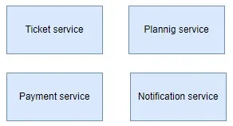
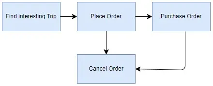

# Java: Event Driven architecture

Some aspects of event driven architecture with examples


Nowadays, one of the most important and interesting architecture patterns is event-driven architecture. Let’s imagine and analyze such a practical butt. It is clear that we are developing a microservice project for purchasing tickets. We have divided the domain model of the project so much that we have identified 4 microservices:

- Reservation ticket service — responsible for tickets and orders.
- Planning trips service — manages routes and trips.
- Payment service — payment system integration and handles payments.
- Notification service — sends notifications via email, sms, other.



UI plan

We will have for the four main pages in the application:

Find Route for Trip Page:
- Allows users to search for routes for their trips.
- Users can enter their starting point and destination to find available routes.
- The page displays various options for routes, including duration, cost, and stops along the way.
- Users can select a route and proceed to book tickets or place an order.

Place Order Page:
- Users can select a route from the options provided on the Find Route for Trip page.
- The page allows users to enter details such as the number of tickets, passenger information, and any additional preferences.
- Once the order details are entered, users can proceed to the payment stage.

Buy Order Page:
- This page handles the payment process for the order placed on the Place Order page.
- Users can choose from various payment methods such as credit/debit card, online banking, or digital wallets.
- After completing the payment, users receive a confirmation of their order, including ticket details and trip information.
- Users can proceed to view their order details or cancel the order if necessary.

Cancel Order Page:
- Users can cancel their order at two stages: while placing the order and after purchasing the order.
- During the placing order stage, users can cancel the order before proceeding to payment.
- After purchasing the order, users can cancel it within a specified time frame, subject to cancellation policies.
- The Cancel Order page allows users to view their order history and select the order they wish to cancel.
- Users confirm the cancellation, and the system processes the request, providing a confirmation of the cancellation.



These pages together form the main user journey for booking trips, placing orders, and managing bookings in the application. Each page serves a specific purpose and provides users with the necessary functionality to complete their desired actions.

Each stage is represented as a distinct screen within the client application. During the payment process, users choose their preferred payment method and its associated details. They then proceed to either confirm the payment or opt to save the order, reserving a spot with the flexibility to pay at a later time.

Payment for an order, like any financial transaction, can take a considerable amount of time. It may involve other financial (banking) websites and systems, including authorization processes, and so forth. How does our system know that the payment has been successfully processed? When we send a request to the payment system, we trigger a callback from our API, which will be the payment service API. But how do other services become aware of this? For example, the ticketing service will need to update the order status, the notification service will need to inform the client and send the ticket along with the notification. The trip service will also be involved in this chain because it needs to mark a seat as sold.

Payment operations must adhere to the principles of atomicity, consistency, isolation, and durability (ACID) to ensure reliability and data integrity. In a distributed environment involving multiple microservices, payment transactions become distributed transactions, requiring careful handling to ensure correctness and rollback in case of errors.

Implementing such a system typically involves using standard approaches like REST APIs. However, handling complex scenarios such as service unavailability can be challenging. Storing failed cases for future processing may introduce delivery issues, as it requires a mechanism to guarantee eventual processing.

Moreover, ensuring atomicity and rollback operations often necessitates supporting operations akin to those in the SAGA pattern. This approach involves orchestrating a series of compensating actions to revert changes made during a transaction in case of failure. Thus, designing a robust payment system involves considering these factors and implementing appropriate error handling and rollback mechanisms.

To solve this we need to avoid coupling of our microservices, and resolve problem of storing and correctly handling system falls. And looks like here will be good way to use some messaging architectures and patterns.

### Event-driven architecture (EDA)

Event-driven architecture (EDA) is a design pattern where components within a system communicate with each other by producing and consuming events. In EDA, components are loosely coupled and interact asynchronously through events. Here’s how we can implement an event-driven architecture for ticket system:

- Events: Define the types of events that will be exchanged between services. In this example, events may include “TicketReservedEvent,” “TripScheduledEvent,” “NotificationSentEvent,” and “PaymentProcessedEvent.”
- Event Producer: Each service acts as an event producer, generating events when certain actions occur. For example, the Ticketing Service produces a “TicketReservedEvent” when a ticket is reserved.
- Event Consumer: Services subscribe to events they are interested in and react accordingly. For instance, the Notification Service subscribes to the “TicketReservedEvent” and sends notifications to the user.
- Event Bus/Queue: Use a message broker or a queue system to facilitate communication between services. Common choices include Apache Kafka, RabbitMQ, or Amazon SQS. For this example, we can use Apache Kafka due to its scalability and fault-tolerance.
- Integration: Each service integrates with the chosen message broker to publish events and consume events relevant to its functionality.

### Pros:

- Loose Coupling: EDA promotes loose coupling between system components. Components communicate indirectly through events, allowing them to evolve independently without affecting each other.
- Scalability: EDA enables horizontal scalability by distributing event processing across multiple nodes. As the system grows, you can add more event consumers to handle the load.
- Flexibility: EDA provides flexibility in system design. New features can be added by introducing new event types and handlers without modifying existing components.
- Asynchronous Communication: Events are typically processed asynchronously, which improves system responsiveness and resilience. Components can continue functioning even if some event consumers are temporarily unavailable.
- Decoupled Systems Integration: EDA facilitates integration between disparate systems. Systems can exchange data and trigger actions by publishing and subscribing to events, without direct dependencies.


### Cons

- Complexity: Implementing EDA introduces additional complexity, especially in managing event routing, handling failures, and ensuring event consistency across the system.
- Event Ordering: Ensuring the correct order of events can be challenging in EDA, especially in distributed systems. Events may arrive out of order, requiring mechanisms to handle this scenario.
- Debugging and Monitoring: Tracking and debugging event flows in EDA systems can be difficult, especially in complex scenarios with multiple event producers and consumers.
- Eventual Consistency: EDA often relies on eventual consistency, where updates to the system propagate through events asynchronously. Achieving strong consistency may require additional coordination and complexity.
- Potential Overhead: Handling events and managing event-driven infrastructure may introduce overhead, especially in terms of resource utilization and latency compared to synchronous communication.

Now, let’s define the main classes for each service:

Ticketing Service:
- TicketingService: Manages ticket reservations and orders.
- TicketReservedEvent: Event indicating a ticket reservation.
- TicketReservedEventHandler: Handles the “TicketReservedEvent” by updating ticketing-related information.
Trip Service:
- TripService: Manages routes and trips.
- TripScheduledEvent: Event indicating the scheduling of a trip.
- TripScheduledEventHandler: Reacts to the “TripScheduledEvent” by updating trip-related data.
Notification Service:
- NotificationService: Sends notifications to users.
- NotificationSentEvent: Event indicating that a notification has been sent.
- NotificationSentEventHandler: Processes the “NotificationSentEvent” to record sent notifications.
Payment Service:
- PaymentService: Handles payments and integrates with payment systems.
- PaymentProcessedEvent: Event signaling a processed payment.
- PaymentProcessedEventHandler: Manages post-payment actions, such as updating payment status.
Queue:
- EventQueue: Represents the message broker or queue system used for event communication. For Apache Kafka, use the KafkaProducer and KafkaConsumer classes to publish and consume events, respectively.
By implementing this event-driven architecture, the system becomes more resilient, scalable, and decoupled, allowing for easier maintenance and evolution of the individual services.


High level classes structure

```java
// Event classes
public class TicketReservedEvent {
private String ticketId;
}

public class TripScheduledEvent {
private String tripId;
}

public class NotificationSentEvent {
private String notificationId;
}

public class PaymentProcessedEvent {
private String paymentId;
}

public interface EventHandler<T> {
void handleEvent(T event);
}

// Ticketing Service
public class TicketingService {
// Method to reserve a ticket and publish a TicketReservedEvent
public void reserveTicket(String ticketId) {
TicketReservedEvent event = new TicketReservedEvent(ticketId);
EventQueue.publish(event);
}
}

public class TicketReservedEventHandler implements EventHandler<TicketReservedEvent> {
@Override
public void handleEvent(TicketReservedEvent event) {
// Handle TicketReservedEvent logic...
}
}

// Trip Service
public class TripService {
// Method to schedule a trip and publish a TripScheduledEvent
public void scheduleTrip(String tripId) {
// Schedule trip logic...
TripScheduledEvent event = new TripScheduledEvent(tripId);
EventQueue.publish(event);
}
}

public class TripScheduledEventHandler implements EventHandler<TripScheduledEvent> {
@Override
public void handleEvent(TripScheduledEvent event) {
// Handle TripScheduledEvent logic...
}
}

// Notification Service
public class NotificationService {
// Method to send a notification and publish a NotificationSentEvent
public void sendNotification(String notificationId) {
// Send notification logic...
NotificationSentEvent event = new NotificationSentEvent(notificationId);
EventQueue.publish(event);
}
}

public class NotificationSentEventHandlerimplements EventHandler<NotificationSentEvent{
@Override
public void handleEvent(TripScheduledEvent event) {
// Handle TripScheduledEvent logic...
}
}
```


This article provides a concise overview of the advantages and disadvantages of event-driven architecture (EDA). While it offers a glimpse into the benefits and challenges associated with this architectural approach, a deeper exploration of its implementation can be achieved through the utilization of Java technologies such as Kafka and Spring Integration. It’s worth noting that the examples and discussions in this article are tailored specifically for Java-based environments.


