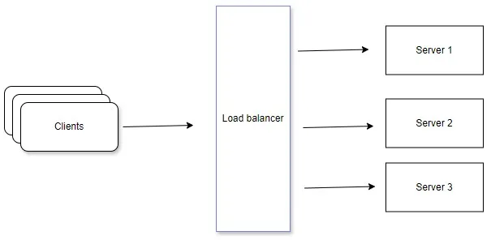
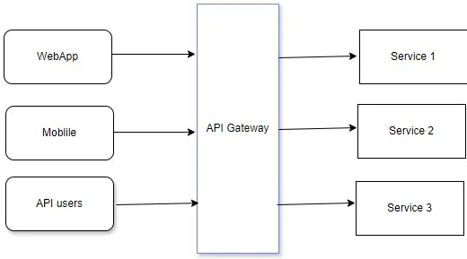
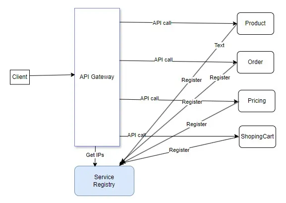
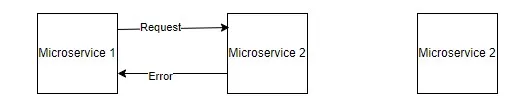
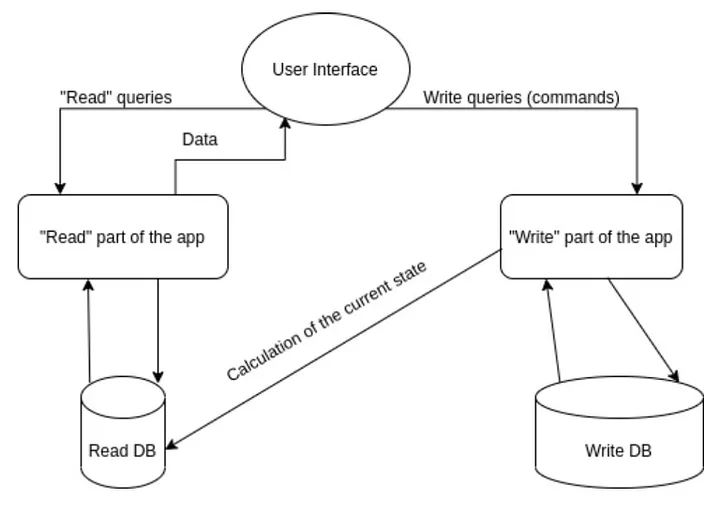
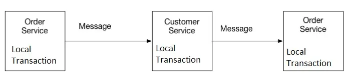
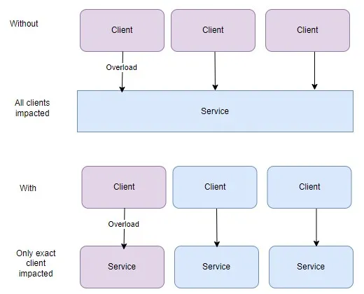

# Java: Microservices Architecture Patterns, Exploring the Essential

Microservices architecture has become increasingly popular in modern software development due to its scalability, flexibility, and resilience. However, building and managing microservices-based systems come with its own set of challenges. To address these challenges effectively, developers often rely on established patterns and best practices. In this article, we will delve into the main microservices patterns that enable developers to design robust, maintainable, and scalable distributed systems. By understanding these patterns, developers can make informed architectural decisions and effectively tackle the complexities of building microservices-based applications.

In this we will review the main microservice patterns. Which are used commonly and very often. Each of this patterns can be easily fill full article, but we briefly describe them. Also all this patterns must know for every modern backend engineer interview.

Microservices architecture offers various patterns and practices to design and implement scalable, resilient, and maintainable systems composed of loosely coupled microservices. Some of the main microservices patterns include:

### Service Decomposition.

This pattern involves decomposing a monolithic application into smaller, independent services, each responsible for a specific business capability or domain. It aims to create cohesive and loosely coupled services that can be developed, deployed, and scaled independently.

### Load balancing

It is hard question is this design pattern or not but load balancing is a critical component of modern web architecture, especially in distributed systems where multiple server instances handle incoming requests. It involves distributing incoming network traffic across multiple servers to optimize resource utilization, maximize throughput, minimize response time, and ensure high availability and fault tolerance.

### API Gateway.

The API Gateway pattern provides a single entry point for clients to access multiple microservices. It acts as a reverse proxy that routes requests to the appropriate services, aggregates responses, and performs cross-cutting concerns such as authentication, authorization, and rate limiting.

### Service Registry and Discovery.
In a distributed microservices environment, services need a way to discover and communicate with each other dynamically. The Service Registry pattern involves maintaining a central registry or service discovery mechanism where services can register themselves and discover other services based on their metadata.

### Circuit Breaker
The Circuit Breaker pattern helps prevent cascading failures in distributed systems by monitoring the health of remote services. When a service or downstream dependency fails repeatedly, the circuit breaker opens and temporarily blocks requests to that service, allowing it to recover or fail gracefully.

### Event Sourcing
Event Sourcing involves capturing all changes to an application’s state as a sequence of immutable events. Each event represents a state transition and is stored in an event log. This pattern enables auditability, scalability, and the ability to reconstruct application state at any point in time.

### CQRS (Command Query Responsibility Segregation)
CQRS separates the read and write operations of an application into distinct components. Commands are responsible for mutating state, while queries are responsible for reading data. This pattern allows for optimized read and write models, scalability, and flexibility in handling different types of data access.

### Saga Pattern
The Saga pattern manages long-lived, distributed transactions in a microservices architecture by orchestrating a series of local transactions within each service. If a transaction fails or needs to be compensated, the saga coordinates compensating transactions across multiple services to maintain consistency. In essence, a saga is a sequence of local transactions, each executed by a single microservice, that together achieve a larger transactional goal. Unlike traditional distributed transactions, where all operations succeed or fail together, a saga breaks down a transaction into smaller, independent steps that can be executed in a coordinated manner.

### Externalized Configuration
Externalized Configuration involves storing configuration settings (such as service endpoints, database connections, and feature toggles) outside the application codebase. This pattern allows for easy configuration management, versioning, and dynamic updates without redeploying services.

### Bulkhead
The Bulkhead pattern isolates components or resources within a microservices architecture to prevent failures in one part of the system from affecting others. It involves partitioning services into separate pools or compartments with their own resources, such as thread pools, databases, or message queues.

### Retry
The Retry pattern involves automatically retrying failed operations or requests in case of transient faults or errors. By retrying operations with backoff and jitter strategies, this pattern improves system resilience and availability in the face of network issues or temporary failures.

### Throttling
Throttling is a microservices pattern used to control the rate at which requests are processed or resources are accessed within a distributed system. This pattern helps prevent overload and ensures that services can handle incoming requests without becoming overwhelmed. Throttling can be applied at various levels of the application stack, including the API gateway, individual services, or even specific operations within a service. At the API gateway level, throttling can be used to limit the number of incoming requests from external clients. This prevents sudden spikes in traffic from overwhelming downstream services and helps maintain system stability. Throttling policies can be based on factors such as request rate, user identity, or API usage quotas. Within individual services, throttling can be applied to limit the rate at which certain operations are executed. For example, a service may implement rate limiting on resource-intensive operations to prevent them from monopolizing system resources. Throttling can also be used to prioritize critical operations over less important ones during periods of high load.

Implementing throttling requires careful consideration of factors such as the desired throughput, acceptable latency, and resource utilization. Additionally, developers must strike a balance between enforcing rate limits to protect system integrity and allowing sufficient flexibility for legitimate usage.

Overall, throttling is a valuable pattern for managing resource consumption and maintaining the performance and reliability of microservices-based architectures. By implementing throttling mechanisms effectively, developers can ensure that their systems remain responsive and resilient under varying load conditions.

### Sticky session

The sticky session design pattern, also known as session affinity or client affinity, is a technique used in distributed web applications to maintain session state consistency for a user’s requests by directing subsequent requests from the same client to the same server instance.

In a typical web application environment with multiple server instances (also known as nodes or instances) behind a load balancer, each server may have its own local session state for a user. Without sticky sessions, subsequent requests from the same user might be directed to different server instances by the load balancer. As a result, the session state would not be consistent across requests, leading to potential issues such as loss of session data or unexpected behavior.

To address this challenge, the sticky session pattern ensures that once a user’s initial request is directed to a specific server instance by the load balancer, all subsequent requests from that user during the session are routed to the same server instance. This is achieved by associating a unique identifier, such as a session ID or client IP address, with the user’s session and using this identifier to determine which server instance should handle the request.

These patterns are commonly used to address various challenges and requirements in microservices architectures, such as scalability, fault tolerance, consistency, and operational efficiency. Depending on the specific needs of an application, multiple patterns may be combined to design robust and adaptable microservices solutions.
