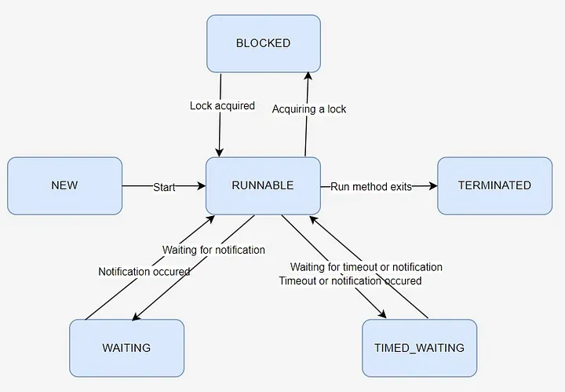

# Navigating Java’s Multithreading Terrain Pt. 1. Dining Philosophers


My other articles of concurrency and multithreading:
> 
HERE [Navigating Java’s Multithreading Terrain Pt. 1. Dining Philosophers](https://medium.com/@alxkm/navigating-javas-multithreading-terrain-dining-philosophers-34f1385e2150)

[Navigating Java’s Multithreading Terrain Pt. 2](https://medium.com/@alxkm/navigating-javas-multithreading-terrain-part-2-fd0d541a973c)

[Unlocking Concurrent Power: A Guide to java.util.concurrent Pt. 1](https://medium.com/@alxkm/unlocking-concurrent-power-a-guide-to-java-util-concurrent-pt-1-b1342edadad1)

[Unlocking Concurrent Power: A Guide to java.util.concurrent Pt. 2.](https://medium.com/@alxkm/unlocking-concurrent-power-a-guide-to-java-util-concurrent-pt-2-056f1da1e74a)

Welcome back, fellow Java enthusiasts! If you’ve been following along with my blog, you’ve likely delved into the fascinating world of Java multithreading through various interview questions. Now, it’s time to take a step back and ensure we have a solid grasp on the fundamentals of this crucial topic.

In this comprehensive review, we’ll cover everything you need to know to navigate the intricacies of multithreading in Java. We’ll start by exploring the fundamental distinction between processes and threads, laying the groundwork for understanding how Java leverages threads for concurrent execution.

In this article we will review next topics:
- Process and Threads
- Creating and Managing Threads in Java
- Thread states
- Terminating Threads
- Thread Switching
- Thread Sleeping with Thread.sleep()
- Thread Yielding with Thread.yield()
- Synchronization Techniques in Java
- Volatile Keyword in Java and its Use Cases
- Semaphores and Mutex
- The Dining Philosophers problem

### Difference between Processes and Threads

Processes and threads are both units of execution, but they operate at different levels of abstraction. A process is an independent entity that consists of its own memory space, resources, and execution context, while a thread is a subset of a process, sharing its memory and resources but having its own execution path. In essence, processes are heavyweight, isolated units, while threads are lighter-weight, cooperative units that enable concurrent execution within a process.

Processes:

- A process is an independent entity in an operating system that consists of its own memory space, resources, and execution environment.
- Each process has its own address space, code, data, and system resources.
- Processes are heavyweight entities and switching between processes requires context switching, which can be resource-intensive.

Threads:

- Threads exist within a process and share the same memory space and resources with other threads in that process.
- Threads are lighter-weight than processes and can be considered as the smallest unit of execution within a process.
- Multiple threads within a process can execute concurrently, allowing for better resource utilization.

### Creating and Managing Threads in Java

In Java, you can create and manage threads in several ways:

- Extending the Thread class: Create a class that extends the Thread class and overrides the run() method. Instantiate the class and call start() to begin thread execution.
- Implementing the Runnable interface: Implement the Runnable interface, override the run() method, and pass the Runnable instance to a Thread object. Start the thread using the start() method.

Example using Runnable interface:

```java
public class MyRunnable implements Runnable {
 public void run() {
   // Thread logic goes here
 }

 public static void main(String[] args) {
   MyRunnable myRunnable = new MyRunnable();
   Thread thread = new Thread(myRunnable);
   thread.start();
 }
}
```

### Thread states:

1. New State
2. Runnable State
3. Blocked State
4. Waiting State
5. Timed Waiting State
6. Terminated State

In Java, a thread can exist in one of several states during its lifetime. These states are:

- NEW: The thread is created but not yet started via the start() method.
- RUNNABLE: The thread is ready to run and waiting for CPU time. When the start() method has been invoked, the thread enter to the runnable state. It could be running or waiting for its turn to execute.
- BLOCKED: The thread is temporarily inactive. It’s waiting for a monitor lock to enter a synchronized block or waiting for some other condition to be satisfied before it can proceed.
- WAITING: This state is reached when a thread awaits notification from another thread, typically as a result of invoking methods such as Object.wait() or Thread.join(). Also, the thread enters WAITING when it awaits a Lock or Condition in the java.util.concurrent package. Upon another thread invoking Object.notify()/notifyAll() or Condition.signal()/signalAll(), the waiting thread transitions back to the runnable state.
- TIMED_WAITING: The thread is waiting for a specified amount of time. This state occurs when a thread calls methods like sleep() or wait(timeout).
- TERMINATED: The thread has completed its execution or been stopped, or finished run() and exits normally.



```java
public class ThreadStateExample {
    public static void main(String[] args) throws InterruptedException {
        Thread t = new Thread(() -> {
            Thread self = Thread.currentThread();
            printThreadState(self, "Initial State"); // Print initial state
            try {
                Thread.sleep(1000); // Simulate some work
            } catch (InterruptedException e) {
                e.printStackTrace();
            }
        });
        printThreadState(t, "Before start");
        t.start();
        printThreadState(t, "After start");
        t.join();
        printThreadState(t, "After joint");
    }

    // Method to print thread state
    private static void printThreadState(Thread thread, String message) {
        System.out.println(thread.getName() + " is " + thread.getState() + " - " + message);
    }
}
```

```java
//output
Thread-0 is NEW - Before start
Thread-0 is RUNNABLE - After start
Thread-0 is RUNNABLE - Initial State
Thread-0 is TERMINATED - After joint
```

### Terminating Threads

In Java, terminating a thread involves careful preparation within the thread implementation code. While the Thread class does provide a stop() method, it’s deprecated due to its inability to ensure the thread’s state upon termination. With the original stop() method, the state of Java objects accessed by the thread remains uncertain, potentially leading to unexpected behavior if other threads are concurrently accessing the same objects.

Rather than relying on the deprecated stop() method, it’s advisable to implement custom logic within the thread code to handle termination gracefully. For instance, consider a Runnable implementation equipped with a doStop() method. This method serves to signal the Runnable to halt its execution. Within the Runnable, this signal is periodically checked, allowing the thread to gracefully terminate when appropriate.

In Java, there are several recommended approaches to terminate a thread gracefully:

- Using a Boolean Flag: Implement a boolean flag within your thread class to indicate whether the thread should continue running. Periodically check this flag within the thread’s main loop, and exit the loop when the flag is set to false.

```java
public class MyThread extends Thread {
    private volatile boolean running = true;

    public void run() {
        while (running) {
            // Thread's main logic
        }
    }

    public void stopThread() {
        running = false;
    }
}
```
- Interrupting the Thread: Use the interrupt() method to interrupt the thread’s execution. Within the thread’s main logic, regularly check if the thread has been interrupted using the isInterrupted() method, and exit the loop if interrupted.


```java
public class MyThread extends Thread {
    public void run() {
        while (!Thread.currentThread().isInterrupted()) {
            // Thread's main logic
        }
    }
}
```

- Using Thread.join(): If you have a reference to the thread you want to terminate, you can call join() on that thread to wait for its completion. This method will block the calling thread until the specified thread completes execution.

```java
Thread myThread = new MyThread();
myThread.start();
// Wait for the thread to complete or specify a timeout
myThread.join();
```

It’s important to note that forcibly stopping a thread using methods like stop() or destroy() is discouraged because they can leave the program in an inconsistent state. Instead, prefer the above approaches to gracefully terminate threads in Java.

Thread priority
To control the importance and order of work of different threads, there is a priority. Priority is one of the key factors in the system’s selection of a thread to execute. You can set a thread’s priority using the setPriority(int) method.

It can have a numeric value from 1 to 10.
By default, the main thread is set to medium priority is 5
For this, next constants are declared in the Thread class:

```java
static final int MAX_PRIORITY = 10
static final int NORM_PRIORITY = 5
static final int MIN_PRIORITY = 1
```
### Thread Switching

Joining a Thread with join() Joining a thread using the join() method allows the calling thread to wait until the specified thread completes its execution.

Here’s an example of using the join() method:

```java
Thread thread1 = new Thread(() -> {});
Thread thread2 = new Thread(() -> {});
Thread thread3 = new Thread(() -> {});
thread1.start(); // Start the other thread
try {
    thread1.join(); // Wait for the other thread to complete
} catch (InterruptedException e) {
    e.printStackTrace();
}
thread2.start();
thread3.start();
```

### Thread Sleeping with Thread.sleep()

The function of the Thread.sleep() method is to pause the thread’s execution for a specified duration. It’s commonly utilized within child threads when there’s a need to perform periodic actions without overwhelming system resources. It’s worth noting that a sleeping thread can be awakened prematurely.

```java
Thread.sleep(2000); // Pause execution for 2 seconds
```

Upon waking up, the thread transitions back to the runnable state. However, it’s important to understand that this doesn’t guarantee immediate execution by the Thread Scheduler.

### Thread Yielding with Thread.yield()

Thread.yield() functions similarly to Thread.sleep(0), essentially giving up the thread’s current time slice. In other words, each thread is allocated a quantum of processor time, and when that time expires, the processor switches to another thread.

Calling Thread.yield() prematurely ends the current thread’s time slice, allowing the processor to move on to the next thread in the queue.

### Synchronization Techniques in Java

Full of this process I already described in this article: [Mastering Synchronization: Best Practices and Patterns in Java](https://medium.com/@alxkm/mastering-synchronization-best-practices-and-patterns-in-java-86214b53211d).

But here is brief review of main ideas:
In Java, synchronization techniques are used to control access to shared resources among multiple threads to prevent data corruption and ensure consistency. Some synchronization techniques include:

**Synchronized methods**: Use the synchronized keyword to make methods mutually exclusive for concurrent threads.
**Synchronized blocks**: Use synchronized blocks to lock specific code sections critical for concurrent access using an object’s intrinsic lock.
**ReentrantLock**: A more flexible lock mechanism provided by java.util.concurrent.locks.ReentrantLock allowing finer control over locking.


### Volatile Keyword in Java and its Use Cases

The volatile keyword in Java is used to declare that a variable’s value may be modified by multiple threads. It ensures that any read of the variable by a thread will reflect the most recent write by another thread.


Use cases of volatile keyword:

- Visibility Guarantee: Ensures changes made by one thread to a volatile variable are immediately visible to other threads.
- Avoiding Compiler Optimizations: Prevents certain compiler optimizations that might reorder or cache the variable’s value.
- Non-atomic Operations: Used in scenarios where simple read/write operations need to be atomic but aren’t covered by atomic classes like AtomicInteger.

```java
public class VolatileExample {
 private volatile boolean flag = false;

 public void toggleFlag() {
   flag = !flag;
 }

 public boolean isFlag() {
   return flag;
 }
}
```

The volatile keyword in this example guarantees that changes made to the flag variable are immediately visible to all threads, ensuring consistent behavior in a multithreaded environment.

More interesting example for volatile usage is this article: [Java: Double check locking pattern](https://medium.com/@alxkm/java-double-check-locking-pattern-3f8782e9d01e).

### Semaphores and Mutex

In Java, semaphores and mutexes are synchronization mechanisms used to control access to shared resources in multithreaded environments.

Mutex (Mutual Exclusion):

- A mutex, short for mutual exclusion, is a synchronization primitive that ensures only one thread can access a shared resource at a time.
- In Java, mutexes are typically implemented using synchronized blocks or the Lock interface from the java.util.concurrent.locks package.
- When a thread acquires a mutex lock, it gains exclusive access to the resource, preventing other threads from accessing it until the lock is released.

Semaphore:

- A semaphore is a synchronization construct that allows a fixed number of threads to access a shared resource simultaneously.
- Semaphores maintain a set of permits, which represent the number of available slots for concurrent access to the resource.
- Threads can acquire permits from the semaphore to access the resource and release them when they are finished.
- In Java, semaphores are implemented using the Semaphore class from the java.util.concurrent package.
- Semaphores can be used to control access to resources with limited capacity, such as connection pools or bounded buffers.

### The Dining Philosophers problem

The Dining Philosophers problem is a classic synchronization problem that illustrates the challenges of resource allocation and deadlock avoidance in concurrent programming. It imagines a scenario where a group of philosophers sits around a table with a bowl of spaghetti. Each philosopher spends their time alternating between thinking and eating. However, to eat, a philosopher must use two forks, one on their left and one on their right.

The problem arises when multiple philosophers attempt to acquire the forks simultaneously, potentially leading to a deadlock if they each hold one fork and wait indefinitely for the other. The challenge is to design a solution that allows the philosophers to dine without encountering deadlock or starvation.

Several solutions have been proposed to address the Dining Philosophers problem, including:

1. Resource Hierarchy: Assign a numerical identifier to each fork and require philosophers to acquire forks in a predefined order, such as always picking up the lower-numbered fork first. This approach prevents circular wait conditions.
2. Resource Allocation: Introduce a mechanism to limit the number of philosophers allowed to pick up forks simultaneously, such as using semaphores or monitors to control access to the forks.
3. Asymmetric Solutions: Allow philosophers to be asymmetric, where some may have different behaviors or priorities than others. For example, one philosopher could be designated as left-handed, always picking up the left fork first.
4. Timeouts: Implement a mechanism where philosophers release their forks after a certain period of time if they cannot acquire the second fork, preventing deadlock by breaking potential circular wait conditions.

These solutions demonstrate various approaches to solving the Dining Philosophers problem while ensuring that philosophers can eat without encountering deadlock or starvation. The problem serves as an important illustration of concurrency challenges and techniques for managing shared resources in multithreaded environments.

Try to do it yourself. This problem can be solved using Semaphore from java.util.concurrent.

Solution to the Dining Philosophers problem using semaphores:

```java
import java.util.concurrent.Semaphore;

public class DiningPhilosophers {
    private static final int NUM_PHILOSOPHERS = 5;
    private static Semaphore[] forks = new Semaphore[NUM_PHILOSOPHERS];
    private static Semaphore dining = new Semaphore(NUM_PHILOSOPHERS - 1);

    public static void main(String[] args) {
        for (int i = 0; i < NUM_PHILOSOPHERS; i++) {
            forks[i] = new Semaphore(1);
        }

        for (int i = 0; i < NUM_PHILOSOPHERS; i++) {
            final int philosopherId = i;
            new Thread(() -> {
                try {
                    while (true) {
                        think(philosopherId);
                        eat(philosopherId);
                    }
                } catch (InterruptedException e) {
                    e.printStackTrace();
                }
            }).start();
        }
    }

    private static void think(int philosopherId) throws InterruptedException {
        System.out.println("Philosopher " + philosopherId + " is thinking.");
        Thread.sleep((long) (Math.random() * 1000));
    }

    private static void eat(int philosopherId) throws InterruptedException {
        dining.acquire(); // Limit the number of philosophers dining

        forks[philosopherId].acquire(); // Acquire left fork
        forks[(philosopherId + 1) % NUM_PHILOSOPHERS].acquire(); // Acquire right fork

        System.out.println("Philosopher " + philosopherId + " is eating.");
        Thread.sleep((long) (Math.random() * 1000));

        forks[(philosopherId + 1) % NUM_PHILOSOPHERS].release(); // Release right fork
        forks[philosopherId].release(); // Release left fork

        dining.release(); // Allow another philosopher to dine
    }
}
```

Solution description:

- Each philosopher is represented by a thread.
- Semaphores are used to represent the forks, with each semaphore initialized with one permit (indicating the fork is available).
- Another semaphore, dining, limits the number of philosophers allowed to eat simultaneously to prevent deadlock.
- The think() method simulates the philosopher thinking for a random amount of time.
- The eat() method represents the critical section where the philosopher tries to acquire both forks, eats for a random amount of time, and then releases the forks.
- The main method creates threads for each philosopher, and they continuously alternate between thinking and eating.

### Conclusion

In conclusion, we’ve delved into some crucial topics of Java multithreading within the context of the Dining Philosophers problem. Each of these topics — mutexes, semaphores, deadlock avoidance, and resource allocation — merits a deep dive of its own, capable of filling entire articles or even books. However, the aim here was to provide a brief introduction, offering insights into the complexities of concurrent programming and the challenges of managing shared resources in multithreaded environments.

By exploring solutions to the Dining Philosophers problem using semaphores, we’ve gained valuable insights into synchronization mechanisms and strategies for ensuring thread safety. These concepts are fundamental to mastering Java multithreading and building robust, scalable applications capable of harnessing the full power of modern computing hardware.

As you continue your journey into the world of concurrent programming, I encourage you to explore each topic in more depth, experiment with different synchronization techniques, and apply these principles to real-world scenarios. With a solid understanding of Java multithreading fundamentals, you’ll be well-equipped to tackle complex concurrency challenges and build high-performance, resilient software systems.

You can find some examples at [Github](https://github.com/alxkm/articles/tree/master/src/main/java/org/alx/article/_28_threads_fundamentals).