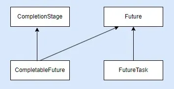

# Unlocking Concurrent Power: A Guide to java.util.concurrent Pt. 2


My other articles of concurrency and multithreading:
[Navigating Java’s Multithreading Terrain Pt. 1. Dining Philosophers](https://medium.com/@alxkm/navigating-javas-multithreading-terrain-dining-philosophers-34f1385e2150)

[Navigating Java’s Multithreading Terrain Pt. 2](https://medium.com/@alxkm/navigating-javas-multithreading-terrain-part-2-fd0d541a973c)

[Unlocking Concurrent Power: A Guide to java.util.concurrent Pt. 1](https://medium.com/@alxkm/unlocking-concurrent-power-a-guide-to-java-util-concurrent-pt-1-b1342edadad1)

>
HERE[Unlocking Concurrent Power: A Guide to java.util.concurrent Pt. 2.](https://medium.com/@alxkm/unlocking-concurrent-power-a-guide-to-java-util-concurrent-pt-2-056f1da1e74a)

Our brief plan for this article:

1. CopyOnWriteArrayList
2. Asynchronous programming with CompletableFuture
3. ForkJoinPool
4. CountdownLatch
5. Phaser
6. Conclusion


[CopyOnWriteArrayList](https://docs.oracle.com/javase/8/docs/api/java/util/concurrent/CopyOnWriteArrayList.html)

CopyOnWriteArrayList is a thread-safe variant of ArrayList introduced in Java 5 as part of the java.util.concurrent package. It provides a concurrent implementation of the List interface, where all mutative operations (add, set, remove) are implemented by making a fresh copy of the underlying array, known as a “copy-on-write” strategy. This design ensures thread safety without the need for explicit synchronization, making CopyOnWriteArrayList suitable for scenarios with frequent reads and infrequent writes.

Java class declaration:

```java
public class CopyOnWriteArrayList<E>
extends Object
implements List<E>, RandomAccess, Cloneable, Serializable
```

Thread Safety:

* CopyOnWriteArrayList guarantees thread safety by allowing multiple threads to read from the list concurrently while ensuring that all write operations are performed on a separate copy of the underlying array.
* Reads do not block and can proceed concurrently with write operations, allowing for high throughput in read-heavy scenarios.

Copy-on-Write Strategy:

* When a mutative operation (add, set, remove) is performed on a CopyOnWriteArrayList, a new copy of the underlying array is created, and the modification is applied to this copy.
* This ensures that existing readers continue to see the original state of the list while the writer operates on the new copy, preventing concurrent modification exceptions and data inconsistencies

Iterators and Snapshot Semantics:

* Iterators returned by CopyOnWriteArrayList provide snapshot semantics, meaning they operate on a stable snapshot of the list taken at the time of iterator creation.
* Iterators do not reflect subsequent modifications to the list and are fail-safe, meaning they will not throw ConcurrentModificationException even if the underlying list is modified during iteration.

Usage Considerations:

CopyOnWriteArrayList is suitable for scenarios where reads significantly outnumber writes, such as read-heavy workloads or scenarios where iteration performance is critical.
It is less suitable for write-heavy workloads or scenarios where immediate visibility of modifications is required, as the cost of copying the array on each write operation can be prohibitive in such cases.

Performance Trade-offs:

* While CopyOnWriteArrayList provides efficient reads and allows for concurrent reads and writes, it incurs overhead in terms of memory consumption and write latency due to array copying.
* The performance characteristics of CopyOnWriteArrayList make it best suited for scenarios with infrequent writes and a large number of concurrent readers.

CopyOnWriteArrayList provides a convenient and efficient mechanism for implementing thread-safe lists in Java applications without the need for explicit synchronization. By leveraging the copy-on-write strategy, it ensures thread safety and allows for high throughput in read-heavy scenarios, making it a valuable tool for concurrent programming in Java. However, developers should be mindful of its performance characteristics and suitability for specific use cases when choosing to use CopyOnWriteArrayList in their applications.

[CompletableFuture](https://docs.oracle.com/javase/8/docs/api/java/util/concurrent/CompletableFuture.html)

CompletableFuture is a versatile class introduced in Java 8 as part of the java.util.concurrent package, offering a powerful asynchronous programming model. It represents a future result of an asynchronous computation, providing a flexible and expressive way to compose, combine, and execute asynchronous tasks.



Java class declaration:

```java
public class CompletableFuture<T>
extends Object
implements Future<T>, CompletionStage<T>
```

### 1. Creating CompletableFuture Instances:

* CompletableFuture can be created in several ways, such as using static factory methods like CompletableFuture.completedFuture(), CompletableFuture.supplyAsync(), or CompletableFuture.runAsync().
* CompletableFuture.completedFuture() creates a CompletableFuture that is already completed with the given value.
* CompletableFuture.supplyAsync() and CompletableFuture.runAsync() initiate asynchronous computations by executing a Supplier or Runnable task asynchronously, respectively.

Example:

```java
CompletableFuture<String> future = CompletableFuture.completedFuture("value");
CompletableFuture<Void> asyncFuture = CompletableFuture.runAsync(() -> {
    // Asynchronous task
});
CompletableFuture<Integer> supplyFuture = CompletableFuture.supplyAsync(() -> {
    // Asynchronous computation
    return 42;
});
```

2. Chaining Asynchronous Tasks:

* CompletableFuture supports fluent API for chaining asynchronous tasks using methods like thenApply(), thenAccept(), thenRun(), thenCompose(), and thenCombine().
* These methods allow you to specify transformations, side effects, and compositions of asynchronous computations.


Example:

```java
CompletableFuture<Integer> future = CompletableFuture.supplyAsync(() -> 10)
        .thenApplyAsync(result -> result * 2)
        .thenApplyAsync(result -> result + 5);
```

### 3. Exception Handling:

* CompletableFuture provides methods like exceptionally() and handle() for handling exceptions that occur during asynchronous computations.
* exceptionally() allows you to handle exceptions and recover from them by returning a default value or another CompletableFuture.
* handle() enables you to handle both successful results and exceptions in a unified manner.

Example:

```java
CompletableFuture<Integer> future = CompletableFuture.supplyAsync(() -> {
    // Asynchronous computation
    throw new RuntimeException("error");
}).exceptionally(ex -> {
    System.out.println("Exception occurred: " + ex.getMessage());
    return 0;
});
```

### 4. Combining Multiple CompletableFutures:

* CompletableFuture offers methods like thenCombine(), thenAcceptBoth(), and eitherOf() for combining the results of multiple CompletableFutures.
* These methods enable you to perform further processing once multiple asynchronous computations complete.

Example:

```java
CompletableFuture<Integer> future1 = CompletableFuture.supplyAsync(() -> 10);
CompletableFuture<Integer> future2 = CompletableFuture.supplyAsync(() -> 20);
CompletableFuture<Integer> combinedFuture = future1.thenCombine(future2, (result1, result2) -> result1 + result2);
```

### 5. Cancellation and Timeout:

* CompletableFuture supports cancellation and timeout mechanisms using methods like cancel() and completeOnTimeout().
* cancel() allows you to cancel the execution of a CompletableFuture, while completeOnTimeout() completes the CompletableFuture with a default value if it does not complete within a specified time.

Example:

```java
CompletableFuture<Integer> future = CompletableFuture.supplyAsync(() -> {
    // Asynchronous computation
});
future.cancel(true); // Cancel the CompletableFuture
CompletableFuture<Integer> timedFuture = future.completeOnTimeout(0, 1, TimeUnit.SECONDS); // Complete with default value after timeout
```

CompletableFuture’s flexible and composable API makes it a powerful tool for building reactive and asynchronous applications in Java. By leveraging its features for chaining tasks, handling exceptions, combining results, and managing cancellation, developers can create responsive and efficient asynchronous workflows with ease.


[ForkJoinPool](https://docs.oracle.com/javase/8/docs/api/java/util/concurrent/ForkJoinPool.html)

ForkJoinPool is a specialized ExecutorService implementation introduced in Java 7, designed for parallel execution of recursive divide-and-conquer tasks. It provides a high-performance framework for parallel computing, particularly suited for tasks that can be decomposed into smaller subtasks and executed concurrently.

Java class declaration:

```java
public class ForkJoinPool
extends AbstractExecutorService
```

### 1. Task Decomposition with Fork-Join Model:

* ForkJoinPool follows the fork-join model, where large tasks are recursively split into smaller subtasks (forked) until they reach a threshold size, and then these subtasks are executed concurrently.
* After execution, the results of subtasks are merged (joined) to produce the final result.
* This model is well-suited for parallelizing recursive algorithms like quicksort, merge sort, matrix multiplication, and tree traversal.

### 2. Work Stealing Algorithm:

* ForkJoinPool employs a work-stealing algorithm to maximize CPU utilization and minimize thread contention in parallel execution.
* Threads in the pool are organized into a pool of worker threads, each equipped with a deque (double-ended queue) of tasks.
* When a thread exhausts its own tasks, it can steal tasks from the back of other threads’ deques, ensuring balanced workload distribution and minimizing idle time.

### 3. Creating and Submitting Tasks:

* ForkJoinTask is the abstract base class for tasks managed by ForkJoinPool, representing a task that can be forked and joined.
* To create a task, developers extend ForkJoinTask and implement the compute() method, which represents the task’s execution logic.
* Tasks are submitted to ForkJoinPool using the pool’s submit() or invoke() methods, initiating their execution within the pool.

Example:

```java
class MyTask extends RecursiveTask<Integer> {
    protected Integer compute() {
        // Task execution logic
    }
}
ForkJoinPool pool = new ForkJoinPool();
Integer result = pool.invoke(new MyTask());
```

### 4. Divide-and-Conquer Algorithms:

* ForkJoinPool is particularly well-suited for implementing divide-and-conquer algorithms, where a large problem is recursively divided into smaller subproblems, each solved independently.
* Examples of divide-and-conquer algorithms suitable for ForkJoinPool include sorting algorithms (e.g., quicksort, mergesort), search algorithms (e.g., binary search), and recursive data processing tasks.

### 5. Performance Considerations:

* ForkJoinPool performance depends on several factors, including the nature of the tasks, the granularity of task decomposition, and the number of available processors.
* Proper tuning of ForkJoinPool parameters such as parallelism level, threshold size, and task granularity is crucial for achieving optimal performance and scalability.
* Monitoring tools like JVisualVM and Java Mission Control can be used to analyze ForkJoinPool performance and identify bottlenecks.

ForkJoinPool provides a powerful framework for parallel computing in Java, leveraging the fork-join model and work-stealing algorithm to achieve efficient and scalable parallel execution of recursive tasks. By understanding its principles, creating and submitting tasks, implementing divide-and-conquer algorithms, and optimizing performance, developers can harness the full potential of ForkJoinPool to accelerate computation and improve the responsiveness of multi-threaded applications.

[CountdownLatch](https://docs.oracle.com/javase/8/docs/api/java/util/concurrent/CountDownLatch.html)

Java CountdownLatch is a synchronization aid introduced in Java 5, designed to allow one or more threads to wait until a set of operations being performed in other threads completes. It provides a simple and efficient mechanism for coordinating the start or termination of multiple threads, particularly in scenarios where certain initialization or computation tasks must complete before others can proceed.

### 1. Latch Basics:

* A CountdownLatch is initialized with a count representing the number of times the await() method must be invoked before it allows waiting threads to proceed.
* Threads waiting on the latch block until the count reaches zero, at which point all waiting threads are released simultaneously.
* The count is decremented by invoking the countDown() method, typically in the completion logic of tasks being synchronized.

### 2. Usage Patterns:

* CountdownLatch is commonly used to coordinate the startup of multiple threads, where each thread performs an initialization task and waits for all other threads to complete their initialization before proceeding.
* It can also be used to coordinate the termination of multiple threads, where each thread performs a computation and waits for all other threads to finish before finalizing results or cleanup.

### 3. Synchronization Point:

* Threads calling await() on a CountdownLatch block until the latch count reaches zero, indicating that all required initialization or computation tasks have completed.
* Once the latch count reaches zero, all waiting threads are released simultaneously, allowing them to proceed with their respective tasks.

Example:

```java
CountdownLatch latch = new CountdownLatch(3); // Initialize with count 3
// In each thread:
latch.countDown(); // Decrement latch count when task completes
latch.await(); // Block until all tasks complete
```

### 4. Dynamic Adjustment:

* Unlike Phasers, CountdownLatch does not support dynamic adjustment of the count once initialized. Once the count reaches zero, it remains at zero, and subsequent calls to countDown() have no effect.
* If dynamic adjustment of the count is required, consider using Phasers or other synchronization constructs that support such functionality.

### 5. Completion Detection:

* Threads waiting on a CountdownLatch can detect when the latch count reaches zero by periodically polling the getCount() method or by using a callback mechanism in combination with a latch.
* Once the count reaches zero, waiting threads are released, and the latch is considered to be in the completed state.
* CountdownLatch provides a straightforward and efficient mechanism for coordinating the synchronization of multiple threads in Java applications. By allowing threads to wait until a specified count of operations completes, CountdownLatch enables efficient coordination of initialization, computation, and termination tasks across concurrent threads, enhancing the scalability and responsiveness of multi-threaded applications.

[Phaser](https://docs.oracle.com/javase/8/docs/api/java/util/concurrent/Phaser.html)

Java Concurrent Phaser, introduced in Java 7, is a synchronization barrier that allows threads to synchronize their execution in multiple phases. It provides a flexible and efficient mechanism for coordinating tasks in a multi-threaded environment, particularly in scenarios where the number of threads or phases is dynamic or unknown.

### 1. Phaser Basics:

* A Phaser manages a set of registered parties (threads) that synchronize at a barrier point, known as a phase.
* Each phase represents a synchronization point where all registered parties must arrive before proceeding to the next phase.
* Phases are numbered sequentially, starting from phase zero, and can progress dynamically as parties arrive and depart.
* 
### 2. Phaser Operations:

* Parties can register with a Phaser using the register() method, indicating their participation in synchronization.
* Upon reaching a synchronization point, threads can wait for other parties to arrive using the arriveAndAwaitAdvance() method, which blocks until all parties have arrived at the current phase.
* Once all parties have arrived, the Phaser advances to the next phase automatically, allowing threads to proceed.
* 
Example:

```java
Phaser phaser = new Phaser();
phaser.register(); // Register the current thread
// Perform some work
phaser.arriveAndAwaitAdvance(); // Synchronize at the barrier
// Continue execution after synchronization
```

### 3. Dynamic Adjustment:

* Phasers support dynamic adjustment of the number of registered parties and phases, allowing threads to join or leave the synchronization barrier dynamically.
* New parties can join the Phaser at any time using the register() method, while existing parties can deregister using the arriveAndDeregister() method.
* This flexibility enables adaptive synchronization patterns and dynamic workload balancing in multi-threaded applications.

### 4. Arrival Actions and Termination:

* Phasers support arrival actions, allowing threads to execute custom actions upon reaching a synchronization point.
* Arrival actions are specified using the onAdvance() method, which is invoked automatically when all parties arrive at a phase.
* Phasers can be terminated explicitly using the forceTermination() method, which interrupts all waiting threads and releases associated resources.
 
### 5. Use Cases:

* Phasers are well-suited for scenarios where tasks can progress through multiple phases and the number of participating threads or phases may change dynamically.
* Common use cases include parallel iterative algorithms, pipeline processing, parallel task decomposition, and synchronization of concurrent data structures.
* Java Concurrent Phaser provides a powerful and flexible synchronization mechanism for coordinating multi-threaded execution in dynamic and adaptive environments. By leveraging Phasers, developers can synchronize threads across multiple phases, dynamically adjust participation, execute custom arrival actions, and achieve efficient coordination of parallel tasks in complex concurrent applications.

### Conclusion
In this article we covered — CopyOnWriteArrayList, CompletableFuture, ForkJoinPool, CountdownLatch, and Phaser — collectively represent a diverse toolkit for addressing various concurrency challenges in Java programming.

CopyOnWriteArrayList offers a thread-safe alternative to ArrayList, particularly suited for scenarios where reads significantly outnumber writes, providing efficient and reliable concurrent access to list data.

CompletableFuture empowers developers with a powerful asynchronous programming model, facilitating the composition, combination, and execution of asynchronous tasks in a flexible and expressive manner.

ForkJoinPool provides a high-performance framework for parallel execution of recursive divide-and-conquer tasks, enabling efficient parallel computing and scalability through its work-stealing algorithm and task decomposition capabilities.

CountdownLatch serves as a synchronization aid for coordinating the start or termination of multiple threads, enabling efficient coordination and synchronization of concurrent tasks in multi-threaded applications.

Phaser offers a flexible synchronization barrier mechanism for coordinating threads through multiple phases, allowing dynamic adjustment of participation and efficient synchronization of parallel tasks in complex concurrent scenarios.

Incorporating these concurrency mechanisms into Java applications empowers developers to build responsive, scalable, and efficient concurrent solutions, enabling them to tackle diverse concurrency challenges and harness the full potential of multi-threaded programming in Java.

