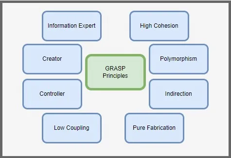

# GRASP: Guiding Object-Oriented Design in Java

Welcome to our guide on mastering object-oriented design with GRASP principles in Java. Object-oriented programming provides a powerful framework for building scalable and maintainable software systems, and GRASP (General Responsibility Assignment Software Patterns) offers invaluable guidelines for effective design. In this article, we’ll explore the fundamental concepts of GRASP and demonstrate how to apply them in Java to create well-structured, flexible, and easily maintainable software solutions. Whether you’re a seasoned Java developer looking to enhance your design skills or a newcomer eager to learn best practices, this article will provide you with essential insights and practical examples to elevate your object-oriented design proficiency.


Understanding GRASP principles is crucial for developers striving to build robust, flexible, and maintainable software systems. By embracing GRASP, developers gain a systematic approach to designing object-oriented applications that are easier to understand, extend, and modify. Mastery of GRASP empowers developers to make informed decisions about class responsibilities, relationships, and interactions, leading to improved code quality, reduced complexity, and enhanced scalability. Whether working on small projects or large-scale enterprise applications, knowledge of GRASP principles equips developers with the tools needed to craft software solutions that meet the evolving needs of users and stakeholders while minimizing the risk of technical debt and software entropy.

GRASP, which stands for General Responsibility Assignment Software Patterns, is a set of guidelines and principles for designing object-oriented software systems. It provides a systematic approach to assigning responsibilities to classes and objects in order to achieve maintainable, flexible, and modular designs. Some of the main concepts of GRASP include:



1. Information Expert
2. Creator
3. Controller
4. Low Coupling
5. High Cohesion
6. Polymorphism
7. Indirection
8. Pure Fabrication

Let’s discover this concepts more deeply:

### Information Expert:

Assign responsibility to the class with the most information or expertise relevant to the task. This promotes high cohesion and reduces coupling by ensuring that behavior related to a particular piece of information is encapsulated within the class that holds that information.

In the context of Java and GRASP (General Responsibility Assignment Software Patterns), “Information Expert” refers to assigning responsibility for a task to the class that has the most information or expertise related to that task. This principle helps promote high cohesion and low coupling in object-oriented designs by ensuring that behavior related to a particular piece of information is encapsulated within the class that holds that information.

### Here’s how “Information Expert” applies in Java:

1. Identify Expert Classes: Determine which classes have the most information or expertise relevant to specific tasks or responsibilities within the system. Expert classes are typically those that contain or manipulate the data needed to perform the task effectively.
2. Delegate Responsibilities: Assign responsibilities to the classes that are best equipped to handle them based on their knowledge and expertise. This may involve distributing tasks across multiple classes or centralizing responsibilities within a single class, depending on the complexity and scope of the task.
3. Encapsulate Behavior: Ensure that behavior related to a particular piece of information is encapsulated within the class that holds that information. This helps to promote encapsulation, modularity, and reusability by keeping related functionality together and reducing dependencies on external classes.
4. Promote High Cohesion: Aim to achieve high cohesion within classes by organizing responsibilities around related pieces of information. This helps to ensure that classes have a clear and focused purpose, making them easier to understand, maintain, and extend.

Example:

```java
public class ShoppingCart {
    
    private List<Item> items = new ArrayList<>();

    public void addItem(Item item) {
        items.add(item);
    }

    public double calculateTotalPrice() {
        double totalPrice = 0;
        for (Item item : items) {
            totalPrice += item.getPrice();
        }
        return totalPrice;
    }
}

public class Item {
    
    private String name;
    private double price;

    public Item(String name, double price) {
        this.name = name;
        this.price = price;
    }

    public double getPrice() {
        return price;
    }
}
```

In this example, the “Information Expert” principle is applied by assigning responsibility for calculating the total price of items in the shopping cart to the ShoppingCart class. Since the ShoppingCart class has access to the list of items and their prices, it is the most suitable class to perform this calculation. The Item class, on the other hand, encapsulates information about individual items, such as their name and price. By delegating responsibilities based on expertise and information, we promote high cohesion and encapsulation in the design.

### Creator:

Assign responsibility for creating objects to classes that have the necessary information to initialize them or that aggregate them as part of their composition. This helps to prevent tight coupling between classes and promotes flexibility in object creation.

Understanding the “Creator” principle in GRASP for Java involves assigning responsibility for creating objects to classes that have the necessary information to initialize them or that aggregate them as part of their composition. The “Creator” pattern helps to promote loose coupling and encapsulation by centralizing object creation logic within specific classes.

### Here’s how to understand “Creator” in Java:

1. Identify Object Creation Scenarios: Determine which classes are responsible for creating instances of other classes within the system. This may include classes that aggregate other objects as part of their composition or classes that have the necessary information to initialize new objects.
2. Delegate Object Creation: Assign responsibility for creating objects to classes that are best suited for the task. This may involve using factory methods, constructor injection, or dependency injection to delegate object creation logic to specialized classes.
3. Encapsulate Initialization Logic: Ensure that the classes responsible for creating objects encapsulate the initialization logic within them. This helps to maintain encapsulation and prevents the proliferation of object creation logic throughout the codebase.
4. Promote Loose Coupling: Aim to minimize dependencies between classes by decoupling object creation logic from the classes that use the created objects. This promotes flexibility and allows for easier testing, maintenance, and evolution of the system.
5. Consider Dependency Inversion: When designing classes that create objects, consider using dependency inversion principles to invert dependencies and promote abstraction. This allows for easier substitution of object implementations and promotes modular design.

Example:

```java
public class OrderService {

    private final OrderRepository orderRepository;

    public OrderService(OrderRepository orderRepository) {
        this.orderRepository = orderRepository;
    }

    public void createOrder(Customer customer, List<Product> products) {
        // Create a new order object
        Order order = new Order(customer, products);
        
        // Save the order to the repository
        orderRepository.saveOrder(order);
    }
}
```

In this example, the OrderService class is responsible for creating instances of Order objects. It encapsulates the initialization logic for creating orders and delegates the task of persisting orders to an OrderRepository class. By centralizing object creation logic within the OrderService class, we promote encapsulation and loose coupling in the system.


### Controller:

Assign responsibility for handling system events or coordinating activities to classes that represent key actors or system boundary objects. This promotes encapsulation of system behavior and ensures that changes in behavior are localized to a single class.

In Java, the “Controller” component of GRASP refers to assigning responsibility for handling system events or coordinating activities to classes that represent key actors or system boundary objects. The Controller pattern helps to encapsulate the logic for processing user inputs, triggering system operations, and coordinating interactions between different parts of the system.

### Here’s how to implement the “Controller” component in Java:

1. Identify System Boundaries: Determine the boundaries of the system, including user interfaces, external systems, or other modules that interact with the core functionality of the application. These boundaries represent entry points for system events and inputs.
2. Define Controller Classes: Create controller classes to handle incoming requests or events from system boundaries. Each controller class is responsible for a specific set of related actions or interactions within the system.
3. Separate Concerns: Ensure that controller classes focus on coordinating activities and delegating work to other parts of the system, rather than performing business logic or data manipulation directly. This separation of concerns promotes modularity and maintainability in the codebase.
4. Handle User Inputs: Implement methods or event handlers within controller classes to process user inputs from user interfaces or external systems. These methods validate inputs, trigger appropriate actions, and update the system state as necessary.
5. Coordinate Interactions: Use controller classes to coordinate interactions between different components or modules within the system. Controllers may invoke methods on service classes, delegate tasks to domain objects, or orchestrate workflow processes to fulfill system requirements.
6. Promote Loose Coupling: Ensure that controller classes interact with other parts of the system through well-defined interfaces and abstractions, rather than direct dependencies. This promotes loose coupling and allows for easier testing, maintenance, and evolution of the system.
7. Handle Exceptions: Implement error handling and exception management within controller classes to gracefully handle unexpected scenarios and communicate errors to users or other parts of the system.

Example:

```java
public class UserController {
    
    private UserService userService;

    public UserController(UserService userService) {
        this.userService = userService;
    }

    public void handleUserRegistration(String username, String password) {
        try {
            // Validate user input
            if (isValidUsername(username) && isValidPassword(password)) {
                // Delegate registration to UserService
                userService.registerUser(username, password);
                System.out.println("User registered successfully!");
            } else {
                System.out.println("Invalid username or password.");
            }
        } catch (Exception e) {
            System.out.println("Error registering user: " + e.getMessage());
        }
    }

    private boolean isValidUsername(String username) {
        // Validation logic for username
        return !username.isEmpty();
    }

    private boolean isValidPassword(String password) {
        // Validation logic for password
        return password.length() >= 8;
    }
}
```

In this example, UserController is responsible for handling user registration requests. It validates the input parameters, delegates the registration process to UserService, and handles any exceptions that may occur during the process. This separation of concerns allows for better organization and maintainability of the codebase.

### Low Coupling:
Minimize dependencies between classes by reducing the amount of information shared between them. This improves the maintainability and flexibility of the system by making it easier to modify or extend individual classes without impacting others.

In Java, “Low Coupling” refers to the degree of interdependence between classes or modules within a software system. It is a measure of how much one class relies on another class to function. Low coupling is desirable in software design because it promotes flexibility, maintainability, and reusability.

### To define “Low Coupling” in Java:

1. Minimize Dependencies: Classes should interact with each other through well-defined interfaces rather than directly accessing each other’s internal details. This reduces the impact of changes in one class on other classes.
2. Use Interfaces: Define interfaces to specify contracts between classes. Classes should depend on abstractions (interfaces) rather than concrete implementations, allowing for easier substitution of implementations and promoting loose coupling.
3. Dependency Injection: Use dependency injection to decouple classes by providing dependencies from external sources rather than having classes create their own dependencies. This allows for easier testing and facilitates the replacement of dependencies with different implementations.
4. Separation of Concerns: Ensure that each class has a single responsibility and does not have unnecessary dependencies on other classes. This promotes modularity and reduces the likelihood of unintended side effects.
5. Single Responsibility Principle (SRP): Classes should have one reason to change. By adhering to the SRP, classes are less likely to be tightly coupled to multiple concerns, making them easier to understand, maintain, and reuse.
6. Event-Driven Architecture: Use events and listeners to decouple components that need to communicate with each other. This allows components to react to events without directly referencing each other, promoting flexibility and scalability.

In summary, low coupling in Java involves designing classes and modules that are minimally dependent on each other, allowing for greater flexibility, maintainability, and reusability in software systems.

### High Cohesion:
Ensure that each class has a single, well-defined responsibility and that its methods and attributes are closely related to that responsibility. This promotes modularity and reusability by making classes more focused and easier to understand and maintain.

In other words applying this to Java context. “High Cohesion” refers to the degree to which elements within a module or class are closely related and focused on a single responsibility or purpose. It is a measure of how well the elements within a class or module work together to achieve a common goal. High cohesion is a key principle of software design and is desirable because it leads to more maintainable, understandable, and reusable code.

### To define “High Cohesion” in Java:

1. Single Responsibility Principle (SRP): Each class or module should have a single responsibility or reason to change. High cohesion ensures that the methods and attributes within a class are closely related and focused on fulfilling that responsibility.
2. Functional Cohesion: Methods within a class should be closely related and contribute to a single function or task. This ensures that the behavior of the class is well-defined and easy to understand.
3. Communicational Cohesion: Methods within a class should operate on the same set of data or communicate closely related information. This promotes clarity and consistency in the class’s behavior and reduces the likelihood of unintended side effects.
4. Sequential Cohesion: Methods within a class should be logically sequenced and work together to achieve a specific sequence of steps or actions. This improves the readability and maintainability of the code by making the class’s behavior more predictable and understandable.
5. Temporal Cohesion: Methods within a class should operate on data that exists within the same time frame or context. This ensures that the class’s behavior is consistent and predictable, leading to fewer errors and easier debugging.

Overall, high cohesion in Java involves designing classes and modules in a way that promotes clarity, simplicity, and focus on a single responsibility or purpose. By ensuring that the elements within a class are closely related and work together harmoniously, developers can create code that is easier to understand, maintain, and extend.

### Polymorphism:

Design classes and methods to be open to extension but closed to modification by using polymorphism and dynamic binding. This allows clients to interact with objects based on their common interfaces rather than their specific implementations, promoting flexibility and adaptability in the system design.

Understanding “Polymorphism” in Java involves grasping the concept of polymorphism within the context of object-oriented design principles. Polymorphism is a fundamental concept in Java that allows objects of different classes to be treated as objects of a common superclass through inheritance and method overriding. In the context of GRASP, polymorphism is used to achieve flexibility and extensibility in object-oriented designs.

### Here’s how to understand “Polymorphism” in Java:

1. Inheritance and Subtyping: In Java, polymorphism is achieved through inheritance, where subclasses can inherit behavior and attributes from a superclass. Subclasses can override methods defined in the superclass to provide specialized behavior while still adhering to the common interface defined by the superclass.
2. Method Overriding: Polymorphism allows subclasses to provide their own implementation of methods defined in the superclass. When a method is called on an object, the JVM determines the appropriate method to execute based on the runtime type of the object. This allows for dynamic dispatch, where the method implementation is selected at runtime based on the actual type of the object.
3. Interfaces and Abstract Classes: In addition to inheritance, Java also supports polymorphism through interfaces and abstract classes. Interfaces define a contract for classes to implement, allowing different classes to provide their own implementations of the interface methods. Abstract classes can define abstract methods that must be implemented by subclasses, providing a way to share common behavior among related classes.
4. Dynamic Binding: Polymorphism in Java is achieved through dynamic binding, where method calls are resolved at runtime based on the actual type of the object. This allows for greater flexibility and extensibility in the code, as new subclasses can be added without requiring changes to existing code that uses polymorphic references.
5. Benefits of Polymorphism: By leveraging polymorphism, Java developers can write code that is more flexible, reusable, and maintainable. Polymorphic references allow for code to be written in terms of interfaces or abstract classes, rather than specific implementations, making it easier to extend and modify the code without affecting other parts of the system.

In summary, understanding “Polymorphism” in Java involves grasping the concept of polymorphism as a fundamental aspect of object-oriented design. By using inheritance, method overriding, interfaces, and dynamic binding, developers can achieve flexibility and extensibility in their Java code, leading to more robust and maintainable software systems.

### Indirection:

In Java, “Indirection” refers to the principle of assigning responsibility for mediating requests or delegating tasks to intermediate objects or components, rather than directly coupling classes or modules together. This pattern helps to promote loose coupling and encapsulation by introducing an additional layer of abstraction between components.

Here’s how to understand “Indirection” in Java:

1. Identify Mediating Responsibilities: Determine which responsibilities involve mediating interactions between different parts of the system or coordinating activities across multiple components. These responsibilities may include routing requests, translating between interfaces, or managing dependencies.
2. Introduce Intermediate Objects: Create intermediary classes or components to handle mediating responsibilities. These intermediate objects act as indirection points, decoupling the classes or modules that interact with each other.
3. Encapsulate Mediating Logic: Ensure that the intermediate objects encapsulate the logic for mediating interactions or delegating tasks. This helps to maintain encapsulation and prevents the proliferation of mediating logic throughout the codebase.
4. Promote Loose Coupling: By introducing indirection, classes or modules become less dependent on each other’s concrete implementations, leading to greater flexibility and easier maintenance. Changes to one part of the system are less likely to impact other parts, as long as the indirection layer remains stable.
5. Facilitate Evolution and Extension: Indirection facilitates the evolution and extension of the system by providing a flexible point of interaction between components. New features or functionalities can be added by introducing new intermediate objects or modifying existing ones, without affecting the rest of the system.

Example:

```java
public class PaymentGateway {

    private PaymentProcessor paymentProcessor;

    public PaymentGateway(PaymentProcessor paymentProcessor) {
        this.paymentProcessor = paymentProcessor;
    }

    public void processPayment(PaymentRequest paymentRequest) {
        // Validate payment request
        if (isValidPaymentRequest(paymentRequest)) {
            // Delegate payment processing to PaymentProcessor
            paymentProcessor.processPayment(paymentRequest);
        } else {
            throw new IllegalArgumentException("Invalid payment request");
        }
    }

    private boolean isValidPaymentRequest(PaymentRequest paymentRequest) {
        // Validation logic for payment request
        return paymentRequest != null && paymentRequest.getAmount() > 0;
    }
}
```

In this example, the PaymentGateway class serves as an intermediate object that mediates payment processing requests. It encapsulates the logic for validating payment requests and delegates the actual payment processing to a PaymentProcessor object. By introducing indirection, the PaymentGateway class decouples the client code from the concrete implementation of the payment processing logic, promoting loose coupling and encapsulation.

### Pure Fabrication:
Introduce additional classes or objects to encapsulate complex or non-natural responsibilities that do not fit well with existing domain concepts. This helps to keep domain objects focused on their core responsibilities and prevents them from becoming overly complex or bloated.

“Pure Fabrication” in Java involves grasping the concept of introducing additional classes or objects to encapsulate complex or non-natural responsibilities that do not fit well with existing domain concepts. This principle helps to keep domain objects focused on their core responsibilities and prevents them from becoming overly complex or bloated.

### Here’s how to understand “Pure Fabrication” in Java:

1. Identify Complex Responsibilities: In Java application design, there may be certain responsibilities or tasks that do not naturally fit within the domain of any existing classes. These responsibilities may involve complex calculations, algorithms, or external integrations that are not directly related to the core domain logic.
2. Introduce Fabrication Classes: Once complex responsibilities are identified, the “Pure Fabrication” principle suggests introducing additional classes or objects solely for the purpose of encapsulating these responsibilities. These classes act as pure fabrications, meaning they do not represent real-world concepts or entities in the domain model but instead serve as containers for non-domain-specific logic.
3. Encapsulation of Non-Natural Responsibilities: The pure fabrication classes encapsulate the complex or non-natural responsibilities, isolating them from the core domain objects. This separation helps to maintain the clarity and simplicity of the domain model by keeping domain objects focused on their primary responsibilities.
4. Promote Modularity and Reusability: By encapsulating complex responsibilities in pure fabrication classes, Java developers can promote modularity and reusability in their codebase. The fabrication classes can be designed to be reusable across different parts of the application, allowing the same logic to be applied in multiple contexts without duplication.
5. Examples of Pure Fabrication: In Java, pure fabrication classes may include utility classes, service classes, or helper classes that perform generic functions such as data validation, formatting, or error handling. These classes do not represent real-world entities but instead provide reusable functionality to support the overall application design.

In summary, “Pure Fabrication” in Java involves the introduction of additional classes or objects to encapsulate complex or non-natural responsibilities, keeping domain objects focused on their core responsibilities and promoting modularity and reusability in the codebase. This principle helps to maintain the clarity, simplicity, and maintainability of Java applications by separating concerns and encapsulating non-domain-specific logic.

By applying these principles and patterns, developers can create object-oriented designs that are more maintainable, flexible, and scalable, making it easier to adapt to changing requirements and evolving business needs.

### Afterword
In this article, we’ve explored the GRASP (General Responsibility Assignment Software Patterns) principles in the context of Java development. By understanding these principles, developers gain valuable insights into how to design object-oriented systems that are modular, maintainable, and flexible. Each GRASP pattern provides a set of guidelines for assigning responsibilities to classes, promoting high cohesion and low coupling within the system.

Conclusion: GRASP principles serve as a foundation for effective object-oriented design in Java, offering guidance on how to distribute responsibilities among classes and promote modular and maintainable code. By applying these principles, developers can create software systems that are easier to understand, maintain, and evolve over time. Whether designing small-scale applications or large-scale enterprise systems, the principles of GRASP provide a framework for building robust and scalable software solutions in Java.

You can find some examples at [Github](https://github.com/alxkm/articles/tree/master/src/main/java/org/alx/article/_33_grasp).
