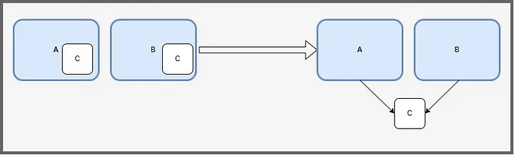
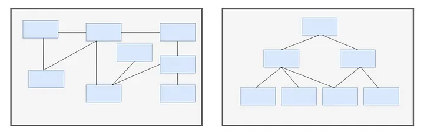
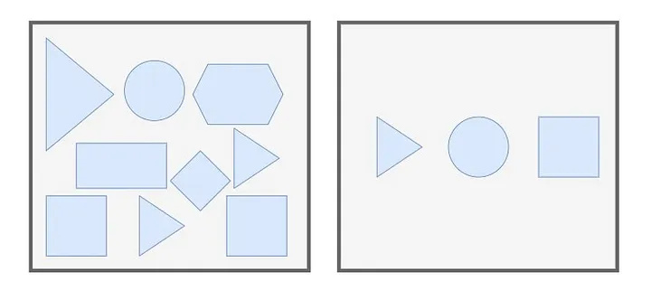

# Crafting Cleaner Java Code: Exploring DRY, KISS and YAGNI Principles

“Premature optimization is the root of all evil.” — Donald Knuth

### Introduction
In the world of Java development, simplicity, clarity, and efficiency are not just desirable traits but essential pillars for successful projects. As developers, we strive to produce code that is not only functional but also maintainable, scalable, and easy to comprehend. However, achieving these goals can often feel like navigating a maze of complex requirements, design patterns, and libraries.

Fortunately, there are guiding principles that help us cut through this complexity and steer our code towards greater elegance and effectiveness. Three such principles stand out as fundamental cornerstones of modern software development: DRY, KISS, and YAGNI.

Also we need to mention SOLID. While SOLID principles are foundational to object-oriented design, our article has centered on DRY, KISS, and YAGNI principles, because SOLID we arleady discovered in this article:

[Java: Mastering SOLID Principles.](https://medium.com/@alxkm/java-mastering-solid-principles-ab2ccda591a3)

### 

DRY, or Don’t Repeat Yourself, reminds us to eliminate redundancy in our codebase, promoting maintainability and reducing the risk of errors. KISS, or Keep It Simple, Stupid, advocates for simplicity in design and implementation, emphasizing clarity and ease of understanding. YAGNI, or You Aren’t Gonna Need It, encourages us to resist the temptation of adding unnecessary features or complexity, focusing instead on delivering the functionality that is actually required.

In this article, we will delve into each of these principles and explore how they can be applied in the context of Java development. From practical examples to real-world scenarios, we will uncover the benefits of embracing DRY, KISS, and YAGNI, and demonstrate how they can lead to cleaner, more maintainable codebases.

So, whether you’re a seasoned Java developer looking to refine your craft or a newcomer eager to learn best practices, join us on this journey as we unravel the secrets of crafting cleaner Java code through the lens of DRY, KISS, and YAGNI principles.

### DRY
DRY, or Don’t Repeat Yourself, is a fundamental principle in software development that advocates for the elimination of redundancy in code. The essence of DRY can be summarized as “Every piece of knowledge must have a single, unambiguous, authoritative representation within a system.” In simpler terms, it means that you should strive to write code in such a way that each piece of logic or information is expressed in only one place.

The rationale behind DRY is straightforward: by avoiding repetition, you reduce the amount of code you need to write, which in turn decreases the likelihood of errors and makes your code easier to maintain and update. When the same logic is repeated in multiple places, it becomes harder to track changes and ensure consistency across the codebase. Additionally, if you later need to modify that logic, you’ll have to make the same change in multiple locations, increasing the risk of introducing bugs.

Practically, adhering to DRY often involves techniques such as modularization, abstraction, and reuse. By breaking down your code into smaller, reusable components and extracting common functionality into shared modules or functions, you can ensure that each piece of logic is implemented only once and then reused wherever it’s needed. This not only promotes code reusability and maintainability but also improves readability and understandability, as developers can easily grasp the overall structure and behavior of the codebase.

In the context of Java development, applying DRY might involve creating utility classes or methods to encapsulate common tasks, using inheritance and polymorphism to avoid duplicating code across similar classes, or employing design patterns like the Template Method pattern to factor out common behavior. By embracing the DRY principle, Java developers can write code that is more efficient, robust, and easier to maintain, ultimately leading to higher-quality software products.

### Here are some suggestions for Java developers to apply the DRY principle effectively:

1. Identify Common Patterns: Regularly review your codebase to identify recurring patterns or logic that are being duplicated across different parts of your application. Look for similarities in code structure, algorithmic approaches, or data manipulation.
2. Extract Reusable Components: Once you’ve identified common patterns, extract them into reusable components such as methods, classes, or interfaces. Create utility classes for frequently used functions or algorithms, and ensure they are properly documented to facilitate easy reuse.
3. Use Inheritance and Polymorphism: Leverage inheritance and polymorphism to avoid duplicating code across similar classes. Identify common behaviors or properties shared by multiple classes and encapsulate them in a superclass or interface. This promotes code reuse and ensures consistency across related classes.
4. Implement Design Patterns: Familiarize yourself with commonly used design patterns such as the Singleton, Factory, or Strategy patterns, which offer proven solutions to common design problems while promoting code reuse and maintainability. Apply these patterns where appropriate to avoid reinventing the wheel and to adhere to DRY principles.
5. Refactor Redundant Code: Regularly review your code for redundancy and refactor it to eliminate duplication. Look for areas where the same logic is repeated or where multiple pieces of code perform similar tasks. Consolidate redundant code into reusable methods or classes to simplify maintenance and improve readability.
6. Encapsulate Business Logic: Ensure that business logic is encapsulated in separate modules or layers of your application, rather than being scattered throughout your codebase. Centralizing business logic promotes consistency, reduces duplication, and makes it easier to update or extend functionality in the future.
7. Automate Repetitive Tasks: Identify repetitive tasks such as data processing, validation, or error handling, and automate them using libraries, frameworks, or custom tools. By automating repetitive tasks, you not only reduce the chance of errors but also save time and effort, allowing you to focus on more complex problems.
8. Follow Modular Design Principles: Embrace modular design principles such as high cohesion and low coupling to break your codebase into smaller, more manageable modules. Each module should have a single responsibility and encapsulate related functionality, making it easier to maintain, test, and reuse.
9. Document and Communicate: Document your code effectively to communicate the intent and purpose of each component or module. Clearly document reusable functions, classes, and interfaces, including their input parameters, return values, and any preconditions or postconditions. This helps other developers understand how to use your code and encourages its reuse.
10. Continuous Improvement: Adopt a mindset of continuous improvement when it comes to applying DRY principles. Regularly review your codebase, gather feedback from peers, and stay updated on best practices and emerging techniques in software development. By continuously striving to eliminate redundancy and improve code quality, you can create more maintainable, efficient, and robust Java applications.

### KISS

KISS, or Keep It Simple, Stupid, is a principle in software development that emphasizes the importance of simplicity in design and implementation. The core idea behind KISS is to favor straightforward, uncomplicated solutions over unnecessarily complex ones. This principle encourages developers to strive for simplicity at every stage of the development process, from initial design to code implementation and system architecture.

At its essence, KISS suggests that simplicity leads to better outcomes in terms of reliability, maintainability, and understandability. By keeping things simple, developers can reduce the risk of introducing bugs, make it easier for themselves and others to understand and modify the code, and minimize the time and effort required for maintenance and troubleshooting.

There are several key aspects to consider when applying the KISS principle in software development:

1. Simplicity in Design: When designing software systems, aim for simplicity in architecture, user interfaces, and overall system structure. Avoid unnecessary complexity in favor of straightforward, intuitive designs that are easy to understand and navigate.
2. Minimalism in Implementation: When writing code, strive for minimalism by using concise and clear syntax, avoiding overly clever or convoluted solutions, and favoring readability and maintainability over unnecessary optimizations or shortcuts.
3. Avoid Overengineering: Resist the temptation to overengineer solutions by adding unnecessary features, layers of abstraction, or complexity. Instead, focus on delivering the essential functionality required to meet the project’s objectives, and avoid premature optimization or speculative design decisions.
4. Clear and Explicit Communication: Ensure that your code communicates its intent clearly and unambiguously. Use meaningful variable names, descriptive comments, and well-structured code organization to make it easy for others (and your future self) to understand the purpose and behavior of each component.
5. Refactoring for Simplicity: Regularly review and refactor your codebase to simplify it wherever possible. Identify areas of complexity, redundancy, or unnecessary abstraction, and refactor them to create cleaner, more straightforward solutions that adhere to the KISS principle.
6. Testability and Debuggability: Prioritize testability and debuggability by designing your code in a way that makes it easy to write unit tests, diagnose issues, and troubleshoot problems. Simple, modular code is typically easier to test and debug than complex, tightly coupled code.
7. Iterative Development: Embrace an iterative approach to development that allows for incremental improvements and adjustments based on feedback and evolving requirements. Start with a simple, working solution and iteratively refine and enhance it as needed, avoiding unnecessary complexity along the way.

Overall, the KISS principle reminds us that simplicity is a virtue in software development, and that the simplest solution that meets the requirements is often the best one. By prioritizing simplicity and avoiding unnecessary complexity, developers can create software that is easier to understand, maintain, and extend, leading to more successful and sustainable projects.

### For Java developers, applying the KISS (Keep It Simple, Stupid) principle involves several key strategies:

1. Simplicity in Code Structure: Keep your codebase organized and modular, with clear separation of concerns. Break down complex tasks into smaller, more manageable functions and classes, each responsible for a single, well-defined purpose.
2. Clear and Concise Naming: Use descriptive and meaningful names for variables, methods, classes, and packages. This helps improve code readability and understanding, reducing the need for excessive comments or documentation.
3. Avoid Overengineering: Resist the temptation to overcomplicate solutions by adding unnecessary abstractions or optimizations. Prioritize simplicity and readability over premature optimization or speculative design decisions.
4. Follow Java Best Practices: Adhere to established Java best practices and coding conventions, such as those outlined in the Java Code Conventions and Java Language Specification. Consistent formatting and coding style make it easier for developers to understand and collaborate on the codebase.
5. Use Standard Libraries and Frameworks: Leverage the extensive ecosystem of Java libraries and frameworks to avoid reinventing the wheel. Choose well-established, widely used libraries that provide simple, reliable solutions to common problems, rather than attempting to build complex functionality from scratch.
6. Refactor for Simplicity: Regularly review and refactor your code to simplify it wherever possible. Look for opportunities to remove duplication, reduce complexity, and improve clarity. Focus on creating clean, straightforward solutions that are easy to understand and maintain.
7. Test-Driven Development (TDD): Embrace test-driven development practices to guide your design and implementation decisions. Start by writing simple, focused tests that describe the desired behavior of your code, then write the minimum amount of code necessary to make those tests pass. This iterative approach encourages simplicity and helps prevent overengineering.
8. Documentation and Communication: Ensure that your code is well-documented and communicates its intent clearly. Use comments, Javadoc, and inline documentation to explain complex logic, edge cases, and design decisions. Effective communication within your team fosters understanding and collaboration, leading to simpler, more cohesive solutions.

By applying these strategies, Java developers can create code that is easier to understand, maintain, and extend, ultimately leading to more successful and sustainable software projects.

### YAGNI

YAGNI, or “You Aren’t Gonna Need It,” is a principle in software development that advises against adding functionality or complexity to a system until it is actually required by current specifications or known, immediate needs. The essence of YAGNI is to avoid speculative development, where features are implemented based on anticipated future requirements rather than existing, concrete ones.

The YAGNI principle encourages developers to focus on delivering the necessary functionality to meet current requirements, without prematurely optimizing, adding extra features, or overengineering the solution. By deferring decisions about future functionality until they are actually needed, developers can avoid wasting time and effort on implementing features that may never be used or that may need to be substantially modified later.

There are several key aspects to consider when applying the YAGNI principle in software development:

1. Prioritize Essential Functionality: Focus on implementing the core features and functionality required to meet the immediate needs of the project. Resist the urge to add “nice-to-have” features or optimizations that are not explicitly requested or essential for the current iteration.
2. Avoid Overengineering: Refrain from designing overly complex or flexible solutions to accommodate potential future requirements that may never materialize. Instead, design your system to be simple, straightforward, and easy to understand, with room for adaptation and evolution as needed.
3. Keep It Simple: Embrace simplicity in design and implementation, opting for straightforward solutions that meet the current requirements without unnecessary bells and whistles. Avoid adding complexity or additional layers of abstraction unless they are absolutely necessary to solve the problem at hand.
4. Iterative Development: Adopt an iterative approach to development that allows for incremental refinement and adjustment based on feedback and changing requirements. Start with a minimal viable product (MVP) that addresses the most critical needs, then iteratively build and improve upon it as new requirements emerge.
5. Refactor When Necessary: Be prepared to refactor your code as the project evolves to remove duplication, improve clarity, and accommodate new requirements. However, only refactor code when it is necessary to support current functionality or address known issues, rather than preemptively optimizing for hypothetical future scenarios.
6. Stay Agile: Embrace agile principles and practices, such as continuous integration, frequent releases, and close collaboration with stakeholders, to respond effectively to changing requirements and priorities. By staying agile and adaptable, you can ensure that your software remains focused on delivering value to users without being weighed down by unnecessary features or complexity.

Overall, the YAGNI principle reminds developers to be pragmatic and focused on delivering value in the present, rather than getting caught up in speculation about future needs. By prioritizing essential functionality, embracing simplicity, and staying agile, developers can create software that is more efficient, maintainable, and responsive to the needs of users and stakeholders.

Certainly! Here are some concrete suggestions for applying the YAGNI principle to Java development:

1. Minimalistic Class Design: Start with minimalistic class designs that only include the essential attributes and methods necessary to fulfill the current requirements. Avoid adding extra fields or methods based on speculative future needs.
2. Simple Method Signatures: Keep method signatures simple and focused on their immediate purpose. Avoid overloading methods with unnecessary parameters or adding complex optional arguments unless they are required for current functionality.
3. Lean Dependency Management: Minimize dependencies on external libraries and frameworks unless they are essential for addressing current requirements. Evaluate each dependency carefully and consider whether its inclusion is justified by immediate needs or if it introduces unnecessary complexity.
4. Avoid Premature Optimization: Resist the temptation to optimize code for performance or efficiency before it is necessary. Instead, focus on writing clean, readable code that solves the problem at hand effectively. Premature optimization can lead to overly complex solutions that are difficult to maintain and understand.
5. Refactor Duplication: Refactor duplicated code as it arises to eliminate redundancy and improve maintainability. However, refrain from preemptively abstracting common functionality into reusable components unless there is clear evidence that it will be needed in multiple places.
6. Incremental Development: Adopt an incremental development approach that prioritizes delivering working software in small, iterative increments. Focus on implementing the most critical features first and defer less important or speculative features until they are validated by user feedback or business requirements.
7. Avoid Overly Generic Solutions: Resist the urge to create overly generic or flexible solutions that attempt to anticipate every possible future use case. Instead, design your code to be adaptable and extensible within the context of current requirements, with the understanding that it may need to be refactored or extended later as new needs arise.
8. Keep It Simple, Stupid (KISS): Embrace the KISS principle alongside YAGNI to prioritize simplicity and clarity in your code. Simple solutions are often easier to understand, maintain, and extend, reducing the risk of introducing unnecessary complexity.
9. Test-Driven Development (TDD): Adopt a test-driven development approach to guide your implementation and validate your assumptions. Write tests that verify the behavior of your code against current requirements, rather than attempting to anticipate future scenarios that may never materialize.
10. Continuous Refinement: Continuously refine and improve your codebase as you gain a better understanding of the problem domain and user needs. Stay open to feedback and be willing to adapt your code as requirements evolve, while always prioritizing simplicity and pragmatism over speculative features or optimizations.

### Afterword

As we conclude our exploration of DRY, KISS, and YAGNI principles in Java development, it’s essential to reflect on the broader implications of these guiding philosophies.

In the fast-paced world of software engineering, the quest for cleaner, more maintainable code is an ongoing journey. By embracing principles like DRY (Don’t Repeat Yourself), KISS (Keep It Simple, Stupid), and YAGNI (You Aren’t Gonna Need It), Java developers can navigate this journey with greater confidence and clarity.

DRY reminds us to eliminate redundancy and promote code reuse, leading to more efficient and maintainable codebases. KISS encourages simplicity in design and implementation, fostering clarity and ease of understanding. YAGNI advises against premature optimization and unnecessary complexity, focusing instead on delivering value through pragmatic, incremental development.

As we apply these principles in our Java projects, we empower ourselves to write code that is not only functional but also elegant, scalable, and resilient to change. We become architects of software systems that are a joy to work with, where the underlying logic is clear and the codebase is a pleasure to navigate.

But beyond the technical aspects, DRY, KISS, and YAGNI remind us of the broader values that underpin our craft: clarity, simplicity, and pragmatism. They encourage us to approach software development as a creative endeavor, where the beauty of our code lies not in its complexity, but in its elegance and efficiency.

As we continue to refine our skills as Java developers, let us carry these principles forward as guiding lights, illuminating our path towards cleaner, more sustainable code and a brighter future for software engineering as a whole.