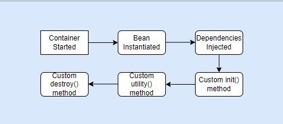

# Tracing the Evolution of Spring Beans: The Evolution of Spring Beans in the Java Ecosystem


In the ever-evolving landscape of Java development, few innovations have left as profound an impact as Spring Beans and Dependency Injection. As foundational elements of the Spring Framework, Spring Beans have revolutionized the way Java applications are built, offering a flexible and modular approach to managing dependencies. However, the story of Spring Beans is not just one of technological advancement; it's a narrative that intertwines with the history of Java itself, reflecting the shifting paradigms and challenges faced by developers over the years. Join us as we embark on a journey through time, tracing the evolution of Spring Beans from their humble beginnings to their current status as essential components of modern Java development. Along the way, we'll explore the key milestones, innovations, and historical context that have shaped the trajectory of Spring Beans, providing insights into their significance and enduring relevance in the Java ecosystem.


By examining the transformations in how developers have interacted with these beans, dispelling prevalent myths and misconceptions, we confront a challenge that promises both novelty and depth. This endeavor is particularly compelling as it intersects with the evolving perspectives of developers on programming paradigms. Moreover, such a retrospective offers a refreshing departure from conventional literature, as it fills a void in available resources. Throughout this exploration, all examples will draw from the latest iterations of Spring, including Spring 6 and Spring Boot 3.

Spring beans are fundamental components in the Spring Framework that encapsulate and manage application objects. While Spring popularized the concept of beans within the Java ecosystem, the notion of beans predates the emergence of Spring itself. The concept of beans was initially introduced in the Java Beans specification, which was added in Java 1.2. This specification outlined the essential characteristics of a Java bean, including:

1. Public Default Constructor: A Java bean must have a public default constructor, allowing it to be instantiated without arguments.
2. Getters and Setters: Beans provide getter and setter methods for accessing and modifying their internal state. These methods allow for encapsulation and controlled access to the bean's properties.
3. Serializable: Beans should implement the Serializable interface, enabling them to be serialized and deserialized, thus supporting various use cases such as persistence and distributed computing.
4. Overridden equals/hashCode/toString Methods: It's recommended for beans to override the equals, hashCode, and toString methods to ensure consistent behavior and meaningful representations.

The introduction of the Java Beans specification marked the beginning of the widespread adoption of getter and setter methods in Java development. Initially, these methods were manually implemented in Java classes. However, with the evolution of the Java ecosystem, tools like Lombok emerged, offering annotations to automatically generate boilerplate code, including getters and setters.

In the context of Spring, beans represent the core building blocks of an application, managed by the Spring IoC (Inversion of Control) container. Spring beans are typically defined in configuration files or through annotations, and they are instantiated, assembled, and managed by the Spring container. By leveraging Spring beans, developers can achieve loose coupling, modularization, and maintainability in their applications, promoting best practices in software design and development.

# History overview

In 1999, the EJB specification was introduced as part of Java EE, giving rise to the concept of "Enterprise Java Beans." Unlike Java beans, which were versatile classes used mainly on the client side like in JSP pages, EJBs were dedicated to server-side tasks, handling business logic and data processing. Despite their different roles, both Java beans and EJBs shared a key feature: manageability. This led to the term "bean" being synonymous with "managed object." Notably, programmers didn't directly create these beans in their code; instead, a container, often provided by a web or application server supporting EJB, handled their instantiation.
Managing EJBs turned out to be quite complex in both the initial 1.0 version and later iterations like version 2.0. Recognizing this complexity, Rod Johnson, a developer of the Spring Framework, suggested a different path: lightweight beans. These beans, distinct from EJBs, were later dubbed Spring beans. They were much simpler to manage and notably didn't require a dedicated server; a console program was sufficient for handling them.

# Spring Framework

Developers configure beans either through XML/Groovy documents or Java code. Information about beans, including their attributes and properties, is encapsulated through the BeanDefinition interface and its implementations. This configuration is facilitated by the BeanDefinitionReader interface and its implementations, such as XmlBeanDefinitionReader, which are tailored to specific configuration types.

To manage beans, developers interact with the BeanFactory interface, the primary entry point for accessing beans stored in a repository. BeanFactory implementations serve as in-memory bean storage, providing a basic API for bean retrieval in read-only mode. However, these internal interfaces are seldom used directly.

Instead, developers typically utilize the ApplicationContext interface for bean management. ApplicationContext implementations serve as comprehensive containers, integrating various components such as bean loading (e.g., from XML), binding beans and their properties (via Dependency Injection), event handling, environment configuration, listeners, and more. Consequently, working with Spring beans commences with creating a Spring context and loading the requisite configuration.

# Spring bean lifecycle

The Spring bean lifecycle involves the following key phases:

1. Instantiation: The bean instance is created, either through constructor instantiation or through a factory method.
2. Populating Properties: Dependencies and properties of the bean are set, either through constructor injection, setter injection, or autowiring.
3. Initialization: If the bean implements the InitializingBean interface, the afterPropertiesSet() method is invoked. Alternatively, custom init methods annotated with @PostConstruct are executed.
4. Bean in Use: The bean is now fully initialized and can be used by other beans or components within the application.
5. Destruction: If the bean implements the DisposableBean interface, the destroy() method is called during application shutdown. Additionally, custom destroy methods annotated with @PreDestroy are executed.



Understanding these lifecycle phases is crucial for managing bean behavior and ensuring proper initialization and cleanup within the Spring application context.

# Xml configuration

Let's assume that we have some class which can send messages:

```java
@FunctionalInterface
public interface Sender {
    void send(String message, String address);
}
```

And we have some implementation which send emails:

```java
public class EmailSender implements Sender {
    @Override
    public void send(String message, String address) {
        System.out.println("Email sent to " + address);
    }

    public void init() {
      // Further code goes here...
    }

    public void destroy() {
      // Further code goes here...
    }
}
```

And some service:

```java
public class EmailNotificationService {
    private final Sender sender;

    public EmailNotificationService(Sender sender) {
        this.sender = sender;
    }

    public void send(String message, String email) {
        sender.send(message, email);
    }
}
```

### Spring XML configuration for this classes can be this applicationContext.xml:

```java
<?xml version="1.0" encoding="UTF-8"?>
<beans xmlns="http://www.springframework.org/schema/beans"
       xmlns:xsi="http://www.w3.org/2001/XMLSchema-instance"
       xsi:schemaLocation="
       http://www.springframework.org/schema/beans
        http://www.springframework.org/schema/beans/spring-beans.xsd">

       <bean id="sender" class="org.alx.EmailSender" 
init-method="init" destroy-method="destroy" />
       <bean id="emailNotificationService" 
class="org.alx.EmailNotificationService">
<constructor-arg ref="sender"></constructor-arg>
       </bean>
 </beans>
```

### To load this from spring application we need XmlWebApplicationContext

```java
ServletContext servletContext = // Obtain ServletContext from your web application

// Create XmlWebApplicationContext
XmlWebApplicationContext context = new XmlWebApplicationContext();
context.setConfigLocation("/WEB-INF/applicationContext.xml");

// Load class from xml
context.getBean("emailNotificationService", EmailNotificationService.class);
```

Pros and cons of using XML configuration in Spring:

Pros:

* Clear separation of configuration from code.
* Easy externalization and customization.
* Well-established and widely adopted.
* Provides a structured format for configuration.
* Good support for dependency injection.

Cons:

* Verbosity and potential for XML boilerplate.
* Limited type safety and compile-time checks.
* XML files can become unwieldy in large projects.
* Coupling between XML configuration and code.
* Requires manual maintenance and updates. A lot of boilerplate code.

As projects expand and incorporate new technologies, complexity inevitably escalates. Once the number of beans surpasses a certain threshold, managing them within a single file becomes impractical. Subdividing the configuration into smaller files becomes necessary, albeit at the cost of increased complexity in navigating and comprehending the overall configuration. For instance, in a comprehensive web application encompassing Spring Security, Spring MVC, Spring Web Flow, and other components, the proliferation of XML configurations can prove daunting for developers, especially when troubleshooting bugs.

Furthermore, the potential for discrepancies arises when renaming classes or methods without updating corresponding entries in XML configurations. Although this scenario may seem less daunting now, thanks to modern IDEs equipped with Spring plugins that prevent incorrect XML syntax, the situation was far more challenging in the past. In the absence of such tools, maintaining consistency between Java code and XML configurations posed significant challenges. Consequently, when Java 5 introduced support for annotations in 2004, the primary beneficiaries were not application developers, but rather library and framework developers such as Spring and Hibernate.

# Annotation-based configuration

Annotation-based configuration is an alternative approach to configuring Spring applications where Spring beans and their dependencies are defined using annotations directly in the source code, rather than being declared in XML or Groovy configuration files. Came to fruition in Spring 2.5, coinciding with the introduction of Java 5 features. This approach revolutionized the way Spring beans were declared, eschewing the need for separate XML or Groovy files in favor of direct declaration within the source code.

```java
import org.springframework.stereotype.Component;

@Component
public class EmailSender implements Sender {

    @Override
    public void send(String message, String address) {
        System.out.println("Email sent to " + address);
    }

    // No need for explicit init() and destroy() methods when using annotations
}
```

Note that there's no need for explicit init() and destroy() methods in annotation-based configuration. Spring will handle bean initialization and destruction automatically based on annotations such as @PostConstruct and @PreDestroy.

Also we can define in annotation style also:


* ID of the bean (default if not suitable).
* Primary sign.
* The init/destroy methods.
* Qualifiers.
* Scope.
* Profiles.

```java
import org.springframework.beans.factory.annotation.Qualifier;
import org.springframework.context.annotation.Bean;
import org.springframework.context.annotation.Profile;
import org.springframework.context.annotation.Scope;
import javax.annotation.PostConstruct;
import javax.annotation.PreDestroy;

@Qualifier("emailSender")
@Scope("singleton")
@Profile("production")
public class EmailSender implements Sender {

    @Override
    public void send(String message, String address) {
        System.out.println("Email sent to " + address);
    }

    @PostConstruct
    public void init() {
        System.out.println("EmailSender bean initialized.");
    }

    @PreDestroy
    public void destroy() {
        System.out.println("EmailSender bean destroyed.");
    }

    @Bean("emailSenderBean")
    public EmailSender emailSenderBean() {
        return new EmailSender();
    }
}
```

@Qualifier("emailSender"): Specifies a qualifier value for this bean, which can be used for injection points that require a specific qualifier.

@Scope("singleton"): Defines the scope of the bean as singleton, meaning only one instance of this bean will be created per Spring container.

@Profile("production"): Indicates that this bean should be active only when the "production" profile is active.

@PostConstruct: Indicates a method that should be invoked after the bean has been constructed, analogous to an init method.

@PreDestroy: Indicates a method that should be invoked before the bean is destroyed, analogous to a destroy method.

@Bean("emailSenderBean"): Defines a bean with the specified name "emailSenderBean". This is used in Java-based configuration rather than component scanning.

You have the option to define bean autowiring using the @Autowired annotation, or even without it in the case of constructor injection. And we need define package to scan:

```java
AnnotationConfigApplicationContext context = new AnnotationConfigApplicationContext("org.example"));
Sender sender= context.getBean(Sender.class);
```

This code creates a new instance of AnnotationConfigApplicationContext and scans the package org.example to register all Spring beans within it. Then, it retrieves a bean of type Sender from the application context.

For annotation configuration, you utilize the updated AnnotationConfigApplicationContext class. This class encompasses not only the BeanDefinitionRegistry instance but also incorporates the ClassPathBeanDefinitionScanner object. The latter is responsible for scanning and registering beans found within the classpath. While XML configuration typically employs the BeanDefinitionReader interface and its implementations for bean scanning, the ClassPathBeanDefinitionScanner internally relies on the MetadataReader interface and its implementations.

These factors contribute to a delay in context creation and application startup. Additionally, unforeseen limitations have surfaced, introducing constraints that were previously absent.

Some details to highlight:

* Dynamically excluding a bean from the configuration without altering its class is challenging.
* Declaring two beans of the same class is not allowed.
* Declaring a bean is impossible if access to its source code is unavailable.
* Beans cannot be declared if they exist within a runtime dependency rather than a compile dependency.
* Runtime specifications of bean classes and attributes are immutable.
* Modifying a bean necessitates recompilation of the code.
* Exporting beans to a library necessitates exporting all dependent beans, resulting in intricate dependencies, thus your objects no longer plain old Java objects (POJOs).

Pros:

* Concise and readable configuration.
* Reduced verbosity compared to XML.
* Enhanced code readability.
* Directly integrated with source code.
* Simplifies dependency injection.

Cons:

* Potential for "annotation hell" with excessive annotations.
* May clutter codebase with annotations.
* Limited support for conditional configurations.
* Annotations may introduce tight coupling.
* Limited support for non-Java frameworks.

Thus, such constraints contribute to the complexity and overhead of Spring. And Java-based configuration aimed to solve these problems.

# Java-based configuration

This configuration method was introduced in Spring 3.0. Annotations are still utilized, but instead of being directly applied to business classes, they are placed within a dedicated file annotated with @Configuration. This approach is known as Java-based configuration.

```java
@Configuration
public class ApplicationConfig {
  
   @Bean
   public EmailSender getEmailSender() {
          return new EmailSender();
   }
  
   @Bean
   public EmailNotificationService getNotificationService() {
          return new EmailNotificationService(getEmailSender());    
   }
}
```

To load beans from a class in Spring, you can use the AnnotationConfigApplicationContext class along with the class that contains the configuration. Here's the provided code snippet:

```java
AnnotationConfigApplicationContext context = new AnnotationConfigApplicationContext(ApplicationConfig.class));
```

ApplicationConfig.class refers to a Java class that is annotated with @Configuration and contains the bean definitions. When the AnnotationConfigApplicationContext is instantiated with ApplicationConfig.class, Spring scans the ApplicationConfig class for bean definitions and registers them in the application context. You can then retrieve beans from the context as needed.

Spring generates beans from methods annotated with @Bean, effectively eliminating most of the constraints from the previous approach thus, our beans no longer being and bound to the Spring Framework container. Furthermore, we gain the ability to externally initialize beans within @Bean methods, a feature previously unavailable with @Component.

With bean configuration centralized in one (or more) Java classes, there's no need to scan the entire classpath for beans. Instead, you can provide the essential class configurations to the Spring context for analysis and import additional configurations using the @Import annotation.

For legacy projects requiring support for other configuration types, integration is straightforward with the @ComponentScan and @ImportResource annotations. Spring Boot enhances this capability by offering instructions to conditionally load beans or configurations based on specific conditions.

These are examples of conditional bean loading in Spring based on certain conditions:

# Loading only if a class is present in the classpath:

```java
@Configuration
@ConditionalOnClass(CustomClass.class)
public class ApplicationConfig {
  //
}
```

This configuration specifies that beans defined in ApplicationConfig will be loaded only if the class CustomClass is present in the classpath.

# Loading only if a specific bean already exists:

```java
@Configuration
@ConditionalOnBean(name = "sender")
public class ApplicationConfig {
  //
}
```

This configuration ensures that beans defined in ApplicationConfig will be loaded only if a bean named "sender" is already present in the application context.

# Alternatively, loading only if a bean of a specific type is missing:

```java
@Configuration
@ConditionalOnMissingBean(value = NotificationService.class)
public class ApplicationConfig {
  //
}
```

Here, beans defined in ApplicationConfig will be loaded only if there is no bean of type NotificationService already present in the application context.

These annotations serve as a potent tool for developers and are integral to autoconfiguration, often referred to as "Spring magic". However, their excessive use can result in what is known as "annotation hell," where the code becomes overloaded with annotations to the extent that it becomes challenging to read and analyze, especially when instructions from different technologies are combined. Additionally, projects employing numerous Spring technologies, all reliant on auto-wiring, auto-discovery, and auto-configuration, may struggle to comprehend how these components function together.

Pros:

* Type-safe configuration.
* IDE support for refactoring and auto-completion.
* Centralized and programmatic approach.
* Improved testability.
* Avoids XML verbosity.

Cons:

* Increased code volume compared to annotations.
* Configuration may be tightly coupled with application logic.
* Requires recompilation for changes.
* Steeper learning curve for beginners.
* Limited integration with existing XML configurations.

Overall, Java-based configuration offers a powerful and flexible way to configure Spring applications, but it also comes with its own set of trade-offs and considerations. Understanding these pros and cons is essential for making informed decisions when choosing the configuration approach for your Spring projects.

# Functional registration

Functional registration of beans in Spring refers to a programming approach where developers define bean configurations using functional programming techniques rather than annotations or XML-based configurations. This approach was introduced to address the challenges associated with annotation-driven configurations, such as "annotation hell" and complexity in large projects with multiple technologies.

In functional registration, developers use Java code to programmatically register beans and define their dependencies. This is typically achieved using a fluent API provided by Spring, which allows for concise and expressive bean definitions. Instead of scattering annotations throughout the codebase, bean configurations are centralized and can be easily understood and managed.

Functional registration provides several benefits:

1. Reduced Complexity: By centralizing bean configurations in Java code, functional registration reduces the complexity of the configuration process. Developers can clearly see how beans are defined and wired together, making the codebase more maintainable.
2. Improved Readability: Functional registration promotes a more readable and understandable configuration code compared to annotations or XML. Bean definitions are expressed in a clear and concise manner, making it easier for developers to grasp the application's structure.
3. Flexibility: Functional registration offers greater flexibility in defining bean configurations compared to annotation-driven approaches. Developers have more control over bean creation and wiring, allowing for complex scenarios to be handled more effectively.
4. Testability: Since bean configurations are defined in Java code, they can be easily tested using unit tests. This improves the overall testability and reliability of the application.

Overall, functional registration of beans in Spring provides a more flexible, readable, and maintainable approach to bean configuration, making it well-suited for large and complex projects.

Since the early versions of Spring, it has been possible to register beans programmatically without relying on XML or annotations. This capability allows developers to define bean configurations using pure Java code. Furthermore, beans can be registered dynamically, even after the creation or loading of the application context. This flexibility enables developers to adapt and modify the bean configuration at runtime based on changing requirements or conditions.

```java
ServletContext servletContext = // Obtain ServletContext from your web application

// Create XmlWebApplicationContext
XmlWebApplicationContext context = new XmlWebApplicationContext();
context.setConfigLocation("/WEB-INF/applicationContext.xml");

context.getBeanFactory().registerSingleton("smsSender", new SmsSender());
Sender sender = context.getBean("smsSender", Sender.class);
```

The BeanDefinitionRegistry interface in Spring provides a mechanism for managing bean definitions within the Spring IoC container. It defines methods for registering, removing, and retrieving bean definitions. But in such case, all init destroy and other methods will not call during work. And to register your bean you need to call

```java
context.registerBean(NotificationService.class)
```

Using such approach you avoid redundant Reflection API and declaration is very compact.

It doesn't rely on any hidden tricks or automatic bean detection methods, so Spring doesn't have to search extensively through your project's files to find beans.

If we need to construct bean with parameters, we need to take them from Environment, they are very easy to get and pass. For example we need to add defaultMessageTemplate to our Sender.

```java
public class EmailSender implements Sender {
    private final String defaultMessageTemplate;

    public EmailSender(String defaultMessageTemplate) {
        this.defaultMessageTemplate = defaultMessageTemplate;
    }
    
    @Override
    public void send(String message, String address) {
        System.out.println("Email sent to " + address);
    }

    public void init() {
    }

    public void destroy() {
    }
}

// Exception NoSuchBeanDefinitionException for this case
context.registerBean(EmailSender.class);
```

So after this edition in functional style we will get an error that we do not have parameters to satisfy default Message Template of type String. To fix this we need to get them from environment.

```java
String defaultMessageTemplate = context.getEnvironment().getProperty("app.defaultMessageTemplate");
context.registerBean(EmailSender.class, defaultMessageTemplate);
```

New registered beans can't be used for @Autowiring. To do this we should use ApplicationContextInitializer. ApplicationContextInitializer is an interface in Spring that allows you to customize the application context before it is fully refreshed and initialized. You can use it to perform initialization tasks or modify the application context programmatically.

```java
import org.springframework.context.ApplicationContextInitializer;
import org.springframework.context.ConfigurableApplicationContext;

public class MyApplicationContextInitializer implements ApplicationContextInitializer<ConfigurableApplicationContext> {

    @Override
    public void initialize(ConfigurableApplicationContext applicationContext) {
        // Perform initialization tasks or modify the application context
        System.out.println("Custom initialization logic...");
    }
}
```

You can then register this initializer with your Spring application context. If you are using Java configuration, you can do this as follows:

```java
import org.springframework.context.annotation.AnnotationConfigApplicationContext;

public class MyApp {

    public static void main(String[] args) {
        // Create the application context
        AnnotationConfigApplicationContext context = new AnnotationConfigApplicationContext();

        // Register the initializer
        context.addInitializer(new MyApplicationContextInitializer());

        // Refresh the application context
        context.refresh();

        // Use the application context...
    }
}
```

Pros:

* Concise and expressive configuration.
* Dynamic registration of beans.
* Promotes functional programming style.
* Offers flexibility in bean definition.
* Simplifies configuration management.

Cons:

* May not be familiar to all developers.
* Requires understanding of functional programming concepts.
* Limited support for complex configurations.
* Potential for decreased readability in complex scenarios.
* May not integrate seamlessly with existing codebases.

Alternatively, if you are using XML configuration, you can register the initializer in your applicationContext.xml file:

```java
<context:annotation-config/>
<context:component-scan base-package="com.example"/>

<bean class="com.example.MyApplicationContextInitializer"/>
```

So, ApplicationContextInitializer provides a mechanism to customize the application context before it is fully initialized, allowing you to perform initialization tasks or modify the context programmatically.

In conclusion, Spring offers multiple approaches for configuring beans within an application, each with its own strengths and considerations.

* XML Configuration: This traditional approach provides a verbose but flexible way to define bean configurations using XML files. While it offers a clear separation of concerns and allows for easy externalization of configurations, it can become cumbersome to maintain, especially in large projects.
* Annotation-based Configuration: With annotations, developers can define bean configurations directly within the source code, reducing verbosity and improving readability. This approach offers convenience and flexibility, allowing for more concise configurations. However, excessive use of annotations can lead to "annotation hell" and may make the codebase harder to understand.
* Java-based Configuration: Java-based configuration, introduced in Spring 3.0, allows developers to define bean configurations using pure Java code. This approach provides type safety, compile-time checks, and IDE support, making it easier to manage configurations and refactor code. It promotes a more programmatic and centralized approach to bean configuration, reducing the reliance on XML files or annotations.
* Functional Registration: Functional registration, a variation of Java-based configuration, emphasizes a functional programming approach to define bean configurations. This approach is concise, expressive, and allows for dynamic registration of beans. It promotes a more flexible and readable way to configure beans, especially for complex scenarios.

In summary, the choice of configuration approach depends on the specific requirements, preferences, and constraints of the project. While XML configuration offers flexibility and separation of concerns, annotation-based and Java-based configurations provide convenience and type safety. Functional registration, on the other hand, offers a more concise and expressive way to define bean configurations, especially for modern, functional programming-oriented projects. Ultimately, understanding the strengths and trade-offs of each approach is essential in making informed decisions when configuring Spring applications.

Full example you can find on [Github](https://github.com/alxkm/articles/tree/master/src/main/java/org/alx/article/_37_spring_beans).

