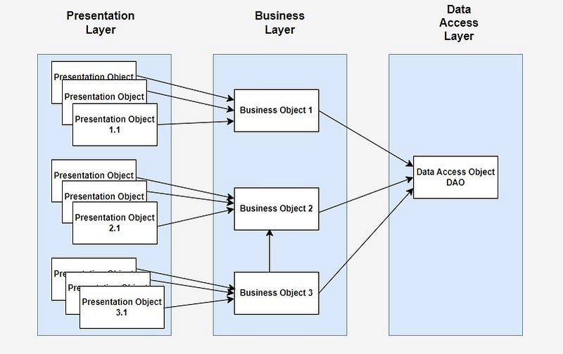
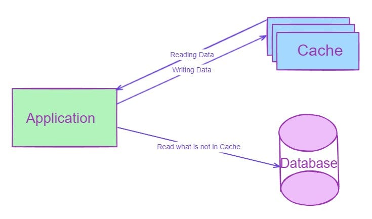
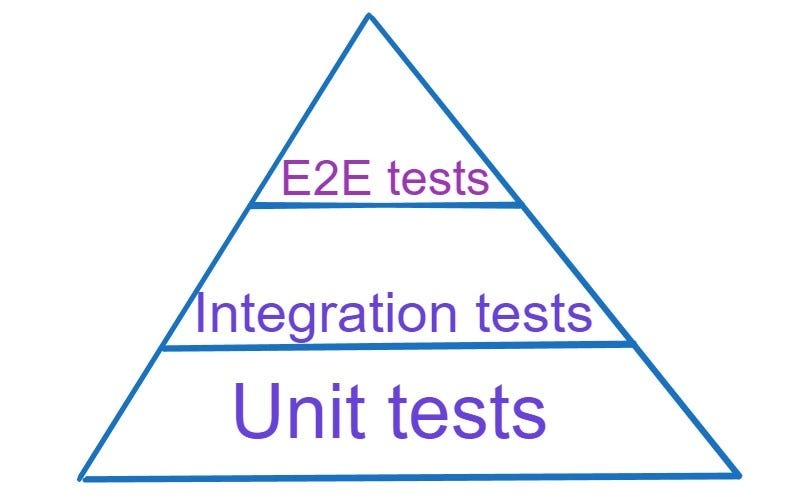
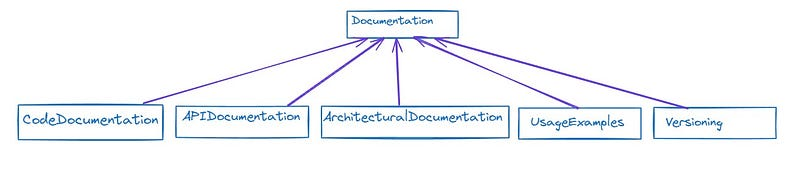

# Java Architecture Blueprint: Strategies for Scalable and Reliable Apps

Java has long been a cornerstone of enterprise-grade software development, powering a vast array of applications across industries. However, as the complexity and scale of modern software continue to evolve, so too must our approach to architecting Java applications. In this age of cloud computing, microservices, and ever-increasing user demands, it's imperative to adhere to robust architectural principles to ensure scalability, maintainability, and reliability.

In this article, we dive into the essential best practices that underpin the creation of robust Java applications. These principles will serve as your guiding light, empowering you to design systems that can grow and adapt to meet the challenges of today's dynamic software landscape.

So, join us on this journey as we unravel the intricacies of Java application architecture and unlock the secrets to building scalable, maintainable, and resilient software solutions. Let's dive in and elevate our Java applications to new heights of excellence.

Architecture best practices" for Java applications encompass a set of guidelines and principles that promote scalability, maintainability, performance, and reliability in software design. Here's a breakdown of some key practices:

1. Modularity
2. Design Patterns
3. Layered Architecture
4. Dependency Injection (DI)
5. RESTful APIs. API development
6. Data protocols
7. Database Design
8. Error Handling
9. Caching
10. Security
11. Performance Optimization
12. Testing
13. Documentation
14. Continuous Integration/Continuous Deployment (CI/CD)
15. Scalability and Resilience
16. Monitoring and Logging

# Modularity

Modularity: Divide your application into cohesive modules or layers such as presentation layer, business logic layer, and data access layer. Use packages to organize classes within modules logically.

In a Java application, modularity refers to structuring the codebase into distinct, independent modules or layers, each responsible for a specific aspect of the application's functionality.

1. Presentation Layer: This layer handles the user interface (UI) part of the application. It includes classes responsible for interacting with users, displaying information, and capturing user input. Examples of classes in this layer could be GUI components, web controllers (if it's a web application), or command-line interfaces.
2. Business Logic Layer: Also known as the service layer, this is where the core logic of the application resides. It contains classes that implement business rules, process data, and perform operations specific to the application's domain. These classes are independent of any particular UI or data storage mechanism, making them reusable and easier to maintain.
3. Data Access Layer: This layer is responsible for interacting with the data storage mechanisms such as databases, files, or external APIs. It encapsulates the logic for reading from and writing to the data storage, providing an abstraction over the underlying data source. Classes in this layer typically handle database connections, execute SQL queries, and map database records to Java objects (if using an ORM framework).

### To implement modularity in Java:

* Use packages to organize classes within each module logically. For example, you might have a package structure like com.example.presentation, com.example.businesslogic, and com.example.dataaccess.
* Define clear boundaries and interfaces between modules. Each module should have well-defined responsibilities and interact with other modules through well-defined interfaces.
* Encapsulate implementation details within each module, exposing only necessary interfaces to other modules. This promotes loose coupling and allows for easier maintenance and testing.
* Follow best practices such as the Single Responsibility Principle (SRP) and Separation of Concerns (SoC) to ensure that each module has a single, well-defined purpose.

By organizing your Java application into modular layers, you can achieve better maintainability, scalability, and reusability of code, making it easier to understand, extend, and evolve over time.

# Design Patterns

Utilize design patterns like MVC (Model-View-Controller), DAO (Data Access Object), Singleton, Factory, Observer, Decorator, Chain of Responsibility, to solve common design problems and promote flexibility and maintainability.

# Layered Architecture:

Adopt a layered architecture where each layer has a specific responsibility. For instance, separate user interface concerns from business logic and data access logic.

1. Presentation Layer: This layer handles the user interface concerns. It includes components responsible for interacting with users, displaying information, and capturing user input. Examples include GUI components, web controllers (for web applications), or command-line interfaces.
2. Business Logic Layer: Also known as the service layer, this layer contains the core logic of the application. It implements business rules, processes data, and performs operations specific to the application's domain. These classes are independent of any particular UI or data storage mechanism, making them reusable and easier to maintain.
3. Data Access Layer: This layer is responsible for interacting with the data storage mechanisms such as databases, files, or external APIs. It encapsulates the logic for reading from and writing to the data storage, providing an abstraction over the underlying data source. Classes in this layer typically handle database connections, execute queries, and map database records to Java objects.

By adopting a layered architecture:

* You separate concerns, making the codebase more modular and easier to understand, maintain, and extend.
* Changes in one layer have minimal impact on other layers, promoting flexibility and reducing the risk of unintended side effects.
* Each layer can be developed, tested, and maintained independently, enabling parallel development and better collaboration among team members.

Overall, a layered architecture helps in building robust, scalable, and maintainable Java applications by enforcing clear boundaries between different aspects of the system's functionality.

# Dependency Injection (DI)

Dependency Injection (DI) is a design pattern that allows components to be loosely coupled by providing their dependencies from external sources rather than creating them internally. This approach promotes modularity, testability, and maintainability in Java applications.

Here's how you can apply DI principles:

* Identify Dependencies: Determine the dependencies required by your components. These can be other classes, interfaces, or external resources like databases or web services.
* Define Interfaces: Use interfaces to define contracts between components. This allows for easier swapping of implementations and promotes flexibility.
* Inject Dependencies: Rather than creating dependencies within a class, accept them as constructor parameters, method arguments, or through setter methods. This allows the dependencies to be provided from external sources, such as configuration files or dependency injection frameworks.
* Use Dependency Injection Frameworks: Utilize frameworks like Spring to manage dependencies automatically. These frameworks provide mechanisms for defining dependencies, managing their lifecycle, and injecting them into components at runtime.

By applying DI principles and using dependency injection frameworks:

* Components become more modular and reusable since they're not tightly coupled to their dependencies.
* Testing becomes easier as dependencies can be easily mocked or replaced with stub implementations.
* Maintenance is simplified as changes to dependencies can be made externally without modifying the component's code.

Overall, DI enhances the flexibility, testability, and maintainability of Java applications by decoupling components and managing their dependencies effectively.

# RESTful APIs. API development

Design your APIs following RESTful principles for better scalability, interoperability, and simplicity. Use HTTP methods appropriately, resource naming conventions, and stateless communication. When designing RESTful APIs in Java, adhering to RESTful principles enhances scalability, interoperability, and simplicity. Here's how you can achieve this:

1. HTTP Methods: Use HTTP methods (GET, POST, PUT, DELETE) appropriately to perform CRUD (Create, Read, Update, Delete) operations on resources. For example, use GET for retrieving resources, POST for creating resources, PUT or PATCH for updating resources, and DELETE for deleting resources.
2. Resource Naming Conventions: Use meaningful and descriptive resource names following RESTful conventions. Use plural nouns to represent collections and singular nouns for individual resources. For example, /users for a collection of users and /users/{id} for a specific user.
3. Stateless Communication: Design APIs to be stateless, meaning each request from a client contains all the information needed by the server to fulfill the request. Avoid storing client state on the server between requests. Utilize stateless authentication mechanisms like JSON Web Tokens (JWT) for secure and scalable authentication.

# Data Protocols

When choosing data protocols for apps and web services, it's essential to consider factors like performance, flexibility, scalability, and compatibility with client technologies. Here are some commonly used data protocols:

### JSON (JavaScript Object Notation):

* Lightweight and human-readable data interchange format.
* Widely supported by programming languages and frameworks.
* Ideal for transmitting structured data between web servers and clients, especially in RESTful APIs.
* Well-suited for mobile applications due to its compact size and ease of parsing in JavaScript.

### XML (eXtensible Markup Language):

* A markup language that defines a set of rules for encoding documents in a format that is both human-readable and machine-readable.
* Provides strong support for hierarchical data structures and metadata.
* Widely used in legacy systems and enterprise applications.
* Not as lightweight as JSON, but still used in various contexts, especially in SOAP-based web services.

### Protocol Buffers (protobuf):

* Developed by Google, Protocol Buffers are a language-neutral, platform-neutral, extensible mechanism for serializing structured data.
* Offers smaller message sizes and faster serialization/deserialization compared to JSON and XML.
* Suitable for high-performance applications and microservices architectures.
* Requires defining a schema for data structures but provides efficient binary serialization.

### gRPC (gRPC Remote Procedure Call):

* An open-source RPC framework developed by Google that uses Protocol Buffers for defining service contracts and HTTP/2 for transport.
* Provides features like bidirectional streaming, authentication, and load balancing.
* Ideal for building high-performance, language-agnostic microservices and distributed systems.
* Supports multiple programming languages and platforms.

### GraphQL:

* A query language for APIs and a runtime for executing those queries with existing data.
* Allows clients to specify exactly what data they need, reducing over-fetching and under-fetching issues commonly encountered in RESTful APIs.
* Offers a flexible and efficient approach to data querying and manipulation, enabling clients to retrieve multiple resources in a single request.
* Suitable for building modern web and mobile applications with complex data requirements.

When choosing a data protocol for your application or web service, consider factors such as performance, compatibility, developer experience, and the specific requirements of your project. Each protocol has its strengths and weaknesses, so it's essential to evaluate them based on your project's needs and constraints.

# Database Design:

Follow database normalization principles to avoid data redundancy and inconsistency. Use indexes wisely for better query performance. Consider ORM (Object-Relational Mapping) frameworks like Hibernate for mapping Java objects to database tables.

1. Database Normalization: Database normalization is the process of organizing the attributes and tables of a relational database to minimize redundancy and dependency. By following normalization principles (such as the normalization forms like 1NF, 2NF, 3NF, etc.), you can avoid anomalies like data duplication and inconsistencies, ensuring data integrity and making it easier to maintain and update your database schema.
2. Use of Indexes: Indexes are data structures that improve the speed of data retrieval operations on database tables. By creating indexes on columns frequently used in search conditions or join operations, you can enhance query performance. However, it's essential to use indexes wisely and avoid excessive indexing, as it can impact insert and update performance.
3. ORM (Object-Relational Mapping) Frameworks: ORM frameworks like Hibernate facilitate the mapping between Java objects and database tables, eliminating the need for manual SQL queries and providing a more object-oriented approach to database interactions. ORM frameworks handle tasks such as object creation, retrieval, updating, and deletion, abstracting away the underlying database interactions and making database access more intuitive and less error-prone.

By following these database design practices:

* You can ensure that your database schema is well-organized, normalized, and optimized for performance.
* Data redundancy and inconsistencies are minimized, leading to improved data integrity.
* Database access from Java applications is simplified and more efficient, thanks to ORM frameworks like Hibernate.
* Overall, these practices contribute to the development of robust, scalable, and maintainable Java applications with a solid foundation in database design.

# Error Handling:

Implement consistent error handling mechanisms throughout your application. Use try-catch blocks to gracefully handle exceptions, ensuring that your application doesn't crash unexpectedly. Log errors with relevant context information to aid in debugging and troubleshooting, facilitating faster resolution of issues. By handling errors effectively, you can enhance the reliability and stability of your Java application.

# Caching:

Employ caching strategies to improve performance and reduce database load. Use caching libraries like Ehcache or Redis for caching frequently accessed data.

Implementing caching strategies can significantly enhance the performance and scalability of your Java application by reducing the need to repeatedly fetch data from the database or expensive external services. Caching involves storing frequently accessed data in a temporary storage location, called a cache, which is typically faster to access than the original data source.

### Types of Caching:

* In-Memory Caching: Store cached data in memory, such as RAM, for rapid access. In-memory caches like Ehcache or Guava Cache are commonly used for storing objects or query results.
* Distributed Caching: Distribute cached data across multiple nodes or servers to scale horizontally. Distributed caching solutions like Redis or Memcached offer high availability and reliability by replicating data across nodes.

### Caching Strategies:

* Cache-Aside (Lazy Loading): Fetch data from the cache. If not found, retrieve it from the database, store it in the cache, and return it to the caller. Subsequent requests for the same data can then be served from the cache.
* Write-Through: Write data to both the cache and the database simultaneously. Ensures that data in the cache and the database remain consistent.
* Write-Behind (Write-Back): Write data to the cache first and then asynchronously update the database. This strategy improves write performance by reducing the number of database writes.

### Choosing a Caching Library:

* Ehcache: A popular open-source Java caching library that supports both in-memory and disk-based caching. It offers features like cache replication, expiration policies, and distributed caching.
* Redis: An in-memory data store that can be used as a caching solution. Redis provides high performance, data persistence, and support for various data structures like strings, hashes, lists, sets, and sorted sets. It's often used for distributed caching and as a message broker.
* Hazelcast: Also in-memory data store that can be used as a caching solution with very similar to Redis features, and some. But Hazelcast team says that their cache is faster and have better performance than Redis.

### Cache Management:

* Set appropriate cache expiration policies to ensure that stale data doesn't linger in the cache.
* Monitor cache usage, hit rates, and eviction rates to fine-tune cache configuration and optimize performance.
* Implement cache invalidation strategies to remove outdated or invalid data from the cache.

By employing caching strategies and leveraging caching libraries like Ehcache or Redis, you can reduce latency, improve scalability, and minimize database load, leading to a more responsive and efficient Java application.

# Security:

Implement security best practices such as input validation, authentication, authorization, and encryption to protect your application from common security threats like SQL injection, cross-site scripting (XSS), and CSRF (Cross-Site Request Forgery).

Security: Ensure robust security measures are implemented in your application to safeguard against common threats like SQL injection, cross-site scripting (XSS), and CSRF (Cross-Site Request Forgery). Implement best practices including:

1. Input Validation: Validate and sanitize user input to prevent malicious data from compromising your application's integrity. Use server-side validation to ensure data meets expected criteria before processing it.
2. Authentication: Verify the identity of users accessing your application. Implement authentication mechanisms such as username/password authentication, OAuth, or JWT (JSON Web Tokens) to validate user credentials and grant access to authorized users only.
3. Authorization: Control access to resources based on user roles and permissions. Implement role-based access control (RBAC) or attribute-based access control (ABAC) to enforce authorization policies and prevent unauthorized access to sensitive data or functionality.
4. Encryption: Encrypt sensitive data both at rest and in transit to prevent unauthorized access. Use secure encryption algorithms and protocols (e.g., AES for data encryption, TLS/SSL for secure communication over the network) to protect data confidentiality and integrity.

By implementing these security best practices:

* You can mitigate common security vulnerabilities and protect your application from malicious attacks.
* Your application becomes more resilient to security threats, ensuring data privacy and integrity.
* Users can trust your application with their sensitive information, leading to increased confidence and user satisfaction.

Overall, prioritizing security measures such as input validation, authentication, authorization, and encryption is crucial for building secure and trustworthy Java applications.

# Performance Optimization:

Profile your application to identify performance bottlenecks and optimize critical sections of code. Use tools like JProfiler or YourKit to analyze its runtime behavior and identify areas where improvements can be made. Optimize critical sections of code by employing techniques such as algorithm optimization, data structure selection, and resource utilization. By fine-tuning your application's performance, you can achieve better responsiveness, scalability, and user satisfaction.

# Testing:

Ensure the reliability and correctness of your application by prioritizing automated testing. Write a variety of tests including unit tests to verify individual components, integration tests to validate interactions between components, and end-to-end tests to assess the functionality of the entire system. Utilize testing frameworks like JUnit for unit testing, Mockito for mocking dependencies, and Selenium for automated browser testing. By adopting a comprehensive testing approach, you can detect bugs early, maintain code quality, and build confidence in your application's behavior across different scenarios.

Also remember of this:

### Testing Pyramid:

- Description: The testing pyramid is a visual representation of the ideal distribution of different types of tests in a software testing strategy. It emphasizes having a large number of low-level unit tests, followed by a smaller number of integration tests, and finally, a minimal number of end-to-end tests.
- Purpose: Encourage a balanced approach to testing that prioritizes fast, reliable, and maintainable tests while minimizing the overhead of slow and brittle end-to-end tests.
- Layers:
  

* Unit Tests: Form the base of the pyramid and constitute the majority of tests. They are fast, isolated, and focused on verifying individual units of code.
* Integration Tests: Sit in the middle layer and validate interactions between units/modules. They ensure that integrated components function correctly.
* End-to-End Tests: Occupy the top layer and validate the system's behavior from end to end. They are slower and more brittle than unit and integration tests, as they typically involve interactions with external dependencies such as databases, APIs, or UIs.

By following the testing pyramid model, teams can build a robust testing strategy that provides comprehensive test coverage while maintaining a balance between speed, reliability, and maintainability.

# Documentation:

Create thorough documentation for your codebase, APIs, and architectural decisions to support comprehension, maintenance, and collaboration within your team. Comprehensive documentation includes:

* Code Documentation: Comments within the codebase explaining its functionality, purpose, and any complex algorithms or logic. This aids developers in understanding the code's behavior and facilitates future modifications or debugging.
* API Documentation: Clear and detailed documentation for APIs, including endpoints, request/response formats, error handling, and authentication mechanisms. This enables other developers to integrate with your APIs effectively.
* Architectural Documentation: Documents outlining the system's architecture, design patterns, and key decisions made during development. This provides context for developers joining the project and helps maintain consistency across the codebase.
* Usage Examples: Include practical examples and use cases in the documentation to illustrate how to use various features or APIs effectively.
* Versioning: Maintain versioned documentation to track changes and updates over time, ensuring that developers are referencing the correct documentation for their codebase version. By prioritizing comprehensive documentation, you empower your team to understand, maintain, and collaborate on the codebase more effectively, ultimately improving productivity and code quality.

# Continuous Integration/Continuous Deployment (CI/CD):

CI/CD is a software development practice that automates the processes of integrating code changes, running tests, and deploying applications to production environments. Here's how it works:

### Continuous Integration (CI):

* Developers regularly commit code changes to a shared repository.
* Automated CI pipelines trigger builds upon each code commit.
* Builds include compiling code, running unit tests, and performing code quality checks.
* If the build fails, developers are notified, allowing them to address issues promptly.

### Continuous Deployment (CD):

* After successful builds and passing tests, CI pipelines trigger deployment processes.
* CD pipelines automate the deployment of applications to staging or production environments.
* Deployments can include provisioning infrastructure, deploying code, and configuring services.
* Automated tests, such as integration tests or end-to-end tests, may be executed post-deployment to ensure the application behaves as expected in the production environment.

### Benefits of CI/CD:

* Faster Delivery: Automated pipelines accelerate the delivery of software updates, reducing time-to-market.
* Improved Quality: Automated tests catch bugs early, ensuring code quality and stability.
* Reduced Risk: Automated deployments reduce the risk of human errors associated with manual deployments.
* Increased Collaboration: CI/CD fosters collaboration among development, operations, and QA teams by automating processes and providing visibility into the software delivery pipeline.

### Popular CI/CD Tools:

* Jenkins: An open-source automation server widely used for building, testing, and deploying software.
* GitLab CI/CD: Integrated CI/CD capabilities within the GitLab platform, allowing seamless automation from code commit to deployment.
* Travis CI: A cloud-based CI/CD service that integrates with GitHub repositories for automated testing and deployment.

By implementing CI/CD pipelines, teams achieve faster, more reliable software delivery, enabling them to respond quickly to customer feedback and market changes.

# Scalability and Resilience:

Design your application architecture to accommodate increasing loads and withstand failures gracefully. Here's how:

### Horizontal Scalability:

* Design your application to scale horizontally by adding more instances of components or services to handle increased demand.
* Utilize technologies like load balancers to distribute incoming traffic evenly across multiple instances, preventing overload on any single component.
* Implement clustering techniques to enable dynamic scaling and efficient resource utilization across distributed systems.

### Resilience:

* Design your application with resilience in mind, anticipating and handling failures at various levels.
* Use circuit breakers to detect and prevent cascading failures by temporarily halting requests to a failing component, allowing it to recover.
* Implement retry mechanisms and timeouts to handle transient failures and degraded performance in distributed environments.
* Utilize fault-tolerant architectures and redundancy strategies to ensure continued operation even in the face of hardware or network failures.

By focusing on scalability and resilience:

* Your application can accommodate growth and maintain performance under increasing loads.
* Failures are handled gracefully, minimizing downtime and user impact.
* The overall reliability and availability of your application are improved, leading to a better user experience and higher customer satisfaction.

Technologies like load balancers, clustering, and circuit breakers play a crucial role in achieving scalability and resilience in modern distributed systems, enabling applications to scale seamlessly and withstand failures in dynamic environments.

# Monitoring and Logging:

Integrate robust monitoring and logging mechanisms into your application to track performance metrics, detect anomalies, and facilitate effective troubleshooting. Here's how:

### Monitoring:

* Implement monitoring tools to collect and analyze performance metrics, such as response times, throughput, and resource utilization.
* Use tools like Prometheus to gather metrics from various components of your application and store them in a time-series database.
* Visualize and analyze metrics using tools like Grafana to gain insights into system performance, identify trends, and detect anomalies.

### Logging:

* Incorporate logging frameworks into your application to record relevant events, errors, and transactions.
* Log messages should include contextual information such as timestamps, severity levels, and request identifiers to aid in troubleshooting.
* Use structured logging formats and log aggregation tools like the ELK stack (Elasticsearch, Logstash, Kibana) to centralize log storage, search, and visualization.

### Benefits of Monitoring and Logging:

* Early Detection of Issues: Monitoring alerts can notify you of performance degradation or system failures in real-time, allowing for proactive response.
* Performance Optimization: Detailed performance metrics and logs help identify bottlenecks and optimize resource utilization.
* Effective Troubleshooting: Comprehensive logging provides valuable insights into application behavior, facilitating efficient troubleshooting and root cause analysis.

### By incorporating monitoring and logging into your application:

* You gain visibility into system performance and health, enabling timely decision-making and proactive maintenance.
* Issues can be detected and addressed swiftly, minimizing downtime and ensuring a positive user experience.
* Continuous monitoring and logging support iterative improvements, helping your application evolve to meet changing requirements and challenges.

# Conclusion
In summary, adopting best practices across these areas is essential for building high-quality, reliable, and scalable software applications that meet the evolving needs and expectations of users and stakeholders. By prioritizing these principles and practices, developers can drive innovation, deliver value, and achieve success in today's dynamic and competitive software landscape.
