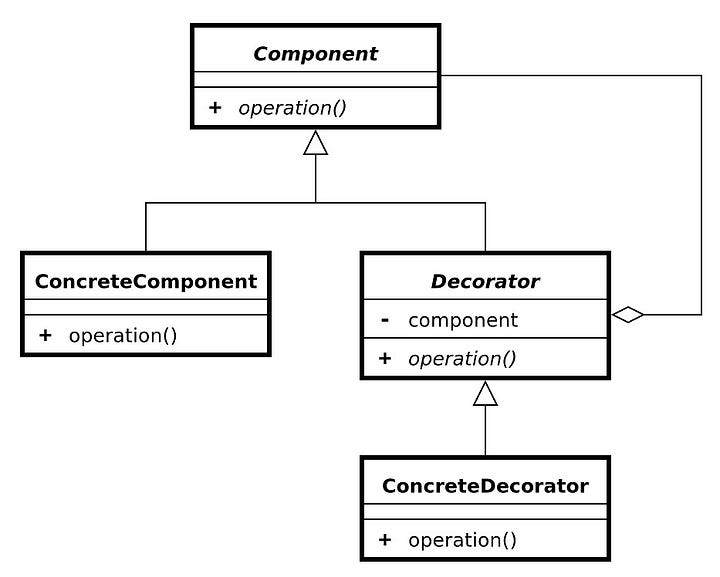

# Decorator Pattern: Elevating Code Flexibility


The Decorator pattern is a structural design pattern that allows behavior to be added to individual objects, either statically or dynamically, without affecting the behavior of other objects from the same class. In Java, the Decorator pattern is commonly used to extend the functionality of classes in a flexible and reusable manner.

# Why do we need to know the Decorator

In Java libraries and frameworks like Spring, the Decorator pattern might not be explicitly named, but its principles are often employed in various features and components. Let's explore some areas in Spring where the Decorator pattern, or its similar concepts, are utilized:

1. AOP (Aspect-Oriented Programming): Spring's AOP module allows you to separate cross-cutting concerns from the main application logic. AOP works by dynamically adding behavior to certain methods (join points) of classes (pointcuts). This is akin to the Decorator pattern, where aspects act as decorators adding functionality to the core business logic.
2. Spring Security: Spring Security provides comprehensive security services for Java applications. It often utilizes filters, interceptors, and aspects to add security-related functionalities such as authentication, authorization, and protection against common security threats. These additional functionalities are applied to existing components, much like decorators augmenting objects with new behaviors.
3. Spring MVC Interceptors: In Spring MVC, interceptors allow you to pre-process and post-process HTTP requests and responses. Interceptors are similar to decorators in that they wrap around the handling of requests, adding functionalities like logging, authentication checks, or modifying request/response parameters.
4. Transaction Management: Spring's transaction management capabilities allow you to manage database transactions declaratively. Under the hood, Spring utilizes proxies to intercept method calls and add transaction management logic around them. This is akin to the Decorator pattern, where additional behavior (transaction handling) is added around the core method execution.
5. Spring Data Repositories: Spring Data provides a powerful way to interact with various data stores in a consistent manner. It often uses dynamic proxies or generated proxy classes to provide additional functionalities like lazy loading, caching, auditing, etc., around basic CRUD operations. This approach resembles the Decorator pattern, where behaviors are added to repository methods transparently.

While these examples may not explicitly mention the Decorator pattern, they illustrate how the same principles of separating concerns and adding functionality dynamically are applied in various parts of the Spring framework. This flexible and modular design allows Spring applications to be highly customizable, maintainable, and scalable.



Let's explore how the Decorator pattern is implemented in Java with a simple example. Suppose we have a basic interface Coffee representing different types of coffee beverages:

```java
public interface Coffee {
    double cost();
    String getDescription();
}
```
And we have a concrete implementation of this interface called SimpleCoffee:

```java
public class SimpleCoffee implements Coffee {

    @Override
    public double cost() {
        return 1.0; // $1 for a simple coffee
    }

    @Override
    public String getDescription() {
        return "Simple Coffee";
    }
}
```

Now, let's say we want to add additional functionalities such as adding milk, adding sugar, or adding whipped cream to the coffee. Instead of modifying the existing classes directly, we can use the Decorator pattern.
First, we create an abstract decorator class CoffeeDecorator implementing the Coffee interface:

```java
public abstract class CoffeeDecorator implements Coffee {
    protected Coffee decoratedCoffee;

    public CoffeeDecorator(Coffee decoratedCoffee) {
        this.decoratedCoffee = decoratedCoffee;
    }

    @Override
    public double cost() {
        return decoratedCoffee.cost();
    }

    @Override
    public String getDescription() {
        return decoratedCoffee.getDescription();
    }
}
```
Now, we can create concrete decorators by extending the CoffeeDecorator class. For example, let's create a MilkDecorator:

```java
public class MilkDecorator extends CoffeeDecorator {

    public MilkDecorator(Coffee decoratedCoffee) {
        super(decoratedCoffee);
    }

    @Override
    public double cost() {
        return super.cost() + 0.5; // $0.5 for milk
    }

    @Override
    public String getDescription() {
        return super.getDescription() + ", Milk";
    }
}
```

Similarly, we can create other concrete decorators like SugarDecorator, WhippedCreamDecorator, etc.

Now, we can use these decorators to enhance our coffee objects dynamically:

```java
public class Main {
    public static void main(String[] args) {
        Coffee simpleCoffee = new SimpleCoffee();
        System.out.println("Cost: $" + simpleCoffee.cost());
        System.out.println("Description: " + simpleCoffee.getDescription());

        // Decorate with milk
        Coffee milkCoffee = new MilkDecorator(simpleCoffee);
        System.out.println("Cost: $" + milkCoffee.cost());
        System.out.println("Description: " + milkCoffee.getDescription());

        // Decorate with milk and sugar
        Coffee milkAndSugarCoffee = new SugarDecorator(new MilkDecorator(simpleCoffee));
        System.out.println("Cost: $" + milkAndSugarCoffee.cost());
        System.out.println("Description: " + milkAndSugarCoffee.getDescription());
    }
}
```

Output:

```java
Cost: $1.0
Description: Simple Coffee
Cost: $1.5
Description: Simple Coffee, Milk
Cost: $2.0
Description: Simple Coffee, Milk, Sugar
```

As you can see, the Decorator pattern allows us to add new functionalities to objects dynamically at runtime without altering their structure. This makes our code more flexible, reusable, and easier to maintain. In Java, this pattern is widely used in frameworks like Java I/O classes (e.g., BufferedReader, InputStreamReader) and Swing GUI components.

### Using the Decorator pattern in software development offers several benefits

1. Enhanced Flexibility: Decorators allow you to add or remove responsibilities from objects dynamically at runtime. This flexibility enables you to create complex combinations of behaviors by composing simple objects in various ways without modifying their code. This makes the system more adaptable to changing requirements.
2. Open/Closed Principle: The Decorator pattern promotes the Open/Closed Principle, which states that classes should be open for extension but closed for modification. Instead of modifying existing code to add new functionalities, you can create new decorators to extend the behavior of objects. This results in code that is less prone to bugs and easier to maintain.
3. Single Responsibility Principle (SRP): Decorators adhere to the Single Responsibility Principle by allowing each class to have a single responsibility. Each decorator is responsible for adding a specific behavior to the object it decorates, keeping the code modular and focused.
4. Promotes Code Reusability: Decorators can be reused to add similar functionalities to different objects. Once you create a decorator, you can apply it to multiple objects without duplicating code. This promotes code reusability and reduces development time and effort.
5. Easy to Combine Behaviors: Decorators can be stacked or combined in various ways to create complex behaviors. By chaining decorators together, you can create sophisticated objects with a combination of functionalities. This enables you to build systems with highly customizable and extensible features.
6. Separation of Concerns: Decorators separate the core concerns of an object from additional functionalities. This separation makes the codebase easier to understand, maintain, and test. Each decorator focuses on a specific aspect of behavior, leading to cleaner and more modular code.
7. Transparent to Clients: From the client's perspective, decorated objects behave the same way as the undecorated ones. Clients interact with objects through their common interface without needing to know about the decorators. This encapsulation ensures that the complexity of adding functionalities is hidden from the clients, promoting code encapsulation and abstraction.

Overall, the Decorator pattern is a powerful design pattern that promotes code flexibility, maintainability, and reusability. By allowing you to add functionalities dynamically and transparently, decorators provide an elegant solution for extending the behavior of objects in object-oriented systems.

### Decorator inside languages from scratch
While the Decorator pattern itself is not directly embedded into programming languages as a language feature, some languages provide constructs or libraries that facilitate similar functionality, making it easier to implement decorators or achieve similar effects.

# Conclusion
The Decorator pattern is essential in software engineering for enhancing object functionality without altering its structure. It facilitates the addition of new behaviors or responsibilities dynamically, promoting flexibility and scalability in codebases. By adhering to the Open/Closed Principle, it allows for extending the functionality of existing classes without modifying their source code. This pattern promotes code reusability and maintainability by favoring composition over inheritance. Decorators can be stacked or combined to create complex behaviors, offering a modular and flexible approach to software design. It enables the creation of fine-grained and reusable components that can be easily customized or extended as per specific requirements. The Decorator pattern is particularly useful in scenarios where subclassing would result in a proliferation of classes or when class modification is impractical or undesirable. It fosters a clean and cohesive design by separating concerns and promoting single responsibility principles. In essence, the Decorator pattern empowers developers to augment object behavior dynamically at runtime, facilitating the creation of highly adaptable and modular systems. Its versatility makes it a valuable tool in the software architect's toolkit for crafting robust and maintainable codebases.
