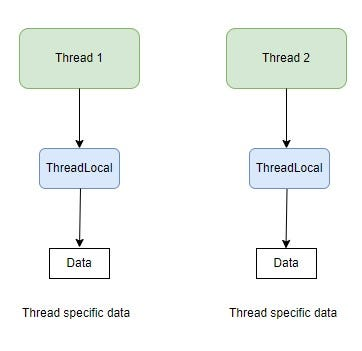

# ThreadLocal


In the realm of concurrent programming, managing shared data among multiple threads is a critical challenge. Java's ThreadLocal class emerges as a powerful tool in addressing this challenge by providing a mechanism to maintain thread-local variables. Unlike traditional variables whose values are shared across threads, thread-local variables ensure that each thread accessing them has its own isolated copy, independent of other threads.

# History

The history of ThreadLocal in Java traces back to the early days of Java's evolution in the late 1990s. It was introduced in JDK 1.2, marking a significant milestone in Java's concurrency utilities. The motivation behind its creation stemmed from the need to provide a mechanism for thread-local variables, ensuring thread isolation in multi-threaded environments. Initially, its adoption was gradual, as developers familiarized themselves with its concepts and usage patterns. Over time, as multi-threaded programming became more prevalent, the importance of ThreadLocal grew, especially in scenarios where per-thread state management was essential. With advancements in Java versions, ThreadLocal underwent optimizations and refinements to enhance its performance and usability. Its versatility and effectiveness made it a cornerstone in concurrent programming paradigms, influencing the design of frameworks and libraries that leverage thread-local semantics. Today, ThreadLocal remains a vital component in Java's concurrency toolkit, empowering developers to write efficient and thread-safe applications with ease.

In this discussion, we'll delve into the essence of ThreadLocal in Java, exploring its purpose, mechanics, and practical applications. From its fundamental principles to real-world use cases, understanding ThreadLocal is pivotal for developing robust, scalable, and thread-safe Java applications. Let's embark on a journey to unlock the mysteries of ThreadLocal and harness its potential in concurrent programming.

In Java, ThreadLocal is a class that provides thread-local variables. These variables differ from their normal counterparts in that each thread accessing one (via its get or set method) has its own, independently initialized copy of the variable.



```java
public class MyThreadLocalExample {

    // Define a ThreadLocal variable
    private static ThreadLocal<Integer> threadLocalValue = new ThreadLocal<Integer>() {
        @Override
        protected Integer initialValue() {
            return 0; // Default value for each thread
        }
    };

    public static void main(String[] args) {
        // Set the value of the thread-local variable for the main thread
        threadLocalValue.set(10);

        // Create and start a new thread
        Thread newThread = new Thread(() -> {
            // Get the value of the thread-local variable for this thread
            int value = threadLocalValue.get();
            System.out.println("Thread-local value in newThread: " + value);
        });
        newThread.start();

        // Get the value of the thread-local variable for the main thread
        int mainThreadValue = threadLocalValue.get();
        System.out.println("Thread-local value in main thread: " + mainThreadValue);
    }
}
```

In this example, ThreadLocal allows each thread to have its own copy of threadLocalValue, initialized independently. So, even though we set it to 10 in the main thread, the value accessed by the new thread remains at its default (0 in this case), demonstrating the thread isolation feature.

ThreadLocal is often used in scenarios where you need to maintain per-thread state, such as in web applications where you might want to store user session information without explicitly passing it around in method parameters. However, it's essential to use ThreadLocal judiciously, as excessive reliance on it can lead to memory leaks or subtle bugs, especially in long-running applications or in environments like application servers where threads are pooled and reused.

Another example:
```java
public class ThreadLocalExample {
    private static final ThreadLocal<Integer> threadLocalValue = ThreadLocal.withInitial(() -> 0);

    public static void main(String[] args) {
        Runnable task = () -> {
            int value = threadLocalValue.get();
            value += 1;
            threadLocalValue.set(value);
            System.out.println(Thread.currentThread().getName() + ": " + threadLocalValue.get());
        };

        Thread thread1 = new Thread(task, "Thread 1");
        Thread thread2 = new Thread(task, "Thread 2");

        thread1.start();
        thread2.start();
    }
}
```
In this example, ThreadLocal.withInitial provides each thread with an initial value of 0. Each thread independently increments and accesses its value without interference.

### Benefits of Using ThreadLocal

* Thread Safety: Since each thread has its own copy of the variable, there's no need for synchronization, reducing the risk of concurrency issues.
* Performance: By avoiding synchronization, ThreadLocal can improve performance, especially in highly concurrent environments.
* Simplicity: It simplifies the design of classes that use thread-specific data, making the code easier to understand and maintain.

# ThreadLocal and Spring

Spring Framework utilizes ThreadLocal in various contexts to manage thread-specific data and ensure thread safety within its components. Some common use cases include:

1. Request Context: In web applications built with Spring MVC or Spring WebFlux, ThreadLocal is often used to store the request and response objects, session information, and other request-specific data. This allows controllers, interceptors, and other components to access this data without explicitly passing it around in method parameters, promoting cleaner code and decoupling.
2. Transaction Management: Spring's transaction management capabilities, such as those provided by @Transactional annotations or programmatic transaction management, often rely on ThreadLocal to associate transactional state with the current thread. This ensures that each thread executing a transaction operates within its own transactional context, preventing interference between concurrent transactions.
3. Security Context: Spring Security, the de facto standard for securing Spring-based applications, uses ThreadLocal to store security-related information such as the current user's authentication details, authorities, and access control context. This allows security-related components to access this information conveniently without introducing coupling between different layers of the application.
4. Locale Context: Spring's internationalization (i18n) and localization (l10n) features use ThreadLocal to store the current locale associated with each thread. This allows components such as view resolvers, message sources, and date formatters to access the appropriate locale without relying on global state or passing the locale explicitly.
5. Logging Context: Spring's logging abstraction, such as the MDC (Mapped Diagnostic Context) in Spring Boot, uses ThreadLocal to store diagnostic information such as request IDs, user IDs, or other contextual data that should be included in log messages generated by the application. This ensures that the correct context is included in log messages, even in multi-threaded environments.

By leveraging ThreadLocal, Spring Framework provides a convenient and efficient way to manage thread-specific data across various layers of the application, promoting modularity, reusability, and thread safety. However, it's essential for developers to use ThreadLocal judiciously and be mindful of potential memory leaks or concurrency issues, especially in long-running applications or in environments with thread pooling.

### ThreadLocal and MDC context

In logging frameworks like Logback or Log4j, the MDC (Mapped Diagnostic Context) is a feature used to enrich log messages with contextual information. ThreadLocal is often employed to manage MDC context because it allows each thread to have its own copy of the MDC context, ensuring thread safety and preventing interference between concurrent threads. Here's how ThreadLocal can be used in conjunction with MDC:

1. Setting Context: Before processing begins, relevant contextual information is stored in the MDC. This information might include request IDs, user IDs, session IDs, or any other data specific to the current thread's execution context. ThreadLocal is used to store this context, ensuring that each thread maintains its own isolated copy.
2. Logging: Throughout the execution of the request or task, log messages are generated. The MDC context stored in the ThreadLocal variable is accessed and included in these log messages. This ensures that each log message contains the relevant context without explicitly passing it as a parameter to every logging method call.
3. Example: Below is a simplified example demonstrating how ThreadLocal can be used with MDC in a logging context using Logback:

```java
import org.slf4j.Logger;
import org.slf4j.LoggerFactory;
import org.slf4j.MDC;
import java.util.UUID;

public class MyService {
    private static final Logger logger = LoggerFactory.getLogger(MyService.class);
    private static final ThreadLocal<String> requestId = new ThreadLocal<>();

    public void processRequest() {
        // Set request ID in the MDC context
        requestId.set(generateRequestId());
        MDC.put("requestId", requestId.get());

        // Perform some processing
        logger.info("Processing request...");

        // Clear the MDC context after processing
        requestId.remove();
        MDC.clear();
    }

    private String generateRequestId() {
        // Generate a unique request ID
        return UUID.randomUUID().toString();
    }
}
```

In this example, before processing a request, the request ID is stored in the MDC context using ThreadLocal. The MDC context is then enriched with this request ID using MDC.put(). The request ID is accessed within the processRequest() method and included in the log message generated by logger.info(). Finally, after processing the request, the MDC context is cleared using MDC.clear() to prevent memory leaks and ensure clean-up.
By using ThreadLocal to manage MDC context, each thread processing a request or task maintains its own isolated copy of the context, ensuring thread safety and preventing interference between concurrent threads. This approach simplifies logging by automatically including relevant context in log messages without requiring explicit parameter passing.

### Some Internal Aspects

Internally, ThreadLocal uses a ThreadLocalMap to store thread-local variables and their respective values. Here's how it works:

1. ThreadLocalMap: Each thread that accesses ThreadLocal variables maintains its own ThreadLocalMap instance. This map is essentially a custom implementation of a hash map optimized for the small number of entries typically associated with thread-local variables.
2. Entry Storage: The ThreadLocalMap stores entries where each entry corresponds to a ThreadLocal instance and its associated value for the current thread. The ThreadLocal instance serves as the key, and the value is the object associated with that ThreadLocal instance for the current thread.
3. Weak References: To prevent memory leaks, ThreadLocalMap uses weak references for the ThreadLocal instances. Weak references allow the garbage collector to collect ThreadLocal instances when they are no longer reachable from the application code, even if they are still referenced in the ThreadLocalMap.
4. ThreadLocal as Key: When a ThreadLocal variable is accessed or modified within a thread, the thread retrieves its ThreadLocalMap instance and uses the ThreadLocal instance itself (not its value) as the key to access the associated value in the map.
5. Isolation: Because each thread has its own ThreadLocalMap instance, changes made to ThreadLocal variables in one thread do not affect the values of those variables in other threads. This isolation ensures that each thread maintains its own independent copy of thread-local variables.
6. Memory Management: ThreadLocalMap internally handles memory management for the entries. When a ThreadLocal instance is no longer referenced from the application code and is garbage collected, the corresponding entry in the ThreadLocalMap is removed to prevent memory leaks.
7. Collision Resolution: TreadLocalMap resolves hash collisions using linear probing, where entries with the same hash code are stored in consecutive slots in the underlying array. This ensures efficient lookup and insertion of entries even in the presence of hash collisions.

Overall, ThreadLocal leverages ThreadLocalMap to provide efficient and thread-safe storage for thread-local variables, ensuring that each thread can maintain its own independent state without interfering with other threads.

# ThreadLocal usecases

ThreadLocal is a versatile tool in Java that finds application in various scenarios where thread isolation and thread-specific data management are crucial. Here are some common use cases:

1. User Sessions in Web Applications: In web applications, ThreadLocal can store user session data that's specific to a request-handling thread, ensuring data isolation between requests.
2. Database Connections: Managing database connections per thread can be simplified using ThreadLocal, allowing each thread to have its own connection without needing to manage a pool manually.
3. Transaction Management: In transactional systems, ThreadLocal can be used to store transaction-specific data, such as the current transaction context, database connection, or transaction ID. This ensures that each thread executing a transaction operates within its own isolated transactional context, preventing interference between concurrent transactions.
4. Logging: ThreadLocal is commonly used in logging frameworks to enrich log messages with contextual information such as request IDs, user IDs, or session IDs. This contextual information is stored in ThreadLocal variables and accessed when generating log messages, ensuring that each log message contains the relevant context without explicitly passing it as a parameter to every logging method call.
5. Security Context: In security-sensitive applications, ThreadLocal can be used to store security-related information such as the current user's authentication details, authorities, or access control context. This allows security-related components to access this information conveniently without introducing coupling between different layers of the application.
6. Internationalization (i18n) and Localization (l10n): ThreadLocal can be used to store the current locale associated with each thread in internationalized applications. This allows components such as view resolvers, message sources, and date formatters to access the appropriate locale without relying on global state or passing the locale explicitly.
7. Caching: ThreadLocal can be used to implement thread-local caches, where each thread maintains its own cache of frequently accessed data. This can improve performance by reducing contention on shared cache instances and avoiding the need for explicit synchronization.
8. Resource Management: ThreadLocal can be used to manage resources that are expensive to create or acquire, such as database connections, thread pools, or file handles. By associating each thread with its own instance of the resource, ThreadLocal ensures that the resource is reused across multiple invocations within the same thread, reducing overhead and improving efficiency.

# Best Practices

* Proper Initialization and Cleanup: Ensure ThreadLocal variables are properly initialized and cleaned up to prevent memory leaks. Use try-finally blocks or frameworks that manage the lifecycle of threads.

```java
public class ThreadLocalExample {
    private static final ThreadLocal<Object> threadLocal = ThreadLocal.withInitial(Object::new);

    public static void main(String[] args) {
        try {
            Object obj = threadLocal.get();
            // Use obj
        } finally {
            threadLocal.remove();
        }
    }
}
```

* Avoid Overuse: While ThreadLocal is powerful, overusing it can lead to complex and hard-to-debug code. Use it judiciously for genuine thread-local storage needs.
* Document Usage: Clearly document the purpose and lifecycle of ThreadLocal variables to ensure maintainability and avoid confusion among team members.
* Thread Pools Consideration: Be cautious when using ThreadLocal with thread pools. Since threads are reused, stale data might persist across tasks. Always clean up the ThreadLocal data after task completion.


Overall, ThreadLocal provides a convenient and efficient way to manage thread-specific data in Java applications, promoting modularity, reusability, and thread safety. However, it's important to use ThreadLocal judiciously and be mindful of potential memory leaks or concurrency issues, especially in long-running applications or in environments with thread pooling.