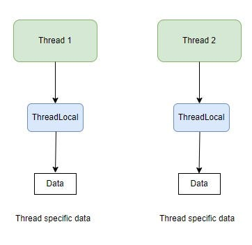

# ThreadLocal vs ScopedValue


ThreadLocal is a class that provides thread-local variables. Each thread accessing such a variable has its own, independently initialized copy of the variable. ThreadLocal is useful when you have some data that you want to be isolated per thread, like user session data in a web server.



Example:

```java
import java.util.concurrent.ExecutorService;
import java.util.concurrent.Executors;

public class ThreadLocalExample {
    private static ThreadLocal<Integer> threadLocalValue = ThreadLocal.withInitial(() -> 0);

    public static void main(String[] args) {
        ExecutorService executor = Executors.newFixedThreadPool(2);

        Runnable task = () -> {
            int value = threadLocalValue.get();
            value += (int) (Math.random() * 100);
            threadLocalValue.set(value);
            System.out.println(Thread.currentThread().getName() + " initial value: " + value);
            
            try {
                Thread.sleep(100);
            } catch (InterruptedException e) {
                e.printStackTrace();
            }
            
            System.out.println(Thread.currentThread().getName() + " final value: " + threadLocalValue.get());
        };

        executor.submit(task);
        executor.submit(task);

        executor.shutdown();
    }
}
```

# ScopedValue

Java 20 introduces ScopedValue as part of Project Loom to provide a way to share immutable data with a bounded scope across threads, especially useful in the context of virtual threads. ScopedValue allows defining a value that is accessible only within a certain scope and ensures that this value is not modified.

Here's a simple example of using ScopedValue:

```java
import java.util.concurrent.ExecutorService;
import java.util.concurrent.Executors;
import jdk.incubator.concurrent.ScopedValue;

public class ScopedValueExample {
    private static final ScopedValue<String> scopedValue = ScopedValue.newInstance();

    public static void main(String[] args) {
        ExecutorService executor = Executors.newFixedThreadPool(2);

        Runnable task = () -> {
            ScopedValue.where(scopedValue, "Value in " + Thread.currentThread().getName()).run(() -> {
                System.out.println(Thread.currentThread().getName() + " initial value: " + scopedValue.get());
                
                try {
                    Thread.sleep(100);
                } catch (InterruptedException e) {
                    e.printStackTrace();
                }
                
                System.out.println(Thread.currentThread().getName() + " final value: " + scopedValue.get());
            });
        };

        executor.submit(task);
        executor.submit(task);

        executor.shutdown();
    }
}
```

# Key Differences

### Scope and Mutability:

* ThreadLocal: Each thread has its own isolated copy of the variable, and this value can be changed by the thread.
* ScopedValue: Provides an immutable value that is accessible within a bounded scope. The value cannot be changed once it is set for a given scope.

### Context Propagation:

* ThreadLocal: The value is thread-specific and does not naturally propagate to child threads.
* ScopedValue: Designed for use with Project Loom and virtual threads, allowing the scoped value to be shared across threads within a certain scope.

# Use Case:

* ThreadLocal: Best used for per-thread context or data that needs to be isolated to individual threads.
* ScopedValue: Ideal for scenarios where you need to pass immutable data through a controlled scope, especially in structured concurrency models introduced with Project Loom.

By using ThreadLocal, each thread manages its own version of the variable, whereas ScopedValue ensures that the data is shared immutably and is scoped to a specific execution context, providing more controlled and safer sharing of data.

# How ThreadLocal Works

* ThreadLocal provides thread-local variables, ensuring that each thread accessing such a variable has its own, independently initialized copy. This is useful for maintaining per-thread state without using synchronization.
* Internal Mechanism of ThreadLocal

### ThreadLocal Object:

Each ThreadLocal object is associated with a key, which is used to retrieve the value for the current thread.

### Thread's Storage:

Each Thread object has a reference to a ThreadLocalMap, which is a custom hash map that maps ThreadLocal instances to their corresponding values for that thread.

### Set and Get Methods:

* When you call ThreadLocal.set(T value), it sets the value for the current thread in the thread's ThreadLocalMap.
* When you call ThreadLocal.get(), it retrieves the value for the current thread from the thread's ThreadLocalMap.

Here is a simplified illustration of how ThreadLocal works:

```java
public class ThreadLocalExample {
    private static ThreadLocal<Integer> threadLocalValue = ThreadLocal.withInitial(() -> 0);

    public static void main(String[] args) {
        threadLocalValue.set(123);
        Integer value = threadLocalValue.get(); // Retrieves 123 for the current thread
    }
}
```

###  Internally:

* When threadLocalValue.set(123) is called, the current thread's ThreadLocalMap associates threadLocalValue with 123.
* When threadLocalValue.get() is called, it looks up threadLocalValue in the current thread's ThreadLocalMap and returns 123.

###  How ScopedValue Works

* ScopedValue is a feature introduced in Java 20, designed to manage immutable data that is accessible within a certain scope, particularly beneficial in the context of Project Loom and virtual threads.
* Internal Mechanism of ScopedValue

###  ScopedValue Object:

* ScopedValue instances are used to create values that are scoped to specific contexts or blocks of code.

### Scoped Context:

* You define a scope using ScopedValue.where(scopedValue, value).run(runnable). Within this block, the scopedValue is accessible and immutable.

### Immutable and Scoped:

* The value associated with a ScopedValue is immutable and only accessible within the defined scope. This ensures safe sharing of data across threads without synchronization issues.

Here is a simplified illustration of how ScopedValue works:

```java
import jdk.incubator.concurrent.ScopedValue;

public class ScopedValueExample {
    private static final ScopedValue<String> scopedValue = ScopedValue.newInstance();

    public static void main(String[] args) {
        ScopedValue.where(scopedValue, "Scoped Value Example").run(() -> {
            String value = scopedValue.get(); // Retrieves "Scoped Value Example" within this scope
            System.out.println(value);
        });
    }
}
```

### Internally:

* When ScopedValue.where(scopedValue, "Scoped Value Example").run(runnable) is called, it establishes a new scope.
* Within this scope, calling scopedValue.get() returns "Scoped Value Example".

# Key Differences in How They Work

### Thread-Specific Storage vs. Scoped Context:

* ThreadLocal: Stores data in a per-thread hash map (ThreadLocalMap). Each thread has its own independent copy of the data.
* ScopedValue: Establishes a scoped context where the value is accessible and immutable within that scope.

# Lifecycle and Cleanup:

* ThreadLocal: Data persists for the lifetime of the thread unless explicitly removed. Requires manual cleanup to avoid memory leaks.
* ScopedValue: Data is automatically managed and cleaned up when the scope exits, ensuring no residual data outside the scope.

# Synchronization and Concurrency:

* ThreadLocal: Each thread has its own copy of the data, eliminating the need for synchronization but limiting data sharing across threads.
* ScopedValue: Allows safe, immutable data sharing within a defined scope, making it suitable for structured concurrency and virtual threads.

# Practical Use Cases

* ThreadLocal: Suitable for cases where each thread needs its own isolated data, such as user session data in web servers or transaction contexts in database applications.
* ScopedValue: Ideal for cases where immutable data needs to be shared across a controlled scope, particularly in new concurrency models like those enabled by Project Loom, which involve many lightweight virtual threads.

# Conclusion

ThreadLocal is better for use, Applications with a traditional thread-per-request model and scenarios where each thread needs its own independent and mutable data. Also there are a lot Legacy systems where thread-specific storage is needed.
ScopedValue use cases are Modern applications leveraging structured concurrency and virtual threads. Also for cases requiring immutable data that needs to be safely shared within a specific execution context. New projects where clean and manageable context propagation is a priority.
By carefully considering the nature of your application's concurrency requirements and the characteristics of the data you need to manage, you can choose the right tool ThreadLocal for thread-specific mutable state, or ScopedValue for scoped, immutable context propagation in modern concurrency models.