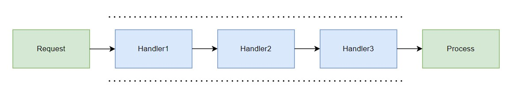

# Chain of Responsibility in Java: A Practical Guide


In the ever-evolving landscape of software development, architects and developers continually seek robust solutions to handle complex scenarios efficiently. Design patterns emerge as guiding principles, offering time-tested strategies for crafting maintainable, scalable, and flexible software systems. Among these patterns, the Chain of Responsibility stands as a versatile tool, particularly valuable in scenarios where multiple objects may handle a request without a predefined recipient.

In this article, we embark on a journey to unravel the intricacies of the Chain of Responsibility pattern and its practical implementation in Java. We'll delve into its core concepts, explore real-world use cases, and demonstrate how it empowers developers to design elegant solutions to intricate problems.

First, we'll establish a foundational understanding of the Chain of Responsibility pattern, elucidating its purpose and principles. Then, armed with this knowledge, we'll dive into Java-specific implementations, examining how the language's features facilitate the seamless integration of this pattern into software architectures.

Throughout our exploration, we'll leverage illustrative examples and code snippets to illuminate key concepts and best practices. By the end of this journey, readers will not only grasp the essence of the Chain of Responsibility pattern but also feel empowered to wield it effectively in their Java projects, fostering codebases that are modular, extensible, and resilient to change.

So, let's embark on this enlightening voyage into the world of Chain of Responsibility, where intricate problems find elegant solutions through the power of design patterns and Java programming.

# Usage in Frameworks and Java

The Chain of Responsibility pattern finds application in various domains within Java development, including frameworks like Spring, where it serves to enhance modularity, flexibility, and maintainability. Here are a few key areas where the Chain of Responsibility pattern applies in Java and frameworks like Spring:

1. HTTP Request Handling in Spring MVC: In a Spring MVC application, incoming HTTP requests often need to traverse multiple layers of middleware or interceptors before reaching the controller responsible for processing them. The Chain of Responsibility pattern can be employed to define a chain of interceptors, each responsible for performing specific pre-processing or post-processing tasks on the request or response. This approach facilitates the modularization of request-handling logic and allows developers to plug in or remove interceptors dynamically.
2. Filter Chains in Servlet Containers: Servlet containers like Apache Tomcat utilize filter chains to process incoming requests before they reach the servlet responsible for handling them. Each filter in the chain can inspect or modify the request and pass it along to the next filter or servlet in the chain. The Chain of Responsibility pattern provides a natural abstraction for implementing filter chains, enabling developers to compose complex request-processing pipelines with ease.
3. Event Handling and Propagation: In event-driven architectures, events often propagate through a hierarchy of listeners or handlers, with each node in the hierarchy having the option to handle the event or pass it along to its parent or sibling. The Chain of Responsibility pattern can be used to model this propagation mechanism, allowing developers to define a chain of event handlers and delegate event processing in a flexible and extensible manner.
4. Security Interceptors and Authorization Filters: Security is a critical concern in modern web applications, and frameworks like Spring Security provide comprehensive solutions for implementing authentication, authorization, and other security features. The Chain of Responsibility pattern can be leveraged to define a chain of security interceptors or authorization filters, each responsible for enforcing a specific security policy or performing a particular security check. This approach enables developers to compose complex security configurations from modular, reusable components.
5. Aspect-Oriented Programming (AOP): AOP is a programming paradigm that allows developers to modularize cross-cutting concerns, such as logging, caching, and transaction management, by separating them from the core business logic of an application. In Spring AOP, aspects are applied to join points in the application's execution flow to implement cross-cutting functionality. The Chain of Responsibility pattern can be employed to define a chain of aspects, each responsible for intercepting method invocations or other join points and applying a specific aspect to them. This approach enhances the modularity and reusability of aspect-oriented code.

In summary, the Chain of Responsibility pattern finds application in a wide range of scenarios within Java development and frameworks like Spring, including HTTP request handling, filter chains, event propagation, security enforcement, and aspect-oriented programming. By providing a flexible and modular way to compose and execute chains of responsibility, this pattern empowers developers to build scalable, maintainable, and extensible software systems.

# Pattern

Chain of Responsibility pattern is applicable when:

- The request is handled by multiple objects, determined at runtime
- custom dynamically change these handlers, and do not hardcode them



Pattern diagram:


# Example

Let's illustrate the Chain of Responsibility pattern with a simple example scenario: processing purchase requests in an e-commerce application. In this scenario, each purchase request needs to be approved by multiple authorities based on the purchase amount. We'll implement a chain of approvers, where each approver has a specific purchasing limit they can approve. If a request exceeds the limit of one approver, it gets passed to the next one in the chain until it's approved or rejected.

```java
// Define the base interface for request handlers
interface PurchaseApprover {
    void setNextApprover(PurchaseApprover nextApprover);
    void processRequest(PurchaseRequest request);
}

// Concrete implementation of PurchaseApprover
class Manager implements PurchaseApprover {
    private double purchasingLimit;
    private PurchaseApprover nextApprover;

    public Manager(double purchasingLimit) {
        this.purchasingLimit = purchasingLimit;
    }

    @Override
    public void setNextApprover(PurchaseApprover nextApprover) {
        this.nextApprover = nextApprover;
    }

    @Override
    public void processRequest(PurchaseRequest request) {
        if (request.getAmount() <= purchasingLimit) {
            System.out.println("Manager approved purchase of $" + request.getAmount());
        } else if (nextApprover != null) {
            nextApprover.processRequest(request);
        } else {
            System.out.println("Purchase request for $" + request.getAmount() + " exceeds approval limit.");
        }
    }
}

// Purchase request class
class PurchaseRequest {
    private double amount;

    public PurchaseRequest(double amount) {
        this.amount = amount;
    }

    public double getAmount() {
        return amount;
    }
}

public class ChainOfResponsibilityExample {
    public static void main(String[] args) {
        // Create chain of approvers
        PurchaseApprover manager = new Manager(1000);
        PurchaseApprover director = new Manager(5000);
        PurchaseApprover vp = new Manager(10000);

        // Set up the chain of responsibility
        manager.setNextApprover(director);
        director.setNextApprover(vp);

        // Process purchase requests
        manager.processRequest(new PurchaseRequest(500));
        manager.processRequest(new PurchaseRequest(2500));
        manager.processRequest(new PurchaseRequest(7500));
        manager.processRequest(new PurchaseRequest(15000));
    }
}
```

In this example:


* We have an interface PurchaseApprover that defines the contract for request handlers. Each handler implements this interface and is responsible for processing purchase requests based on its purchasing limit.
* Manager is a concrete implementation of PurchaseApprover with a specific purchasing limit. If it can't approve the request, it passes it to the next approver in the chain.
* In the ChainOfResponsibilityExample class, we create instances of Manager representing different levels of authority. We then set up the chain by linking them together based on their hierarchy.
* Finally, we simulate purchase requests with different amounts and observe how they're processed through the chain of responsibility.

# Data Conversion example

Let's consider an example where we have a pipeline of data converters, each responsible for converting data from one format to another. We'll define an interface for the converters, and then create concrete implementations for converting data between different formats, such as JSON to XML, XML to CSV, and CSV to JSON.

```java
// Define the base interface for data converters
interface DataConverter {
    void setNextConverter(DataConverter nextConverter);
    String convert(String data);
}

// Concrete implementation of DataConverter for JSON to XML conversion
class JsonToXmlConverter implements DataConverter {
    private DataConverter nextConverter;

    @Override
    public void setNextConverter(DataConverter nextConverter) {
        this.nextConverter = nextConverter;
    }

    @Override
    public String convert(String data) {
        // Perform JSON to XML conversion
        return "<xml>" + data + "</xml>";
    }
}

// Concrete implementation of DataConverter for XML to CSV conversion
class XmlToCsvConverter implements DataConverter {
    private DataConverter nextConverter;

    @Override
    public void setNextConverter(DataConverter nextConverter) {
        this.nextConverter = nextConverter;
    }

    @Override
    public String convert(String data) {
        // Perform XML to CSV conversion
        return data.replaceAll("<", ",").replaceAll(">", "");
    }
}

// Concrete implementation of DataConverter for CSV to JSON conversion
class CsvToJsonConverter implements DataConverter {
    private DataConverter nextConverter;

    @Override
    public void setNextConverter(DataConverter nextConverter) {
        this.nextConverter = nextConverter;
    }

    @Override
    public String convert(String data) {
        // Perform CSV to JSON conversion
        return "{\"json\": \"" + data + "\"}";
    }
}

public class DataConversionPipeline {
    public static void main(String[] args) {
        // Create instances of converters
        DataConverter jsonToXmlConverter = new JsonToXmlConverter();
        DataConverter xmlToCsvConverter = new XmlToCsvConverter();
        DataConverter csvToJsonConverter = new CsvToJsonConverter();

        // Set up the pipeline
        jsonToXmlConverter.setNextConverter(xmlToCsvConverter);
        xmlToCsvConverter.setNextConverter(csvToJsonConverter);

        // Input data in JSON format
        String jsonData = "{ \"key\": \"value\" }";

        // Process data through the pipeline
        String result = jsonToXmlConverter.convert(jsonData);

        // Output the result
        System.out.println("Result: " + result);
    }
}
```

In this example:

* We define the DataConverter interface, which declares methods for setting the next converter in the pipeline and converting data.
* We create concrete implementations for converting data between JSON, XML, and CSV formats.
* In the DataConversionPipeline class, we create instances of the converters and set up the pipeline by linking them together based on the desired conversion order.
* We then input data in JSON format and pass it through the pipeline. The data gets converted successively from JSON to XML, then from XML to CSV, and finally from CSV to JSON.
* Finally, we output the result after it has passed through the entire pipeline of converters.

# Conclusion

In conclusion, the Chain of Responsibility pattern provides a powerful mechanism for implementing a pipeline of data converters in Java. By decomposing the conversion process into a series of discrete steps, each handled by a separate converter, we can achieve modularity, flexibility, and extensibility in our data processing logic. This approach allows for easy composition of complex conversion pipelines and facilitates the addition or modification of converters without affecting the overall structure of the system. By leveraging the Chain of Responsibility pattern, developers can build robust and scalable data transformation pipelines that meet the evolving needs of their applications.

