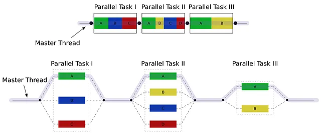

# Java ForkJoinPool: A Comprehensive Guide



The ForkJoinPool class is a part of Java's concurrency framework introduced in Java 7. It provides an efficient way to handle parallelism by dividing tasks into smaller subtasks and executing them concurrently. This article will explore the ForkJoinPool, its configuration, use cases within frameworks, and an example of implementing Merge Sort using ForkJoinPool.

In this article we will review next topics:

1. Should be description for ForkJoinPool. Where is better to use.
2. Examples how to configure
3. Use cases where it used inside some frameworks
4. Should have an example of Merge Sort using forkJoinPool
5. Conclusion

# 1. What is ForkJoinPool?

The ForkJoinPool is designed to simplify the execution of parallel tasks in Java. It leverages the Fork/Join framework, which allows tasks to be split into smaller chunks (forking) and then recombined (joining) after processing. This approach is particularly effective for recursive algorithms where a problem can be divided into similar subproblems.

### Where to Use ForkJoinPool

### ForkJoinPool is ideal for:

* Recursive Algorithms: Tasks that can be broken down into smaller subtasks, such as sorting algorithms.
* CPU-Bound Tasks: Tasks that primarily utilize CPU resources and benefit from parallel execution.
* Data Processing: Scenarios requiring large datasets to be processed in parallel.


# Configuring ForkJoinPool

Configuring a ForkJoinPool is straightforward. You can create a pool with a specified level of parallelism (number of threads). 
Here's a simple example:

```java
import java.util.concurrent.ForkJoinPool;
import java.util.concurrent.RecursiveTask;

public class ForkJoinPoolExample {

    public static void main(String[] args) {
        ForkJoinPool forkJoinPool = new ForkJoinPool(4); // 4 parallel threads
        MyRecursiveTask task = new MyRecursiveTask(100);
        Integer result = forkJoinPool.invoke(task);
        System.out.println("Result: " + result);
    }
}

class MyRecursiveTask extends RecursiveTask<Integer> {
    private int workload;

    MyRecursiveTask(int workload) {
        this.workload = workload;
    }

    @Override
    protected Integer compute() {
        if (workload > 16) {
            MyRecursiveTask subtask1 = new MyRecursiveTask(workload / 2);
            MyRecursiveTask subtask2 = new MyRecursiveTask(workload / 2);

            subtask1.fork();
            subtask2.fork();

            int result = subtask1.join() + subtask2.join();
            return result;
        } else {
            return workload * workload;
        }
    }
}
```

In this example, a ForkJoinPool is created with 4 threads. The MyRecursiveTask class extends RecursiveTask, which returns a result after computation.

# Use Cases in Frameworks

ForkJoinPool is utilized in various Java frameworks to enhance performance through parallel processing:

- Java Streams: The parallel stream API in Java internally uses ForkJoinPool to parallelize stream operations.

```java
List<Integer> list = Arrays.asList(1, 2, 3, 4, 5);
list.parallelStream().forEach(System.out::println);
```

- Spring Framework: In Spring Batch, ForkJoinPool can be used to parallelize batch jobs.

```java
@Bean
public TaskExecutor taskExecutor() {
    return new ForkJoinPool(4);
}
```

- Akka: The Akka framework, used for building highly concurrent applications, can utilize ForkJoinPool for actor execution.


# Example: Merge Sort Using ForkJoinPool

Merge Sort is a classic example where ForkJoinPool can be effectively utilized. Here's an implementation:

```java
import java.util.concurrent.ForkJoinPool;
import java.util.concurrent.RecursiveAction;

public class ForkJoinMergeSort {

    public static void main(String[] args) {
        int[] array = {38, 27, 43, 3, 9, 82, 10};
        ForkJoinPool pool = new ForkJoinPool();
        pool.invoke(new MergeSortTask(array, 0, array.length - 1));

        for (int i : array) {
            System.out.print(i + " ");
        }
    }

    static class MergeSortTask extends RecursiveAction {
        private int[] array;
        private int left;
        private int right;

        MergeSortTask(int[] array, int left, int right) {
            this.array = array;
            this.left = left;
            this.right = right;
        }

        @Override
        protected void compute() {
            if (left < right) {
                int mid = (left + right) / 2;

                MergeSortTask leftTask = new MergeSortTask(array, left, mid);
                MergeSortTask rightTask = new MergeSortTask(array, mid + 1, right);

                invokeAll(leftTask, rightTask);

                merge(array, left, mid, right);
            }
        }

        private void merge(int[] array, int left, int mid, int right) {
            int n1 = mid - left + 1;
            int n2 = right - mid;

            int[] L = new int[n1];
            int[] R = new int[n2];

            System.arraycopy(array, left, L, 0, n1);
            System.arraycopy(array, mid + 1, R, 0, n2);

            int i = 0, j = 0, k = left;
            while (i < n1 && j < n2) {
                if (L[i] <= R[j]) {
                    array[k] = L[i];
                    i++;
                } else {
                    array[k] = R[j];
                    j++;
                }
                k++;
            }

            while (i < n1) {
                array[k] = L[i];
                i++;
                k++;
            }

            while (j < n2) {
                array[k] = R[j];
                j++;
                k++;
            }
        }
    }
}
```

In this example, the MergeSortTask extends RecursiveAction and overrides the compute method to divide the array and merge the sorted subarrays.

# Conclusion

The ForkJoinPool class is a powerful tool in Java's concurrency framework, enabling efficient parallel execution of tasks. It is particularly useful for recursive algorithms and CPU-bound tasks. By configuring ForkJoinPool and utilizing it within frameworks like Java Streams and Spring, developers can significantly improve application performance. The Merge Sort example demonstrates how ForkJoinPool can be applied to real-world sorting problems, showcasing its practical utility in concurrent programming.
Incorporating ForkJoinPool into your Java applications can lead to substantial performance gains, making it an essential component of your concurrency toolkit.

