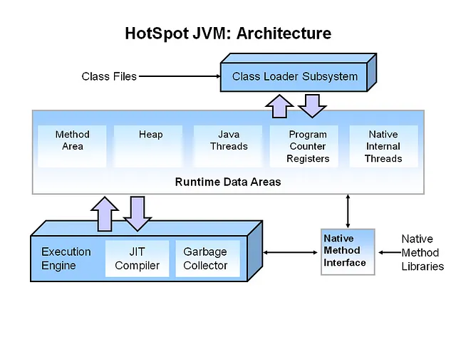

# Garbage Collection in Java



Garbage Collection (GC) in Java is a process by which the Java Virtual Machine (JVM) automatically reclaims memory by deleting objects that are no longer reachable in the application. This helps in preventing memory leaks and optimizing the available memory for active objects, thus maintaining the performance and efficiency of Java applications.

### Configuring Garbage Collection in Java

To configure garbage collection in Java, you can use various JVM options. Some key parameters include:

* -XX:+UseG1GC: Enables the Garbage-First (G1) garbage collector.
* -XX:+UseSerialGC: Enables the Serial garbage collector.
* -XX:+UseParallelGC: Enables the Parallel garbage collector.
* -XX:+UseConcMarkSweepGC: Enables the Concurrent Mark-Sweep (CMS) garbage collector.
* -XX:+UseZGC: Enables the Z Garbage Collector (ZGC).
* Heap size options: -Xms to set the initial heap size, -Xmx to set the maximum heap size.
* GC log options: -Xlog:gc* to enable logging of garbage collection details.


### How to Configure Garbage Collection in Your Application

To configure garbage collection for your Java application, follow these steps:

Determine the appropriate GC algorithm: Based on the application's requirements (e.g., low latency, high throughput), choose the suitable GC.
Set JVM options: Add the selected GC options and other related parameters to the JVM options in your application's startup script or configuration file. For example:

```java
java -XX:+UseG1GC -Xms2g -Xmx8g -Xlog:gc* -jar myapp.jar
```

Tune GC parameters: Depending on performance testing, you might need to adjust additional parameters like -XX:MaxGCPauseMillis for G1GC or -XX:ParallelGCThreads for Parallel GC.

### Garbage Collection Algorithms in Java

### Serial GC
The Serial GC uses a single thread for both minor and major garbage collection. It is the simplest GC and works well for small applications with single-threaded environments.

Use Case: Best suited for small applications or environments with limited resources.
Advantages: Low overhead due to single-threaded execution.
Disadvantages: Not suitable for large, multi-threaded applications as it can cause significant pause times.

### Parallel/Throughput GC

The Parallel GC, also known as Throughput GC, uses multiple threads for garbage collection. It aims to maximize the throughput of the application by reducing the time spent on GC.

* Use Case: Ideal for applications where throughput is more critical than pause times.
* Advantages: Efficient for applications with high throughput requirements.
* Disadvantages: Pause times can be longer compared to other GCs.

### Concurrent Mark Sweep (CMS) GC

The CMS GC is designed to reduce pause times by performing most of the garbage collection work concurrently with the application threads.

* Use Case: Suitable for applications requiring low-latency response times.
* Advantages: Lower pause times compared to Serial and Parallel GCs.
* Disadvantages: More CPU-intensive and can lead to fragmentation issues over time.

### G1 (Garbage-First) GC

The G1 GC divides the heap into regions and performs garbage collection in a way that aims to meet a user-defined pause time target.

* Use Case: Recommended for applications with large heaps and a need for predictable pause times.
* Advantages: Balances between throughput and low pause times, with better control over GC pauses.
* Disadvantages: Can be complex to tune effectively.

### Z Garbage Collector (ZGC)

ZGC is designed for applications requiring ultra-low pause times. It performs most of its work concurrently, with minimal impact on application performance.

* Use Case: Suitable for applications with very large heaps and strict latency requirements.
* Advantages: Extremely low pause times, scalable to large heap sizes.
* Disadvantages: Higher memory overhead and relatively new, thus less mature.

### Choosing the Best GC for Your Application

To determine the best GC for your application, consider the following factors:

* Application Type: Whether it is a small, single-threaded application or a large, multi-threaded one.
* Performance Requirements: Whether the application requires high throughput or low latency.
* Heap Size: The size of the heap can influence the choice of GC.
* Pause Time Sensitivity: How sensitive the application is to GC pause times

### Key Considerations for Managing Garbage Collection

* Performance Monitoring: Regularly monitor GC performance using tools like GC logs and Java Flight Recorder (JFR).
* Testing and Tuning: Perform extensive testing under realistic load conditions to fine-tune GC parameters.
* Heap Size Management: Set appropriate initial and maximum heap sizes based on the application's memory usage patterns.
* Stay Updated: Keep the JVM updated to benefit from the latest improvements and bug fixes in garbage collection algorithms.

# Conclusion

Effective garbage collection management in Java requires a good understanding of different GC algorithms and their use cases. By selecting the right GC and tuning its parameters based on the application's needs, you can optimize performance and ensure smooth operation. Regular monitoring and adjustments are essential to maintain the desired balance between throughput and latency.


