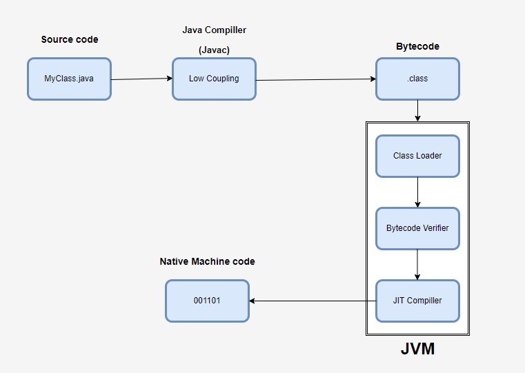

# How Compilation Works in Java

Compilation in Java is a multi-step process that converts human-readable Java source code into machine-readable bytecode that can be executed by the Java Virtual Machine (JVM). This process involves several stages: writing the code, invoking the compiler, generating bytecode, and verifying the bytecode.

The compilation process in Java ensures that source code is transformed into an optimized, secure, and platform-independent format (bytecode), ready to be executed by the JVM. This multi-step process includes writing the source code, invoking the compiler, generating bytecode, and verifying the bytecode, culminating in execution on the JVM.

### Java compilation supports:

* Portability: Java's bytecode allows the compiled code to run on any platform with a compatible JVM, adhering to the "write once, run anywhere" philosophy.
* Security: Bytecode verification helps prevent malicious code from compromising the system.
* Efficiency: The use of bytecode and the JVM enables efficient execution through interpretation and JIT compilation.

The compilation process in Java involves multiple stages, primarily focusing on translating Java source code into bytecode, which can then be executed by the Java Virtual Machine (JVM). Here's a detailed look at the different compilation flows and whether the compilation is done synchronously or asynchronously.

### Compilation types

### Ahead-of-Time (AOT) Compilation

AOT compilation translates Java source code directly into native machine code before execution. This is less common in typical Java environments but can be used to optimize startup times and performance for specific applications. The GraalVM and the jaotc tool (part of the JDK) can perform AOT compilation.

### Just-In-Time (JIT) Compilation

JIT compilation occurs at runtime, where the JVM compiles bytecode into native machine code as the application runs. This approach balances between startup time and execution performance. The HotSpot JVM includes a JIT compiler.

# Asynchronous vs. Synchronous Compilation

Java's compilation process can occur in different flows, primarily AOT and JIT, with the latter being more common. JIT compilation can be performed either synchronously, with potential pauses during execution, or asynchronously, which allows for continuous execution while compiling in the background. The HotSpot JVM supports both synchronous and asynchronous compilation, optimizing for both performance and responsiveness.

### Synchronous Compilation

Synchronous compilation occurs in real-time as the JVM executes the code. It typically involves an initial phase where the bytecode is interpreted until the JIT compiler kicks in for hot methods.

* Pros: Simplifies the flow, as compilation and execution are tightly integrated. 
* Cons: May introduce pauses or latency during the initial phase of execution due to the JIT compilation overhead.

### Asynchronous Compilation

Asynchronous compilation, or background compilation, allows the JVM to continue executing code while the JIT compiler works on compiling hot methods in the background. This approach minimizes the impact of compilation on application performance.

* HotSpot JVM Implementation: The HotSpot JVM supports asynchronous compilation with the -XX:+BackgroundCompilation flag enabled by default.

### Point good to know to interview

* Ahead-of-Time (AOT) Compilation: Less common, pre-compiles code into native machine code for optimized startup and performance.
* Just-In-Time (JIT) Compilation: Standard approach in Java, compiles bytecode into native code at runtime for improved performance.
* Synchronous Compilation: Simplifies flow but may introduce execution latency due to real-time compilation.
* Asynchronous Compilation: Enhances performance by compiling in the background, reducing impact on execution.

Java compilation process
* After you have you.class files, Java Compiler (javac) generates Bytecode.

### 1. Generating Bytecode

Compilation Process: The javac compiler translates the Java source code into bytecode. This intermediate representation is platform-independent and stored in .class files.

* Parsing: The compiler reads the source code and parses it into an Abstract Syntax Tree (AST), representing the hierarchical structure of the code.
* Semantic Analysis: The compiler checks for semantic errors, such as type mismatches, undefined variables, and other logical errors.
* Optimization: Some compilers perform optimization to improve the efficiency of the bytecode, though Java's focus is on maintaining readability and portability of the bytecode.
* Bytecode Generation: The AST is then translated into bytecode, which is a low-level, platform-independent set of instructions for the JVM.

### 2. Verifying the Bytecode

Bytecode Verifier: Before execution, the JVM performs bytecode verification to ensure the code adheres to Java's security and integrity constraints.

* Verification Steps: The verifier checks for illegal code that could violate access rights or produce runtime errors. This step includes checks for type safety, stack overflow, and proper use of objects and arrays.

### 3. Execution

Java Virtual Machine (JVM): The JVM interprets or just-in-time (JIT) compiles the bytecode into native machine code specific to the underlying hardware platform.

* Class Loader: The JVM uses the class loader to load classes as needed. This dynamic loading ensures that only the necessary classes are loaded, reducing memory usage.
* Execution Engine: The execution engine of the JVM interprets the bytecode or uses JIT compilation to convert bytecode into native instructions for better performance.

# Compilation Flags in HotSpot JVM

The HotSpot JVM, part of the OpenJDK and Oracle's JDK, offers a range of compilation flags that control various aspects of the Just-In-Time (JIT) compilation process and the behavior of the JVM. These flags can be used to optimize performance, debug issues, and configure JVM settings for specific use cases.

Here are some commonly used HotSpot JVM compilation flags:

### 1. Optimization Flags:

* -server: Runs the JVM in server mode, which optimizes performance for long-running applications by enabling more aggressive optimizations and a different garbage collection strategy.
* -client: Runs the JVM in client mode, which is optimized for quick startup and smaller memory footprint, suitable for short-lived applications.
* -XX:+AggressiveOpts: Enables experimental performance optimizations that may improve performance. This flag activates optimizations that are not yet enabled by default.
* -XX:+OptimizeStringConcat: Optimizes the performance of string concatenation by converting it to a more efficient sequence of operations.
* -XX:+UseSuperWord: Enables the use of SIMD (Single Instruction, Multiple Data) instructions to optimize operations on arrays of primitive types.

### 2. Debugging and Logging Flags

* -XX:+PrintCompilation: Prints information about methods as they are compiled by the JIT compiler. Useful for understanding which methods are being compiled and when.
* -XX:+PrintInlining: Prints detailed information about method inlining decisions made by the JIT compiler. This helps in understanding the inlining process and optimizing method call performance.
* -XX:+UnlockDiagnosticVMOptions: Unlocks additional diagnostic JVM options that are not available by default. This is often used in combination with other flags for advanced debugging and performance tuning.
* -XX:+LogCompilation: Logs compilation activities to a file. This is useful for post-mortem analysis of JIT compilation behavior.

### 3. Garbage Collection Flags

* -XX:+UseG1GC: Enables the Garbage-First (G1) Garbage Collector, which is designed for low-latency and high-throughput applications. This collector aims to meet specified pause-time goals with high probability.
* -XX:+UseParallelGC: Enables the parallel garbage collector, which uses multiple threads for garbage collection tasks, improving performance on multi-core systems.
* -XX:+UseConcMarkSweepGC: Enables the Concurrent Mark-Sweep (CMS) garbage collector, which aims to minimize pause times by performing most of the garbage collection work concurrently with the application.

### 4. Memory Management Flags

* -Xms<size>: Sets the initial heap size for the JVM. For example, -Xms512m sets the initial heap size to 512 MB.
* -Xmx<size>: Sets the maximum heap size for the JVM. For example, -Xmx1024m sets the maximum heap size to 1024 MB.
* -XX:NewSize=<size>: Sets the initial size of the young generation heap.
* -XX:MaxNewSize=<size>: Sets the maximum size of the young generation heap.
* -XX:MetaspaceSize=<size>: Sets the initial size of the metaspace, where class metadata is stored.
* -XX:MaxMetaspaceSize=<size>: Sets the maximum size of the metaspace.

### 5. Compilation Control Flags

* -XX:CompileThreshold=<value>: Sets the number of method invocations/loops before the JIT compiler compiles the method. A lower value causes more frequent compilations.
* -XX:+TieredCompilation: Enables tiered compilation, where the JVM uses both the client and server JIT compilers. The client compiler performs fast, initial compilations, while the server compiler performs more aggressive optimizations for frequently used methods.
* -XX:+BackgroundCompilation: Enables background compilation, allowing the JVM to compile methods in the background while the application continues to run. This reduces pause times due to compilation.

### 6. Miscellaneous Flags

* -XX:+UseCompressedOops: Enables the use of compressed ordinary object pointers, reducing memory consumption and improving performance on 64-bit JVMs.
* -XX:+UseStringDeduplication: Enables string deduplication, which helps reduce memory usage by identifying and merging duplicate string objects in the heap.

The HotSpot JVM offers a wide range of compilation flags that can be tailored to optimize performance, debug issues, and configure the JVM for specific requirements. By understanding and utilizing these flags, developers can significantly enhance the performance and behavior of their Java applications.

# Flags which is good to know for interview:

* Performance Optimization: Use flags like -server, -XX:+AggressiveOpts, and -XX:+OptimizeStringConcat to enhance application performance.
* Debugging and Monitoring: Utilize flags such as -XX:+PrintCompilation, -XX:+PrintInlining, and -XX:+LogCompilation for detailed insights into the JIT compilation process.
* Memory and Garbage Collection: Configure memory settings and choose appropriate garbage collectors using flags like -Xms, -Xmx, -XX:+UseG1GC, and -XX:+UseParallelGC.
* Compilation Control: Control the JIT compilation process with flags such as -XX:CompileThreshold, -XX:+TieredCompilation, and -XX:+BackgroundCompilation.

These flags provide powerful tools for tuning and optimizing Java applications running on the HotSpot JVM.

# GraalVM

Modern Java applications very widelly use GraalVM. And we need to mention this. GraalVM is a versatile virtual machine and runtime environment that supports multiple programming languages. It's designed to offer high performance, compatibility, and interoperability across different language ecosystems. One of its key features is polyglot execution, meaning it can run applications written in languages like Java, JavaScript, Python, Ruby, R, and more on the same platform.

GraalVM incorporates a just-in-time (JIT) compiler to optimize the performance of applications, aiming for better throughput and lower latency compared to traditional JVMs (Java Virtual Machines). Additionally, it provides a native image builder, enabling the compilation of JVM-based applications into native executables ahead-of-time. This feature can result in faster startup times and reduced memory overhead.

The platform promotes interoperability between languages, allowing developers to seamlessly call functions written in one language from another. It includes the Truffle framework, which simplifies the implementation of programming languages and provides tools for building high-performance language runtimes.

GraalVM can be embedded in various environments, such as databases, applications, and microservices, making it suitable for a wide range of use cases including cloud computing, microservices architecture, data processing, and high-performance computing.

Overall, GraalVM is an open-source project with support for multiple platforms, offering developers a powerful and flexible runtime environment for executing applications written in different languages efficiently.

# Summary

Java compilation involves converting source code into a form that can be executed by the Java Virtual Machine (JVM). This can be done ahead-of-time (AOT) or just-in-time (JIT). AOT compilation translates Java code directly into native machine code before execution, optimizing for startup times and performance using tools like GraalVM and jaotc. JIT compilation, on the other hand, occurs at runtime and involves interpreting bytecode initially, profiling frequently executed (hot) methods, and compiling them into native code. The HotSpot JVM supports both synchronous JIT compilation, which happens in real-time, and asynchronous (background) JIT compilation, which reduces performance impact by compiling methods while the application runs.

Inlining is a crucial optimization technique where method calls are replaced with the actual method code. This reduces the overhead associated with method calls, enables further optimizations, and improves cache performance. While inlining can increase code size and make debugging more complex, it is widely used in the HotSpot JVM to enhance the performance of Java applications by minimizing the overhead of method calls and exposing more opportunities for optimization.
