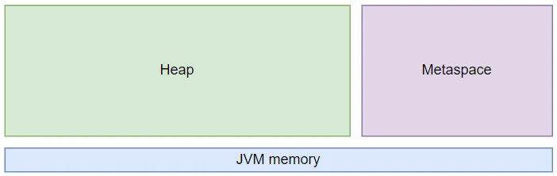
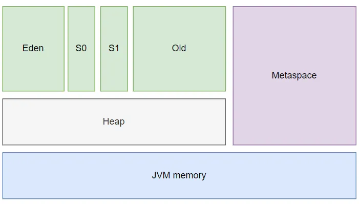

# Metaspace tuning

During launching, every Java application generates numerous objects within the computer’s memory. However, given that memory is finite, it is imperative to utilize it efficiently. The Java Virtual Machine (JVM) is proficient in judiciously handling memory and aids developers by autonomously managing it.

In this article, we’ll delve into the inner workings of the JVM and its interaction with memory during the execution of a Java application.

Why is it important to learn about and understand how Java uses memory?

Firstly need to mention. Java is a programming language with automatic memory management.

Java as a programming language that incorporates automatic memory management. In other words, Java is designed to handle memory allocation and deallocation automatically, relieving programmers from the burden of manually managing memory resources. This feature helps simplify memory management tasks for developers and reduces the likelihood of memory-related errors such as memory leaks or dangling pointers.

Despite the Java Virtual Machine (JVM) being responsible for memory management and resource cleanup in an application, issues such as memory leaks or shortages are not uncommon. These problems cannot be resolved solely by the JVM and often necessitate human intervention.

In a Java program, memory is split into two main sections: the Heap and the Metaspace (formerly known as PermGen starting from Java 8).

### Metaspace

Metaspace is a memory region in Java that stores static information pertaining to a Java application, including metadata associated with loaded classes. Unlike its predecessor, PermGen, Metaspace does not have an explicit size limit by default and expands dynamically. However, without an explicit boundary set, the Metaspace size is implicitly restricted by the available system memory on the hosting machine.

### Metaspace tuning

You can manage the Metaspace memory region using the following JVM flags:

- -XX:MetaspaceSize — Specifies the minimum size of the Metaspace region.
- -XX:MaxMetaspaceSize — Specifies the maximum size of the Metaspace region.
- -XX:MinMetaspaceFreeRatio — Specifies the minimum percentage of reserved memory after garbage collection.
- -XX:MaxMetaspaceFreeRatio — Specifies the maximum percentage of reserved memory after garbage collection.

### Heap

The heap in Java consists of dynamically allocated memory where objects are stored during the execution of a Java program. It is a region of the computer’s memory that is managed by the Java Virtual Machine (JVM). The heap is used to allocate memory for objects created using the “new” keyword, as well as for data structures such as arrays and collections.

The heap is divided into two main areas:

- Young Generation: This area is further divided into Eden space and two Survivor spaces (From and To). Objects are initially allocated in the Eden space. When the Eden space becomes full, a minor garbage collection is triggered, and surviving objects are moved to one of the Survivor spaces. Objects that survive multiple garbage collection cycles in the Survivor spaces are eventually promoted to the Old Generation.
- Old Generation: This area is also known as the Tenured Generation. It is used to store long-lived objects that have survived multiple garbage collection cycles in the Young Generation. Major garbage collections are performed in the Old Generation to reclaim memory from unreachable objects.

S0 and S1, also known as Survivor spaces or Survivor regions, are two areas within the Young Generation of the heap in Java.

When objects are initially created, they are allocated in the Eden space. During garbage collection, objects that are still alive are moved to one of the Survivor spaces. The Survivor spaces are used as temporary storage areas for objects that have survived one garbage collection cycle and are not yet promoted to the Old Generation.

The Survivor spaces work together in a copying algorithm. When a minor garbage collection occurs, live objects from Eden space and one of the Survivor spaces (usually S0) are copied to the other Survivor space (S1). Objects that survive subsequent garbage collection cycles are moved between the Survivor spaces, and eventually, the long-lived objects are promoted to the Old Generation.

The purpose of having two Survivor spaces is to optimize garbage collection performance by reducing the need for copying live objects back to Eden space after each collection cycle. This helps minimize the overhead associated with garbage collection and improves the overall efficiency of memory management in Java applications.

The heap size can be adjusted using JVM flags such as -Xms (initial heap size) and -Xmx (maximum heap size). Proper tuning of the heap size is essential for optimizing the performance and stability of Java applications.

### Heap tuning

To tune the Java heap:

- Set initial and maximum heap size (-Xms, -Xmx).
- Adjust Young Generation size (-Xmn).
- Choose garbage collection algorithm (-XX:+UseSerialGC, -XX:+UseParallelGC, -XX:+UseG1GC).
- Configure garbage collection threads (-XX:ParallelGCThreads).
- Enable adaptive sizing policies (-XX:+UseAdaptiveSizePolicy).
- Enable garbage collection logging (-Xloggc).
- Generate heap dump on OutOfMemoryError (-XX:+HeapDumpOnOutOfMemoryError).
- Use compressed object pointers (-XX:+UseCompressedOops).
- Fine-tune G1GC parameters (-XX:G1HeapRegionSize, -XX:MaxGCPauseMillis).
- -XX:NewSize: Specifies the minimum size of the Eden segment in the Young Generation.
- -XX:MaxNewSize: Specifies the maximum size of the Eden segment in the Young Generation.

### Why do we need to Monitor Java Memory

Monitoring Java memory usage is essential for maintaining the health, performance, and stability of Java applications in production environments. Here’s why it’s important and how to do it:

1. Identify Memory Leaks: Monitoring memory usage helps detect memory leaks, where objects are not properly garbage collected and continue to consume memory over time. Identifying and fixing memory leaks prevents excessive memory consumption and potential OutOfMemoryError crashes.
2. Optimize Performance: Monitoring memory usage allows you to optimize the heap size and garbage collection settings based on the application’s memory requirements and usage patterns. Optimizing memory usage can improve application performance by reducing garbage collection overhead and minimizing pause times.
3. Prevent OutOfMemoryErrors: Monitoring memory usage helps predict and prevent OutOfMemoryError exceptions, which occur when the JVM runs out of memory. By monitoring memory usage and setting appropriate heap sizes, you can ensure that the application has enough memory to handle its workload without crashing due to memory exhaustion.
4. Troubleshoot Performance Issues: Memory usage metrics provide valuable insights into the behavior and performance of Java applications. Monitoring memory usage helps diagnose performance issues, such as excessive garbage collection activity, memory thrashing, or inefficient memory usage patterns.

### How to Monitor Java Memory:

1. JVM Tools: Use built-in JVM tools like Java VisualVM, Java Mission Control, or jstat to monitor memory usage, garbage collection activity, heap dumps, and other memory-related metrics.
2. Third-Party Monitoring Tools: Deploy third-party monitoring tools like Prometheus, Grafana, New Relic, or Datadog to collect and visualize memory usage metrics from multiple Java applications in a centralized dashboard.
3. Heap Dumps: Analyze heap dumps generated by the JVM when an OutOfMemoryError occurs using tools like Eclipse Memory Analyzer (MAT) or VisualVM. Heap dumps provide detailed information about the memory contents, object allocations, and potential memory leaks.
4. Logging and Alerting: Configure logging and alerting mechanisms to monitor memory usage thresholds and trigger alerts when memory usage exceeds predefined thresholds. Use logging frameworks like Log4j or SLF4J to log memory usage metrics to application logs for further analysis.

### Summary

Monitoring Java memory usage in production environments is crucial for detecting memory leaks, optimizing performance, preventing OutOfMemoryErrors, troubleshooting performance issues, and ensuring the overall stability and reliability of Java applications. By monitoring memory usage effectively, you can proactively manage memory resources, identify potential issues early, and optimize application performance.

