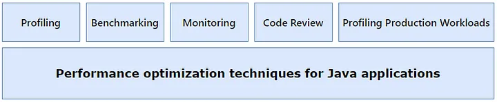
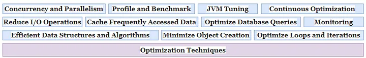

# Top Strategies for Optimizing Java Application Performance: Practical Advice and Best Practices

Source

For Java application performance tuning is very important. This article covers some questions:

- Performance advices and potential bottlenecks in a Java application
- Various optimization techniques in Java for improving performance.
- Performance optimization tools.ces to analyze, measure, and optimize the performance of your Java application. By systematically identifying and addressing performance issues, you can achieve better performance, scalability, and reliability for your application.

Performance tuning involves optimizing a Java application to enhance its speed, efficiency, and resource utilization. Identifying performance bottlenecks is a crucial step in this process. Here’s how you can do it:

- Profiling: Use profiling tools like Java VisualVM, YourKit, or JProfiler to analyze the runtime behavior of your application. Profiling tools provide insights into CPU usage, memory consumption, thread activity, method execution times, and other performance metrics. By profiling your application, you can pinpoint areas of code that contribute most to execution time or resource consumption.
- Benchmarking: Conduct benchmark tests to measure the performance of critical operations or components within your application. Benchmarking involves running controlled experiments to compare the execution times or resource usage of different implementations or configurations. By benchmarking your application, you can identify performance differences and potential optimizations.
- Heap Dump Analysis: Analyze heap dumps to identify memory-related issues such as memory leaks or excessive object creation.
- Logging and Monitoring: Implement monitoring solutions to continuously track the performance of your application in production environments. Monitoring tools collect and analyze performance metrics in real-time, allowing you to detect performance anomalies, identify trends, and troubleshoot issues as they arise. By monitoring your application, you can proactively address performance problems and optimize resource usage.
- Code Review: Perform code reviews to identify inefficient or poorly optimized code patterns. Look for common performance issues such as unnecessary object creation, excessive memory allocation, tight loops, blocking I/O operations, or inefficient algorithms. By reviewing your code, you can refactor or optimize performance-critical sections to improve overall application performance.
- Profiling Production Workloads: Capture and analyze performance data from production environments to understand how your application behaves under real-world conditions. Profiling production workloads helps identify performance bottlenecks, scalability limitations, or resource contention issues that may not be evident in development or testing environments. By profiling production workloads, you can make data-driven decisions to optimize performance and ensure a smooth user experience.

### Optimization Techniques

- Use Efficient Data Structures and Algorithms: Choose the most suitable data structures and algorithms for your application’s requirements. Opt for efficient data structures like HashMap, ArrayList, and HashSet, and algorithms with optimal time and space complexity. Also pay attention for selecting right and efficient library objects, like StringBuilder and StringBuffer.
- Minimize Object Creation: Reduce unnecessary object creation by reusing objects, using object pooling, or employing immutable objects where possible. Excessive object creation can lead to increased memory usage and garbage collection overhead.
- Optimize Loops and Iterations: Minimize the number of iterations in loops, and avoid unnecessary computations within loops. Use efficient looping constructs like enhanced for loops or stream API in Java 8+ to improve readability and performance.
- Reduce I/O Operations: Minimize blocking I/O operations and optimize file, network, and database access. Use asynchronous I/O or non-blocking I/O libraries like Java NIO (New I/O) for improved scalability and responsiveness.
- Cache Frequently Accessed Data: Implement caching mechanisms to store frequently accessed data in memory and reduce the need for repeated computations or database queries. Use caching libraries like Ehcache or Caffeine to manage cache expiration, eviction, and synchronization.
- Optimize Database Queries: Use efficient SQL queries, indexes, and database schema designs to minimize database load and improve query performance. Avoid unnecessary joins, use proper indexing, and optimize database transactions to reduce latency and improve throughput.
- Concurrency and Parallelism: Leverage concurrency and parallelism to improve application scalability and performance. Use Java’s concurrency utilities like Executor framework, CompletableFuture, or parallel streams to execute tasks concurrently and utilize multi-core processors effectively.
- Profile and Benchmark: Use profiling tools to identify performance bottlenecks and benchmark critical sections of code to measure execution times and resource usage. Profiling helps pinpoint performance hotspots, while benchmarking guides optimization efforts and validates performance improvements.
- JVM Tuning: Fine-tune JVM settings such as heap size, garbage collection algorithms, and thread pool sizes to optimize memory usage, garbage collection behavior, and thread concurrency. Experiment with different JVM parameters and monitor performance metrics to find the optimal configuration for your application. Some details you can read in this [article](https://medium.com/@alxkm/java-memory-model-3b973e84dc8c).
- Continuous Optimization and Monitoring: Regularly review and optimize your codebase, infrastructure, and configurations to maintain high performance levels. Implement monitoring solutions to track performance metrics, identify regressions, and detect performance anomalies in real-time.

By applying these optimization techniques judiciously, you can significantly improve the performance, scalability, and responsiveness of your Java applications, ensuring a better user experience and higher efficiency.

Overall, identifying performance bottlenecks requires a combination of tools, techniques, and best practices to analyze, measure, and optimize the performance of your Java application. By systematically identifying and addressing performance issues, you can achieve better performance, scalability, and reliability for your application.

Thanks for reading.

